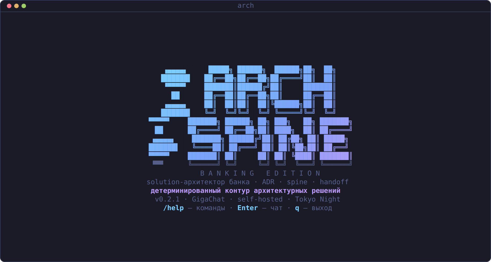
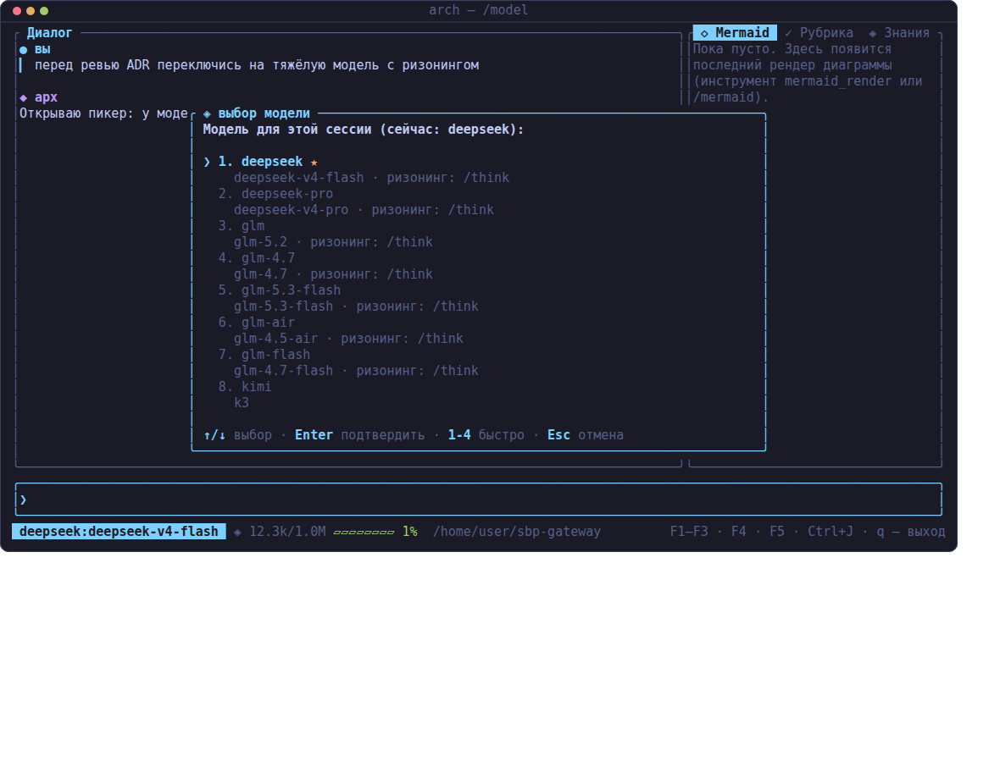
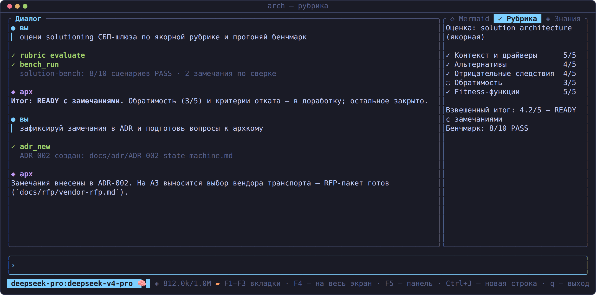
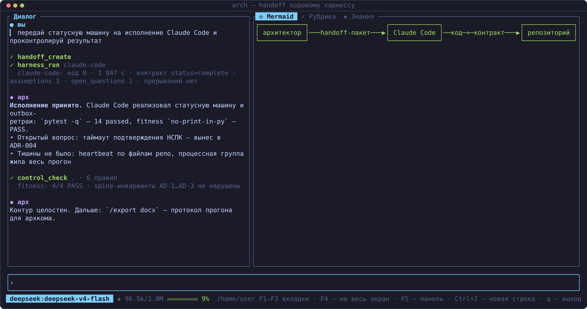
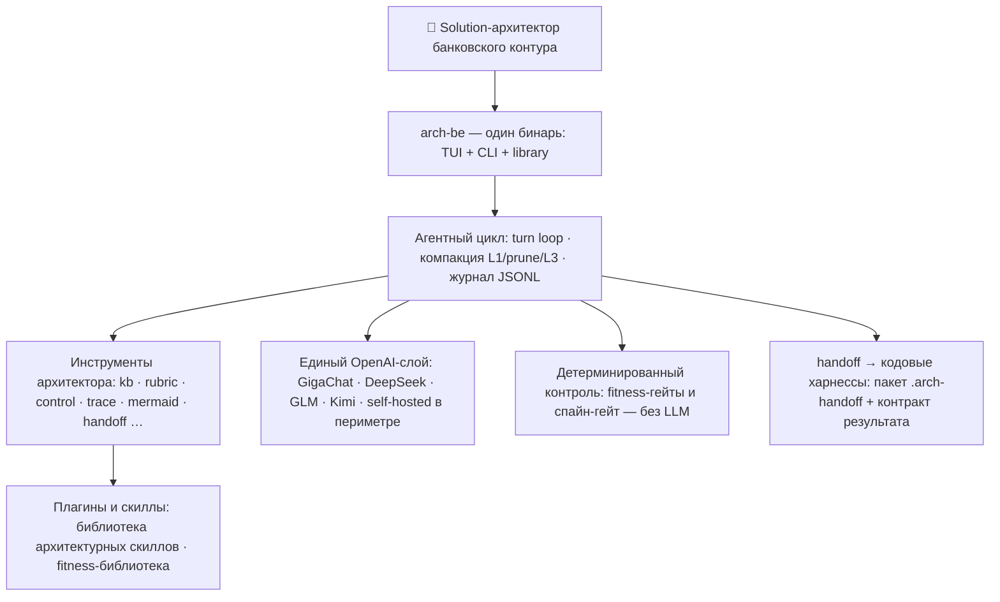
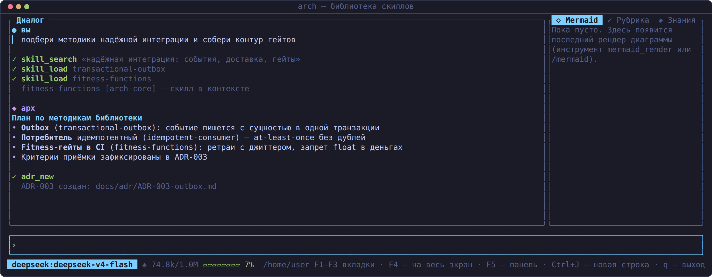

<p align="center">
  
</p>

<p align="center">
  <b>Доменный харнесс solution-архитектора банковского корпоративного контура</b><br>
  <sub>spine-инварианты · ADR · fitness-гейты · рубрики с LLM-судьёй · handoff кодовым харнессам · флоты субагентов<br>
  A domain agent harness for banking solution architects — one Rust binary: TUI + CLI + library.</sub>
</p>

<p align="center">
  <a href="https://github.com/romannekrasovaillm/spine-bank/actions/workflows/ci.yml"></a>
  
  
  
</p>

<p align="center">
  <b>🇷🇺 <a href="#русский">Русский</a></b> · <b>🇬🇧 <a href="#english">English</a></b> · <b>🧪 <a href="#кейсы">Кейсы</a></b> · <b>📦 <a href="docs/handoff_walkthrough.md">Handoff walkthrough</a></b>
</p>

---

<p align="center">
  
</p>

<p align="center">
  <sub>Живая сессия — анимированный цикл 14 с, проигрывается прямо здесь · Live session — a 14-second animated loop, plays inline.</sub>
</p>

<p align="center">
  
</p>

<p align="center">
  
  
  
</p>

<p align="center">
  <sub>Кадры — снимки реальных экранов TUI (рендерятся из кода тестом, не макеты) ·
  Real TUI renders, generated from code — not mockups.</sub>
</p>

<h2 id="кейсы">🧪 Кейсы — сквозные прогоны, а не обещания</h2>

Каждый кейс — самодостаточный пример работы архитектора с харнессом: от
spine-инвариантов до пакета передачи кодовому харнессу. Эталон полного набора —
[`sbp-gateway`](кейсы/sbp-gateway/), реестр и конвенции — [`кейсы/AGENTS.md`](кейсы/AGENTS.md).

| Кейс | Модель | Что показывает |
|------|--------|----------------|
| [sbp-gateway](кейсы/sbp-gateway/) | DeepSeek V4 Flash | Полный цикл: spine → solutioning → ADR → контракты/NFR → handoff кодовому харнессу |
| [payment-processing-platform](кейсы/payment-processing-platform/) | GLM-5.2 | Greenfield маршрута Critical за одну сессию: 27 инвариантов, 16 ADR, fitness-правила уже под код |
| [govproc-platform](кейсы/govproc-platform/) | Kimi K3 | Компактный комплект: 7 AD, 5 ADR, OpenAPI-контракт как первоклассный артефакт |
| [parallel-epics](кейсы/parallel-epics/) | Claude Code ×3 | Параллельный флот по worktree: стыки сошлись с первой сборки (15/15 тестов) |
| [fleet-of-ten](кейсы/fleet-of-ten/) | Claude Code ×10 | Десять эпиков за ~3,2 мин стены: 10/10 complete, флот **сам** закоммитил работу |
| [drift-control](кейсы/drift-control/) | Claude Code (A/B) | Голая задача → гейт FAIL 2/6; та же задача + handoff-пакет → PASS 6/6 |
| [fleet-spine-drift](кейсы/fleet-spine-drift/) | — (механический) | Аудит флота: дубли 66.7% и дрейф `CONSTRAINTS.yaml` как exit-код; delta guard запрещает правки спайна мимо дельты |
| [legacy-survey](кейсы/legacy-survey/) | — (механический) | Reverse discovery legacy-монолита: скрытые связи с `[confirmed]` и честные `[gap]` |
| [jvm-archunit-gate](кейсы/jvm-archunit-gate/) | — (механический) | Один `CONSTRAINTS.yaml` — два исполнителя: нативный гейт и настоящий ArchUnit по байткоду |
| [digital-ruble](кейсы/digital-ruble/) | Claude Code (без LLM у Spine) | Маршрут Critical в режиме «Spine Core без своей LLM»: 65 сущностей, 10 инвариантов, 15 правил, NFR-математика — и evidence FAIL с блокировкой выпуска |

<p align="center">
  <a href="docs/handoff_walkthrough.md"></a><br>
  <sub>Передача контекста кодовому харнессу — пошагово: <a href="docs/handoff_walkthrough.md">docs/handoff_walkthrough.md</a> ·
  Handing context to a coding harness, step by step.</sub>
</p>

### 🏗 Архитектура за 10 секунд



> [!NOTE]
> **🇷🇺 Продукт:** Spine Banking Edition — продуктовый форк Spine (AD-BE4,
> ADR-010…014). Ядро — MIT (`LICENSE`), банковская надстройка `banking/` —
> proprietary (`LICENSE.banking`). **Это публичный снапшот ядра: зона
> `banking/` в репозиторий не входит.** Прежде чем строить на этом коде
> промышленное решение, зафиксируйте собственные инварианты и fitness-правила:
> артефакты (`docs/adr/`, `ARCHITECTURE-SPINE.md`) — рабочая методика, а не
> готовая гарантия под ваш контур.
> **🇬🇧 Product:** Spine Banking Edition — a product fork of Spine. Core is
> MIT-licensed (`LICENSE`); the banking layer `banking/` is proprietary
> (`LICENSE.banking`). **This is a public snapshot of the core — the
> proprietary `banking/` layer is not included.** Before building a
> production solution on this code, define your own invariants and fitness
> rules: the artifacts are a working methodology, not a ready-made guarantee
> for your context.

---

<a id="русский"></a>

## 🇷🇺 Русский

**Spine** — доменный харнесс solution-архитектора (банковский корпоративный
контур): тонкий агентный харнесс с TUI, библиотекой архитектурных скиллов
и контуром архитектурного контроля. Rust, edition 2024, один бинарь `arch-be`:
TUI, CLI, библиотека.

Харнесс намеренно **тонкий**: ядерные инструменты (bash, файлы) плюс
специализированные инструменты архитектора. Тяжёлая часть — не код, а
дисциплина артефактов: спецификации, architecture-spine, ADR, рубрики,
fitness functions, handoff-пакеты кодовым агентам.

Идеи — разбор SDD-харнессов и корпоративных агентных фреймворков
(`docs/SOURCE_BRIEF.md`, август 2026: AI-Disrupt PDLC, AWS AI-DLC/Kiro,
BMAD, Spec Kit, OpenSpec и др.):

- **Маршрутизация изменений Fast/Standard/Critical** по Architecture
  Significance Score — 15 триггеров значимости (`src/control.rs`).
- **Architecture-spine**: позвоночник инвариантов с полями
  `Binds` / `Prevents` / `Rule` — фиксируется только то, в чём независимые
  исполнители могут разойтись несовместимо.
- **ADR-дисциплина**: решение записывается до реализации, с альтернативами,
  отрицательными последствиями и оценкой обратимости.
- **Evidence-подход**: оценка LLM-судьёй только со свидетельствами-цитатами;
  fitness functions — машинно-проверяемые утверждения о репозитории;
  headless JSON-контракт результата у кодовых харнессов и cron-задач.

### Пример: mermaid → ASCII в терминале

`arch-be mermaid examples/mermaid/flow.mmd`:

```
       ┌──────────────────────────────┐
       │ Каналы: мобильный банк и веб │
       └──────────────────────────────┘
                      ┌┘
                      ▼ REST JSON
               ┌─────────────┐
               │ API Gateway │
               └─────────────┘
                      │
                      ▼ маршрутизация и аутентификация
          ┌───────────────────────┐
          │ Платёжный оркестратор │
          └───────────────────────┘
             ├────────┴статус-колбэк─┐
             ▼ команда списания      ▼ ISO 20022 платёжное поручение
┌────────────────────────┐   ┌───────────────┐
│ Ядро: счета и проводки │   │ Платёжный хаб │
└────────────────────────┘   └───────────────┘
             ┌авторизация─и─токены───┤
             ▼                       ▼ событие PaymentStatus
┌────────────────────────┐   ┌──────────────┐
│ Внешний платёжный шлюз │   │ Шина событий │
└────────────────────────┘   └──────────────┘
                       ┌─────────────┘
                       ▼ подписка на статусы
            ┌────────────────────┐
            │ Сервис уведомлений │
            └────────────────────┘
```

### Возможности

#### Модели и ризонинг

- **DeepSeek V4/V4.1** (flash/pro), **GLM-5.3/5.2** (5.3 и 5.3-Flash — окно 1M
  токенов, вывод до 128K; + дешёвые 4.7/air/flash), **Kimi K3**
  (coding-поверхность) — переключение на лету: `/model` (пикер в TUI) или
  `arch-be run --model`. Ключи — только из окружения или файла (`api_key_file`).
- **Любой OpenAI-совместимый провайдер** через `[models.<name>]` в конфиге
  (base_url, модель, `api_key_env`/`api_key_file`, лимит контекста) — появляется
  в пикере `/model` без пересборки (`docs/models.md`).
- **Переключатель ризонинга** `/think on|off|auto` (и `arch-be run --think`):
  карты `thinking_on`/`thinking_off` в конфиге модели; CoT (`reasoning_content`)
  хранится и эхом возвращается в API (контракт DeepSeek thinking+tools);
  индикатор 🧠 в статус-баре. У семейства `glm-5.3*` thinking не отключается —
  вместо off ставится `reasoning_effort=low` (допустимы low/high/max, дефолт —
  max; явный `disabled` отвечает HTTP 1210).
- Промышленная закалка стрима: ретрай обрыва SSE на любой фазе (с заметкой
  в чате), закрытие потока без `[DONE]`/`finish_reason` считается усечением
  и повторяется, вызов инструмента с обрезанными аргументами (потолок
  max_tokens / обрыв) отклоняется с точной причиной и стратегией
  восстановления — крупные файлы пишутся частями (`write_file mode=append`),
  таймаут тишины вместо общего таймаута, компактификация L1/L3,
  детекторы петель, редакция секретов в выводе и журнале.
- **Индикатор контекста** в статус-баре: `◈ 12.3k/1.0M ▰▰▱▱▱▱▱▱ 1%` —
  заполнение окна активной модели; шкала зелёная до порога L1, оранжевая
  до L3, дальше красная.

#### Библиотека скиллов и плагины (agent-plugins.org)

> **Плагин — единственная единица установки**: скиллы отдельно не ставятся,
> они живут внутри плагина (`skills/<имя>/SKILL.md`). `arch-be skills …` —
> плоский индекс скиллов со всех плагинов, а не отдельный реестр.

- Девять встроенных плагинов (`arch-be init` раскладывает в `~/.arch-harness/plugins`):
  **arch-core** (15 методических скиллов архитектора, вкл. мета-скилл `skill-authoring`),
  **patterns-integration** (сага, outbox, CQRS, strangler+ACL, идемпотентность —
  дистилляты microservices.io), **patterns-resilience** (circuit breaker+retry,
  bulkhead, load leveling, cache-aside, throttling — дистилляты Azure),
  **aws-builders-library** (9 дистиллятов Amazon Builders' Library),
  **aws-agentic-ai** (агентные AI-паттерны AWS PG 2026), **arch-office**
  (12 скиллов офисных артефактов: docx-отчёты для МД, SAD, концепция,
  интеграционные спецификации, аудит, план миграции; pptx для правления и
  архкомитета; xlsx-каталоги, матрицы, реестр рисков — с генераторами
  python-docx/pptx/openpyxl) и **arch-governance** (управление библиотекой
  правил: 20 готовых fitness-функций для CONSTRAINTS.yaml, три волны
  внедрения, карточка дистилляции, антипаттерны расширения, карта 15 блоков
  источников), **spine-workflows** (7 плейбуков `spine-*` — сценарии работы
  архитектора поверх MCP из чужого кодового харнесса: `spine-quickstart`,
  `spine-architect-review`, `spine-fitness-gate`, `spine-contracts-gate`,
  `spine-adr-judge`, `spine-content-bootstrap`, `spine-archify-viz`), а также
  **spine-be-docs** (справка по самому продукту: скилл
  `check-spine-be-docs` отвечает на вопросы о Spine-BE по документации
  репозитория, а не по памяти).
- Поиск `arch-be skills search`, показ `arch-be skills show`; в TUI — `/skills`,
  `/skill` (в контекст сессии), `/plugins`; модель зовёт `skill_search`/`skill_load`
  сама. Дистилляция статей/контекста в новые скиллы — `skill_distill` и `/distill`.
- **Banking Edition** (проприетарный слой, в эту публикацию не входит)
  добавляет шесть доменных плагинов `ru-*` — 39 скиллов: **ru-integration**
  (DDD, event storming, таксономия саг, FAPI 2.0, Platform V), **ru-data**
  (medallion, data mesh, PACELC, Platform V Pangolin/Ocean/Radish/DataMarts),
  **ru-compliance** (PCI DSS, OWASP ASVS/LLM Top 10, CIS, MITRE ATT&CK),
  **ru-architecture** (анкета ADF, ISO 42010, ArchiMate), **ru-payments**,
  **ru-archify** — итого в полной редакции **101 скилл в 15 плагинах**.
- Сессии: `/new` — чистый лист с ротацией журнала; `/resume` — пикер сессий
  (стрелки + Enter), `/resume last` — мгновенно к последней; `/sessions` —
  журналы из append-only архива.
- **Failure-memory** «ошибся дважды → урок»: повторная подпись сбоя
  инструмента (пути/имена файлов схлопываются) порождает урок — заметка в
  чате + `state/failure_lessons.md` (`/lessons`), в режиме
  `[agent] failure_memory = "write"` — append в AGENTS.md проекта
  (`docs/failure_memory.md`).

**Самое интересное в библиотеке** (полный разбор — `docs/skills_for_architects.md`):

- `spine-invariants`, `significance-routing`, `handoff-packaging`,
  `adversarial-review` (arch-core) — метод: позвоночник инвариантов,
  маршрутизация Fast/Standard/Critical, упаковка контекста кодовым агентам,
  состязательное ревью.
- `fitness-function-catalog` (arch-governance) — 20 готовых fitness-функций
  с реальными regex и три волны внедрения.
- `docx-research-report` и весь arch-office — отчёты для МД, SAD, деки для
  правления и архкомитета, матрицы и реестр рисков: генераторы
  python-docx/pptx/openpyxl внутри скиллов.
- `timeouts-backoff-jitter`, `load-shedding`, `eight-failure-modes`
  (aws-builders-library) и `saga-transactions`/`transactional-outbox`
  (patterns-integration) — дистиллированная инженерная классика.
- `saga-taxonomy` и `parallel-run-money` (Banking Edition) — какая сага нужна
  именно здесь и как перевести деньги без остановки (двойной учёт + сверка).
- `adf-questionnaire`, `pci-dss-scope-map`, `fapi-financial-api`
  (Banking Edition) — анкета ДИТ, границы scope PCI DSS, hardened OAuth для
  внешних финансовых API.

<p align="center">
  <a href="docs/skills_for_architects.md"></a><br>
  <sub>Скиллы в живом ходе: модель сама ищет методики (<code>skill_search</code>), грузит две в контекст (<code>skill_load</code>) и отвечает по методике · Обзор всех 62 скиллов: <a href="docs/skills_for_architects.md">docs/skills_for_architects.md</a></sub>
</p>

Подробности: `docs/plugins_and_skills.md` (механика: установка, поиск,
доверие) и `docs/skills_for_architects.md` (обзор содержимого — все 62
скилла с разбором самого интересного).

#### Фоновые субагенты, ralph-циклы, worktree-фабрика

- `subagent_run/list/result` — фоновые исполнители со свежим контекстом и
  whitelist инструментов (спеки `agents/*.md` в плагинах); индикатор в
  статус-баре (`· ⣿ субагенты: N`).
- `ralph_run` — ralph-цикл: до 6 раундов к неизменной цели свежими агентами,
  состояние — файлы + handoff (status/summary/evidence/next_steps/blockers).
- `worktree_new` + `arch-be worktree new|list|diff|accept|drop` — изоляция
  агентной работы в git worktree; review/accept — человеком.

#### Слоистая модель 5.2 + дельта-протокол

Инструментарий для флотов worktree БЕЗ полных копий спайна (по разбору
реального кейса: 15 worktree × полная копия → 90% дублей, дрейф копий):
спайн — в одной копии (SSOT), компонент несёт lean-дельту, изменения спайна —
только дельтами `changes/<id>`.

- `arch-be fleet audit <paths…>|--repo <path>` — SSOT-аудит флота: точные дубли
  документации, файлы-ядро, дрейф копий с поимёнными отступниками
  (канон — majority-версия); дрейф → **exit 1**, порог дублей —
  `--fail-on-dupes <pct>` (гейты для CI). Агенту — инструмент `fleet_audit`.
- `arch-be delta guard [--base origin/main...HEAD] [--protect <префикс>]` —
  CI-запрет прямых правок спайна мимо дельты: изменённые файлы под
  `model/`, `ARCHITECTURE-SPINE.md`, `CONSTRAINTS.yaml` обязаны упоминаться
  в активной дельте `changes/*/DELTA.md`, иначе **exit 1**.
- **SPEC.md в handoff-пакете** — шаблон верифицируемых контрактов интерфейсов
  (входы/выходы, структуры данных, границы ошибок, критерии верификации;
  EARS-стиль) вместо прозаического ARCHITECTURE.md компонента; как и
  CONSTRAINTS.yaml, не затирается повторной генерацией.

Живой мини-кейс: [`кейсы/fleet-spine-drift`](кейсы/fleet-spine-drift/) (007).

#### AGENTS.md для команд репозиториев

- `arch-be agents-md refresh <repo>` — компилирует AGENTS.md из spine-инвариантов,
  CONSTRAINTS.yaml и манифестов; рукописная зона команды не затирается.
- `arch-be agents-md lint <repo>` / `lint-all` — дрейф-контроль по хэшу входов
  (CI/крон по флоту репозиториев); рубрика `agents_md_quality`.

Подробности: `docs/agents_md.md`.

#### Губернанс: автономия, доказательства, метрики, дельты

- **R-уровни автономности** (`[policy] autonomy = "R2"`): каждый вызов
  инструмента классифицируется по риску — `rm -rf` получает DENY на уровне
  R2, журнал фиксирует попытки (AI-Disrupt PDLC). `arch-be policy --check "<cmd>"`.
- **Evidence Bundle** — аудиторский след как гейт выпуска:
  `arch-be evidence pack/verify` с профилями Fast/Standard/Critical.
- **Метрики**: `arch-be metrics` — сессии, инструменты, ошибки, токены/₽, баллы
  рубрик, pass rate бенчей + трансформационные KPI: approval theater (доля
  бездумных согласий), architecture drift (дрейф AGENTS.md по флоту),
  cost per validated outcome.
- **Дельта-спеки**: `arch-be delta new|validate|archive` — state machine OpenSpec;
  `arch-be delta guard` — гейт прямых правок спайна мимо дельты (см. выше блок
  про модель 5.2). **Адаптер OpenSpec** (`arch-be openspec scan|coverage|init|gate`,
  `docs/openspec.md`): требования SHALL/MUST из openspec/specs и changes →
  отчёт покрытия fitness-правилами (связь — поле `covers:` правила),
  генерация скелета CONSTRAINTS.from-openspec.yaml + SPINE.draft.md,
  archive-гейт change (exit 1).

**Как переключить уровень автономии (R0–R5).** Уровень задаётся в конфиге:

```toml
[policy]
autonomy = "R2"   # допустимы формы "R2", "r3", "4"
```

Файл конфига ищется в порядке: `./arch-harness.toml` (каталог запуска) →
`~/.config/arch-harness/config.toml`; либо явно — `arch-be --config /path/strict.toml`.
Разовое ужесточение для конкретного репозитория: положите `arch-harness.toml`
с секцией `[policy]` в его корень и запускайте `arch-be` оттуда. CLI-подкоманды
читают конфиг на каждый запуск; в TUI политика вшивается в реестр инструментов
при старте — после правки перезапустите `arch-be` (фоновые субагенты наследуют
снимок конфига на момент своего запуска).

| Уровень | Чтение/поиск | Изменения (`write_file`, `cargo test`, `git commit`) | Деструктив (`rm -rf`, `git push --force`, `kubectl delete`) |
|---|---|---|---|
| R0–R1 | авто | эскалация человеку | DENY |
| R2 (дефолт) | авто | авто | DENY |
| R3 | авто | авто + обязательный журнал (в Spine он ведётся всегда) | DENY |
| R4 | авто | авто | эскалация человеку |
| R5 | авто | авто | авто — не рекомендуется, красный флаг аудита |

«Эскалация человеку» означает, что действие не выполняется: модель получает
отказ с текстом эскалации и корректно останавливается (в том числе в
headless-режиме); человек либо выполняет действие сам, либо поднимает уровень.
Проверка без исполнения: `arch-be policy` — текущий уровень;
`arch-be policy --check "rm -rf /tmp/x"` — класс риска и вердикт по команде.
Отказы журналируются в сессионный JSONL — материал аудита и детектора
approval theater. Bash классифицируется по тексту команды (паттерны —
`src/policy.rs`).

Харнесс применяет эти механики к самому себе: корневые `ARCHITECTURE-SPINE.md`
(10 инвариантов кодовой базы) и `CONSTRAINTS.yaml` (64 fitness-правила) гейтятся
CI-джобой `dogfood` (`arch-be control spine` + `arch-be control check .` + скан
персональных путей) — инварианты живут не на бумаге, а в пайплайне.

Подробности: `docs/governance.md`.

#### Учебные кейсы

- [`кейсы/`](кейсы/AGENTS.md) — сквозные примеры цикла solution-архитектора,
  подготовленные харнессом: от spine-инвариантов до handoff-пакета кодовому
  харнессу. Кейс 001 — [`sbp-gateway`](кейсы/sbp-gateway/) (платёжный шлюз
  СБП, C2B-приём; DeepSeek V4 Flash): spine AD-001…008, solutioning, 7 ADR,
  контракты/NFR/RFP, handoff-пакет с рубрикой и fitness-правилами.
  Кейс 002 — [`payment-processing-platform`](кейсы/payment-processing-platform/)
  (процессинг банка: рельсы карты/СБП/SWIFT/БЭСП; GLM-5.2): 27 инвариантов
  spine, 16 ADR, fitness-констрейнты под Go-код, walking skeleton.
  Кейс 003 — [`govproc-platform`](кейсы/govproc-platform/) (электронная
  коммерция госсектора: B2G-закупки 44-ФЗ, ЕИС, УКЭП; Kimi K3): 7 AD spine,
  5 ADR, NFR, OpenAPI-контракт, эмулятор внешней системы.
  Кейс 004 — [`parallel-epics`](кейсы/parallel-epics/) (три параллельных
  Claude Code по worktree, бэкенд deepseek-v4-pro): спайн AD-1…3 склеил
  стыки без взаимной видимости исполнителей — 15/15 тестов, интеграция с
  первой сборки; handoff-пакет по MCP; дефекты прогона → фиксы харнесса;
  цветные кадры в `screenshots/`.
  Кейс 005 — [`fleet-of-ten`](кейсы/fleet-of-ten/) (десять параллельных
  Claude Code, бэкенд deepseek-v4-pro): десять эпиков за ~3,2 мин стены —
  10/10 complete, 42/42 тестов, 60/60 fitness; флот сам закоммитил работу
  (контракт «Финализация»); цветные кадры в `screenshots/`.
  Кейс 006 — [`drift-control`](кейсы/drift-control/) (дрейф-эксперимент,
  две руки; Claude Code): одна задача платёжного ядра — голая vs с
  handoff-пакетом; механический гейт: FAIL 2/6 exit 1 (нет thiserror, нет
  идемпотентности — дрейф при зелёных тестах) против PASS 6/6; обе руки
  воспроизводимо перепроверяются из репозитория; цветные кадры в
  `screenshots/`.
  Кейс 007 — [`fleet-spine-drift`](кейсы/fleet-spine-drift/) (механический,
  без LLM): флот из трёх worktree с полными копиями спайна — `arch-be fleet
  audit` измеряет дубли (66.7%) и дрейф `CONSTRAINTS.yaml` (отступник wt-c,
  exit 1), `arch-be delta guard` запрещает прямые правки спайна мимо дельты;
  воспроизводится голым бинарём.

  Эксперимент — [`openspec-vs-spine`](experiments/openspec-vs-spine/)
  (масштабный прогон 2026-09-05): 10 задач × 3 контекста × 3 прогона ×
  2 модели = 180 генераций, пререгистрация, один детерминированный гейт
  arch-be для всех. Без контекста 367 error-нарушений (0 % чистых), с
  контекстом OpenSpec-стиля 32, со спайн-форматом 24 (за вычетом ложных
  срабатываний regex — 26/21); преимущество спайна модель-зависимое.
  Входы, контексты, протоколы и 180 записей results.jsonl — в каталоге.

#### Прочее

- **TUI** (ratatui, Tokyo Night): стриминг, markdown, mermaid-арт на боковой
  вкладке (панель сама расширяется под ширину схемы, до 60% экрана; рендер
  не усечается), мышь, скроллбар диалога и кнопка «▼» — прыжок к свежему ответу,
  **выделение текста мышью с автокопированием в буфер обмена** (драг по логам;
  нативно через `arboard` — внешние утилиты не нужны; фолбэки: wl-copy/xclip/
  xsel, OSC 52), **многострочный ввод** (перевод строки —
  Shift+Enter, Alt+Enter или Ctrl+J; поле растёт до 8 строк, Up/Down — по строкам,
  на крайней — история), **очередь сообщений во время хода** карточкой в окне
  логов (Enter — в очередь, Alt+Enter или префикс «!!» — срочно первым),
  **прерывание хода**: Esc или Alt+Enter во время хода отменяют текущий запрос
  к модели или вызов инструмента (включая ожидание `harness_run`) — срочное
  сообщение из очереди стартует немедленно, история сессии остаётся
  консистентной (висячие tool-вызовы получают результат «прервано»),
  полноэкранный просмотр `F4` с горизонтальной панорамой, экспорт экрана в
  Word/Excel (`/export`), модалки выбора (`propose_options`).
- **Диагностика** `arch-be doctor` — 10 проверок окружения с ✓/⚠/✗.
- **Eval-сьюты конфигурации** (`docs/evals.md`): continuous evals — регрессионный
  сьют задач с гейтом pass-rate (встроенный сьют `agent-config` герметичен и
  гоняется в CI; `--judge` — слой LLM-судьи по рубрике).
- **Рубрики и бенчмарки** архитектурного контроля (`docs/rubrics_and_benchmarks.md`).
- **Platform V Arch-Bench** (`benchmarks/platformv-arch-bench/`,
  `docs/platformv-benchmark.md`): бенчмарк из 24 архитектурных задач по
  документации Platform V (СберТех) с пререгистрацией, LLM-судьёй и
  статистикой — выбор модели для Spine, регрессионный гейт продуктовых фич
  (`scripts/run_regression.sh`) и сравнение кодовых харнессов для
  handoff-пакетов.
- **Архитектурный контроль**: score, spine-линтер, сенсоры спек, fitness,
  генератор ADR (`docs/control.md`). JVM-гейты — настоящим ArchUnit из того
  же CONSTRAINTS.yaml: `arch-be archunit gen|check|fetch` (ADR-039,
  `docs/archunit.md`). **Корпоративный спайн** (`docs/corp-spine.md`):
  наследование CONSTRAINTS слоями ДКА → домен → продукт (`extends` с пином
  версии — обновление родителя приходит как error-находка, а не молчаливая
  поломка), детектор тех-радара `deny_dependency` (Cargo.toml/pom.xml/
  requirements.txt), override только через ADR (rule+adr+until, протухает),
  `severity: block|warn`, отчёт вверх `arch-be control report --level corp
  --json`.
- **Handoff кодовым харнессам**: Claude Code, Qwen Code, OpenClaw, Hermes,
  Theseus, CodeWhale, Kimi Code — пакеты `.arch-handoff/` + прогон инструментом
  `harness_run` прямо из диалога (адаптер знает режим промпта, флаги
  разрешений; JSON-контракт результата разбирается **механически** —
  валидация схемы `Valid`/`Invalid`/`Missing`, эскалация blocked/conflicts,
  в CLI `status=blocked` даёт код выхода 2, непустые conflicts — 3).
  `background=true` — **фоновый прогон**: инструмент возвращается сразу
  (задача `hr-*` в общем реестре фоновых задач), агент остаётся доступным
  пользователю во время работы харнесса; статус — `subagent_list`, результат —
  `subagent_result`, полный лог — `reports/harness/<id>.log`.
  Окружение хоста в процесс харнесса протекает по умолчанию; whitelist
  `env_allow` в адаптере стартует его с чистым окружением. Предгейт
  пакета: git-репозиторий гарантирован (`git init` + baseline-коммит — якорь
  **плана отката** в TASK.md), маршрут значимости Fast/Standard/Critical
  задаёт рекомендованный таймаут прогона (1800/3600/7200 с, MANIFEST.json
  подхватывается `harness_run`); при Critical и epic-context ниже окна
  рубрики сборка пакета отклоняется, а грязное дерево (отслеживаемые файлы)
  — предупреждением: откат на baseline его потеряет. План отката — ещё и
  машиночитаемый (`ROLLBACK.yaml` в пакете) и **репетируется на гейте A4**:
  `arch-be control gate A4 <repo> --rehearse` прогоняет шаги во временном
  git-worktree на baseline_commit (деструктивные/внешние шаги отклоняются с
  диагностикой), результат — `REHEARSAL.json` в evidence пакета; для Critical
  без успешной репетиции гейт не проходит (порог — `--require-rehearsal`,
  см. `docs/control.md`). Контракт
  TASK.md требует от исполнителя **финального git-коммита** (секция
  «Финализация» — результат забирается из git log); если исполнитель его
  не сделал, харнесс сам фиксирует оставшиеся правки **авто-коммитом**
  (кроме `.arch-handoff/` и интерпретерного мусора; `auto_commit = false`
  в конфиге адаптера выключает). **Умные
  таймауты**: абсолютный потолок адаптера (по умолчанию 30 мин, до 120 мин
  по маршруту Critical) + таймаут тишины 10 мин (нет вывода
  и изменений файлов репо → завис); молча работающий харнесс не трогаем,
  при прерывании убивается вся процессная группа, частичный вывод
  возвращается с рекомендацией `git status`
  (`docs/harness_integrations.md`; пошаговый разбор с кадрами —
  `docs/handoff_walkthrough.md`).

  > **⚠ Безопасность исполнения кодовых харнессов.** Адаптеры запускают
  > харнессы с флагами, обходящими интерактивные подтверждения (пример:
  > `claude -p --dangerously-skip-permissions` — без него headless-режим
  > вечно ждёт permission-промпт). Это допустимо **только в изолированном
  > контуре**: отдельный git worktree (`arch-be worktree new`), sandbox/VM или
  > контейнер. Никогда не направляйте такой прогон в основной рабочий
  > чекаут и тем более в продакшен-контур — blast radius процесса с
  > отключёнными разрешениями вне изолята неприемлем. Слои сдерживания в
  > Spine: изоляция worktree + baseline-коммит как якорь отката, чистое
  > окружение процесса через whitelist `env_allow`, завершение всей
  > процессной группы по таймауту, авто-коммит для аудиторского следа.
  > Ввод в промышленный контур банка — только после hardening-трека
  > (threat model, sandboxing bash/harness-инструментов, запрет
  > skip-permissions вне изолята, SBOM, подпись и провенанс плагинов);
  > трек входит в дорожную карту поставки Banking Edition
  > (`banking/delivery/`). Статус зрелости и доказательства — в релизах,
  > CI и кейсах `кейсы/`.
- **MCP-клиент** (`docs/mcp.md`), **веб-доступ** (11 кураторских сайтов
  архитектора) и **локальная база знаний** (`docs/web_kb.md`).
- **MCP-сервер** `arch-be mcp serve` (ADR-008): 34 read-only инструмента
  (контроль: `spine_lint`, `fitness_check`, `significance_score`/`significance_from_diff`,
  `trace_check`, `model_query`, `nfr_check`, `delta_guard`, `evidence_verify`,
  `contract_diff`, `rules_suggest`; реестры: `landscape_report`, `adr_registry`, `rules_report`,
  `openspec_coverage`, `model_graph`; составные `architect_review`/`change_impact`;
  знания и судья-механика) наружу кодовым агентам
  (Claude Code и др.) — структурированный verdict (`passed` + находки) в момент написания
  кода; read-only, пути аргументами вызова, `--rw` открывает белый список записей
  (`docs/mcp.md`); 7 промптов-плейбуков `spine-*` — слэш-команды хоста. Подключение одной командой:
  `arch-be connect <claude|qwen|gigacode|codex|kimi|omp|generic>` — MCP-конфиг (мердж, чужие ключи
  сохраняются), пакет скиллов, хуки (`Stop` → `arch-be gate --route auto`, fail-soft на
  инфраструктуру, fail-hard на вердикте); хосто-независимые гейты — `arch-be connect ci`
  (gitlab/github/jenkins) и `arch-be connect git-hooks`.
- **Планировщик md-задач** «md + cron + LLM + баш-пайпы» (`docs/cron_and_md_pipes.md`).
- **Библиотека промптов** (`assets/prompts/`, `arch-be prompts`).
- **Глобальная md-память** (`MEMORY.md` в `~/.arch-harness`, в стиле Kimi Code):
  секция памяти инжектится в системный промпт каждой сессии (TUI и `arch-be run`);
  агент дописывает в неё факты по просьбе пользователя («запомни …») —
  fs-инструментами, а вручную — `/memory add` или
  `arch-be memory add` (путь настраивается: `paths.memory_file`).

### Разработка в цифрах: токены и где окупилась архитектура

Проект за 4 дня (14–17 августа 2026) написан AI-агентом (Kimi K3) под
управлением solution-архитектора-человека. Расход измерен точно — сумма
событий `usage.record` из wire-логов трёх сессий (72 агента: основной +
рой субагентов):

| Метрика | Значение |
|---|---|
| LLM-запросов | 5 628 |
| Output (код, доки, ответы) | 4,2 млн токенов |
| Свежий input (новый контент) | 15,9 млн токенов |
| Cache-read (перечитывание контекста ходами) | 986,6 млн токенов |
| **Всего обработано** | **≈ 1,007 млрд токенов** |

Отдельно, не в этой сумме: прогоны самого харнесса (кейсы 001–006, флоты
исполнителей) на DeepSeek/GLM/Kimi K3 API — ещё ~5–10 млн токенов.

Где окупилась архитектурная дисциплина (работа архитектора, а не модели):

- **Спайн удерживает дрейф — доказано контролируемым экспериментом**
  ([кейс 006](кейсы/drift-control/)): одна задача двумя руками — голая →
  дрейф по орг-инвариантам при полностью зелёных тестах (гейт FAIL, exit
  1), с handoff-пакетом → PASS 6/6. Цена спайна по стене — нулевая
  (360 с против 372 с).
- **Спайн как клей параллелизма** (кейсы [004](кейсы/parallel-epics/) и
  [005](кейсы/fleet-of-ten/)): 3 и 10 исполнителей без взаимной видимости
  сошлись на контрактах с первой сборки; контракт «Финализация», рождённый
  из дефекта кейса 004, дал 10/10 самокоммитов флота в кейсе 005.
- **Якорные рубрики как детектор слабости обвязки**: оценка handoff_quality
  2.90/5 на Critical-кейсе локализовала разрыв (текстовый JSON-контракт
  результата не парсился механически) — фиксы ушли в генератор handoff и
  предгейты, а не в кодовый агент.
- **Внешнее архитектурное ревью → инженерные гейты**: по ревью появились
  догфудинг (свои `ARCHITECTURE-SPINE.md` + `CONSTRAINTS.yaml` и CI-джоба
  dogfood — она уже поймала реальный инцидент: personal-paths scan
  остановил коммит с мусором сборки), clippy `-D warnings` с явной
  политикой исключений, миграция на поддерживаемый YAML-крейт, блок
  безопасности исполнения кодовых харнессов.
- **Ценность контура — измерена внешним агентом** ([кейс
  010](кейсы/digital-ruble/), отчёты — `docs/experiments/`): Claude Code без
  единого API-ключа у Spine спроектировал сервис цифрового рубля маршрута
  Critical и получил то, чего собственный харнесс дать не может, —
  «проверяющего, который не я» (гейты нашли дефекты в его же артефактах;
  evidence-гейт сказал «нет» и заблокировал выпуск), схему, требующую
  полноты (161 связь, 100% трассировки), числа, которые пересчитывает
  машина (99,4004% против SLA, TCO 46,86 млн ₽/год), governance с
  человеческим гейтом A3 и пакет передачи в ~1500 токенов с рубрикой
  3,85/5. Split-judge 0.3.0 поймал подделанную цитату судьи; честные
  границы (что остаётся методикам и человеку) зафиксированы в отчётах.

### Быстрый старт

```bash
cargo build --release          # бинарь: target/release/arch-be
ln -sf "$PWD/target/release/arch-be" ~/.local/bin/arch-be   # запуск одним словом `arch-be`
arch-be init                      # конфиг + ассеты в ~/.arch-harness и
                               # ~/.config/arch-harness/config.toml

# API-ключи — только через окружение (в конфиг пишутся лишь ИМЕНА переменных):
export DEEPSEEK_API_KEY=...    # deepseek (v4-flash, по умолчанию), deepseek-pro (v4-pro)
export ZHIPU_API_KEY=...       # glm (glm-5.3/5.2 + дешёвые 4.7/air/flash)
export KIMI_API_KEY=...        # kimi (k3, coding-поверхность) или файл ~/.kimi_api_key

arch-be                           # интерактивный TUI (одно слово)
arch-be run -q "собери ADR по саге" > adr.md   # строгий headless для скриптов
arch-be run -q --timeout 600 --max-turns 24 "…" > adr.md   # с бюджетами для CI/cron
arch-be models                    # проверить настроенные модели
```

Смоук без LLM: `arch-be mermaid examples/mermaid/flow.mmd`,
`arch-be control score --trigger new_component=true`,
`arch-be control spine examples/specs/ARCHITECTURE-SPINE.example.md`.

Слим-сборка без сети и TUI (фича `core`; план «Spine без собственной LLM»):

```bash
cargo build --release --no-default-features --features core  # MCP-сервер + CLI контроля
arch-be mcp serve                 # «орган» внешнего CLI-агента (Claude Code, Codex, …)
arch-be connect claude            # раскладывает .mcp.json, скиллы, хуки, CLAUDE.md
```

В core-сборке нет TUI, агентного цикла и сетевых LLM-провайдеров (без
reqwest/ratatui/crossterm/arboard/scraper в дереве зависимостей); LLM-судья
рубрик работает через внешний CLI (`[models.*] kind = "cli"`). Полная сборка
остаётся дефолтной (фича `harness`).

### Монорепозиторий: вендоренный Archify

Движок диаграмм Archify (JSON IR → HTML/SVG, MIT) вендорен в
`vendor/archify/` — контур `arch-be archify …` и инструменты `archify_*`
работают из клона без внешних скачиваний: достаточно указать в конфиге
`[archify].cli_path = "<клон>/vendor/archify/bin/archify.mjs"` (Node ≥18).
Политика вендоринга и обновление версии — `vendor/README.md`;
методика — плагин `ru-archify` (ADR-027).

### Настройка персональных путей

Вся привязка к машине пользователя — только в конфиге (в коде — нейтральные
плейсхолдеры). Порядок поиска конфига: `--config <path>` → `./arch-harness.toml`
→ `~/.config/arch-harness/config.toml` → встроенные дефолты. Все секции
опциональны — указывайте только отличия от дефолтов.

```toml
# ~/.config/arch-harness/config.toml
[knowledge]
dirs = ["~/Документы/архитектура", "~/library"]     # ваша база знаний (kb_search)

[plugins]
dirs = ["~/.arch-harness/plugins", "~/my-plugins"]  # ваши библиотеки плагинов

[paths]                          # куда писать данные харнесса
assets_dir = "~/.arch-harness/assets"     # промпты, рубрики, бенчи
reports_dir = "~/.arch-harness/reports"   # отчёты рубрик/крона/субагентов
sessions_dir = "~/.arch-harness/sessions" # журналы сессий
state_dir = "~/.arch-harness/state"       # состояние (failure-memory и др.)
```

- Тильда `~/` раскрывается автоматически; относительные пути — от текущего каталога.
- API-ключи: `api_key_env` (имя env-переменной) или `api_key_file` (путь к файлу,
  напр. `~/.kimi_api_key`) — сами ключи в конфиг не пишутся никогда.
- Проверка после правки: `arch-be doctor` (покажет доступность каталогов и ключей)
  и `arch-be kb "запрос"` (находит ли ваша база).

Полный образец с комментариями — `config.example.toml`.

### CLI

```
arch-be [--config <path>] <command>   # без команды — TUI
```

| Команда | Назначение |
|---|---|
| `tui` | Интерактивный TUI (действие по умолчанию) |
| `init` | Инициализация `~/.arch-harness`: конфиг, ассеты, примеры |
| `run [prompt] [--model] [--no-stream] [--quiet] [--timeout SECS] [--max-turns N] [--think on\|off]` | Headless-прогон агента; `-` или пайп — stdin; `-q`: stdout только финальный ответ (для скриптов); бюджеты `--timeout`/`--max-turns` (превышение таймаута — exit 1); прогресс стрим-режима — в stderr |
| `models` | Список настроенных моделей |
| `prompts [name]` | Библиотека промптов |
| `memory [add <текст>]` | Глобальная md-память (`MEMORY.md`): показать / дописать заметку |
| `mermaid <file>` | Рендер mermaid в Unicode/ASCII-арт (flowchart, sequenceDiagram, erDiagram, C4Context/C4Container/C4Component) |
| `archify doctor` / `archify guide <q>` / `archify validate <тип> <файл>` / `archify deliver <тип> <файл> <html>` / `archify compare <base> <head> <html>` | Контур диаграмм Archify (JSON IR → HTML/SVG): валидация 9 checks, доставка с SHA-256 receipt, delta-review снапшотов; exit code = гейт CI (требуется `[archify].cli_path`, см. `config.example.toml`) |
| `rubric list` / `rubric run <rubric> <target>` | Рубрики: список / оценка LLM-судьёй |
| `bench list` / `bench run <name>` / `bench run --golden` | Архитектурные бенчмарки; `--golden` — калибровка LLM-судьи по golden-set (MAE против эталона; выше `judge.golden_max_mae` — exit 1) |
| `eval run [--suite <dir>] [--gate <pct>] [--judge]` | Регрессионный eval-сьют конфигурации харнесса (continuous evals): детерминированные проверки офлайн + опциональный LLM-судья; pass-rate ниже гейта (дефолт 100%) — exit 1 (`docs/evals.md`) |
| `kb <query> [--limit]` | Поиск по локальной базе знаний |
| `web search <query> [--arch]` / `web fetch <url>` / `web sites` | Веб: поиск, фетч, кураторские сайты |
| `mcp list` / `mcp call <server__tool>` | MCP-серверы и вызовы инструментов |
| `mcp serve` | MCP-сервер (stdio): архитектурный контроль кодовым агентам — verdict в момент написания кода (ADR-008, `docs/mcp.md`); 34 read-only инструмента + 7 промптов-плейбуков `spine-*`; `--rw` — белый список записей (`handoff_create`, `adr_new`, …); каждый вызов журналируется в `.arch-handoff/mcp-calls.jsonl` |
| `connect <claude\|qwen\|gigacode\|codex\|kimi\|omp\|generic> [--dir] [--rw] [--no-skills] [--no-hooks] [--no-agents-md] [--strict-hooks] [--apply-global] [--dry-run]` | Подключение Spine к внешнему CLI-агенту: MCP-конфиг (мердж, чужое сохраняется), скиллы, хуки (`arch-be gate --route auto`); `--dry-run` — только план (`docs/CONNECT.md`, `docs/mcp.md`) |
| `connect ci --provider gitlab\|github\|jenkins` / `connect git-hooks` | Хосто-независимые гейты: джоба `arch-be gate` под площадку CI (нативный формат отчёта: codequality/sarif/junit) / локальные pre-commit + pre-push (`docs/CONNECT.md`) |
| `handoff <harness> --repo <path> --task <text>` | Handoff-пакет `.arch-handoff/` |
| `harness-run <harness> --repo <path> [--task]` | Прогнать кодовый харнесс по пакету |
| `harnesses` | Известные кодовые харнессы и их доступность |
| `control check/spine/sensors/score/adr` | Архитектурный контроль (fitness, линтеры, значимость); у `check` — `--baseline`/`--baseline-update` (ratchet для brownfield), `--changed-since`, `--format sarif\|junit\|gitlab-codequality\|markdown` |
| `control rules-report` / `control fp mark <правило> <файл>` | Реестр правил CONSTRAINTS.yaml (карточки, находки, git-прокси стоимости) / регистр ложных срабатываний (`docs/outcome-metrics.md`) |
| `gate [--route auto\|fast\|standard\|critical] [--repo] [--base] [--constraints] [--format]` | Единый архитектурный гейт: fitness + delta guard + rule_weakened (анти-ослабление) + spine-линт + трассировка (+ nfr и evidence на Standard/Critical); провал любой составляющей — exit 1 |
| `review <dir> [--base] [--json]` | Составное архитектурное ревью одним ответом: гейт + целостность модели + линт контрактов OpenAPI/AsyncAPI |
| `digest [--week\|--days N] [--json]` | Недельный дайджест outcome-данных MCP-контроля из журнала `.arch-handoff/mcp-calls.jsonl` (итерации FAIL→PASS, топ правил, доля FP, истекающие overrides) |
| `contract-diff <old> <new> [--contract-format] [--format] [--model] [--json]` | Дифф контрактов на ломающие изменения: OpenAPI (CD-001..CD-007), proto/gRPC, Avro, JSON Schema, DDL; `--model` — потребители/владельцы по модели (ADR-035); breaking → exit 1 |
| `control report --level corp [--json]` | Отчёт вверх по корп-спайну (`docs/corp-spine.md`): покрытие унаследованных правил, overrides, просроченные |
| `archunit gen/check/fetch` | ArchUnit-мост (ADR-039): JVM-гейты из CONSTRAINTS.yaml настоящим ArchUnit — standalone-раннер без правок Java-репо, JUnit-тест для встраивания, запиненные jar'ы |
| `control gate A4 <repo> [--rehearse]` | Гейт A4: репетиция отката handoff-пакета (rollback-first для Critical) |
| `model validate/show/graph/project/export/import` | Типизированная модель архитектуры (model/): ссылочная целостность, карточки сущностей, граф связей, проекция ADR; обмен с отраслевыми форматами — экспорт SYS/CMP/INT в Structurizr DSL/PlantUML/drawio/ArchiMate, импорт Structurizr DSL (round-trip, ADR-009) и реестров систем `csv`/`xlsx`/`backstage` |
| `model drift <dir>` / `model impact <dir> --id\|--paths` / `model landscape <root> [--aliases] [--diff-since]` | Дрейф «модель ↔ код» (code_roots, манифесты без CMP, INT→контракт) / радиус изменения по графу модели (сущности, правила, контракты, владельцы) / ландшафт систем набора проектов (EA-3, ADR-036/037) |
| `adr registry <root> [--strict]` | Глобальный реестр ADR по набору проектов (ADR-036): коллизии номеров, дубли, пропуски полей |
| `survey <repo> [--out]` | Обратное обследование legacy-репозитория (reverse discovery): детерминированный сканер → каркас карты `docs/reverse/survey.md` |
| `trace check <dir>` | Трассируемость модели: покрытие звеньев REQ → NFR → AD/ADR → CMP → fitness-правило, сироты, exit 1 на обязательных звеньях |
| `nfr budget/availability/capacity/cost <dir>` | Количественные NFR поверх модели (ADR-007): latency-бюджет по hop'ам INT-* против цели p99 (расхождение — error с виновными hop'ами), доступность участков против SLA (+RTO/RPO), ёмкость против RPS-цели, TCO и цена выхода; error → exit 1 |
| `agents-md refresh/lint/lint-all <repo>` | AGENTS.md для репозиториев команд |
| `evidence pack/verify` | Evidence Bundle как гейт выпуска |
| `metrics` | Операционные и трансформационные KPI |
| `delta new/list/validate/archive/guard` | Дельта-спецификации (OpenSpec); `guard` — гейт прямых правок спайна мимо дельты (exit 1) |
| `openspec scan/coverage/init/gate` | Адаптер OpenSpec (`docs/openspec.md`): требования SHALL/MUST → покрытие через `covers:` правил CONSTRAINTS (`--strict` → exit 1 на «без решения»), скелет CONSTRAINTS.from-openspec.yaml + SPINE.draft.md, archive-гейт change (exit 1) |
| `fleet audit [paths…] [--repo] [--include] [--fail-on-dupes]` | SSOT-аудит флота worktree: дубли и дрейф копий спайна (дрейф → exit 1) |
| `skills list/search/show` / `plugins list/show` | Библиотека скиллов и плагинов |
| `policy [--check "<cmd>"]` | Политика автономии R0–R5 |
| `doctor [--host <хост>] [--dir]` | Диагностика окружения; `--host` — точечная проверка подключения `connect <хост>` (бинарь в PATH, запись mcpServers.spine, скиллы, версия хоста) |
| `export <word\|excel> <session> <out>` | Экспорт журнала сессии |
| `publish confluence/jira` | Публикация артефактов в корпоративные системы (файловые адаптеры, ADR-033): Markdown → Confluence XHTML, JSON handoff → Jira-CSV — в stdout |
| `cron list/run/tick` | Планировщик md-задач |
| `worktree new/list/diff/accept/drop` | Worktree-фабрика |

### Документация

- `docs/architecture.md` — устройство, контракты, как расширять.
- `AGENTS.md` — путеводитель для агентов и контрибьюторов (установка, карта модулей, конвенции); `AGENTS-READERS.md` — для агентов-читателей (навигация по идеям за 5 минут, безопасное чтение без ключей).
- `docs/slash_commands.md` — слэш-команды TUI; `docs/tools.md` — инструменты (карта «база vs архитектурные» + полные параметры).
- `docs/models.md` — подключение LLM (DeepSeek/Kimi/GLM, свои endpoint'ы).
- `docs/plugins_and_skills.md` — плагины и библиотека скиллов (механика).
- `docs/skills_for_architects.md` — обзор библиотеки: все 62 скилла в 9
  плагинах, с чего начать.
- `docs/failure_memory.md` — память сбоев инструментов («ошибся дважды → урок»).
- `docs/rubrics_and_benchmarks.md`, `docs/control.md`, `docs/governance.md`,
  `docs/harness_integrations.md`, `docs/handoff_walkthrough.md` (передача
  контекста кодовому харнессу, кадр за кадром), `docs/mcp.md`,
  `docs/mcp_for_architects.md` (MCP для архитекторов: гид по работе из
  кодового харнесса со скриншотами), `docs/cron_and_md_pipes.md`,
  `docs/web_kb.md`, `docs/agents_md.md`, `docs/evals.md` (continuous evals
  конфигурации харнесса), `docs/archify.md` (контур диаграмм JSON IR →
  HTML/SVG), `docs/SOURCE_BRIEF.md` (источник идей).

Конфигурация: `config.example.toml`, `cron.example.toml`. Тесты: `cargo test` (включая
интеграционные CLI-тесты `tests/cli.rs` на `assert_cmd`; live-LLM — `#[ignore]`d).
CI: fmt / clippy / test / MSRV 1.85 / cargo audit — `.github/workflows/ci.yml`.

---

<a id="english"></a>

## 🇬🇧 English

**Spine** is a *domain agent harness for solution architects* (banking-grade
corporate environments): a thin, Rust-built agent that lives in your terminal
and speaks the language of architecture work — ADRs, architecture-spine
invariants, rubrics, fitness functions, handoff packages for coding agents.
One binary, `arch-be`: TUI, CLI, and library.

The harness is deliberately **thin**: core tools (bash, files) plus a small
set of architect-specific tools. The heavy lifting is artifact discipline,
not code. Ideas come from a review of SDD harnesses and corporate agentic
frameworks (`docs/SOURCE_BRIEF.md`, Aug 2026: AI-Disrupt PDLC, AWS AI-DLC/Kiro,
BMAD, Spec Kit, OpenSpec, and more):

- **Fast/Standard/Critical change routing** via a 15-trigger Architecture
  Significance Score (`src/control.rs`).
- **Architecture-spine**: a backbone of invariants with `Binds`/`Prevents`/`Rule`
  fields — only what independent implementers could get *incompatibly wrong*.
- **ADR discipline**: decisions are recorded *before* implementation, with
  alternatives, negative consequences, and reversibility assessment.
- **Evidence over opinion**: rubric scoring by an LLM judge only with quoted
  evidence; fitness functions as machine-checkable claims about the repo;
  headless JSON result contracts for coding harnesses and cron tasks.

### Feature tour

**Models & reasoning**

- DeepSeek V4/V4.1 (flash/pro), GLM-5.3/5.2 (5.3 + 5.3-Flash — 1M-token context,
  up to 128K output; + budget 4.7/air/flash), Kimi K3 (coding
  surface) — switch mid-session via `/model` (TUI picker) or `arch-be run --model`.
  Keys come from the environment or a key file (`api_key_file`) — never stored.
- **Any OpenAI-compatible provider** via `[models.<name>]` in the config
  (base_url, model id, `api_key_env`/`api_key_file`, context limit) — shows up
  in the `/model` picker without a rebuild (`docs/models.md`).
- **Reasoning toggle** `/think on|off|auto` (and `arch-be run --think`): per-model
  `thinking_on`/`thinking_off` maps merged into the request body; chain-of-thought
  (`reasoning_content`) is stored and echoed back (DeepSeek thinking+tools
  contract); 🧠 indicator in the status bar. The `glm-5.3*` family can't disable
  thinking — use `reasoning_effort=low` for the near-off mode (low/high/max,
  default max; an explicit `disabled` gets HTTP 1210).
- Hardened streaming: mid-stream break auto-retry with an in-chat note; a
  stream closed without `[DONE]`/`finish_reason` is treated as truncated and
  retried; a tool call whose arguments arrive cut off (max_tokens ceiling or
  a broken stream) is rejected with the precise cause and a recovery
  strategy — large files are written in chunks (`write_file mode=append`);
  silence-timeout instead of a whole-request timeout, L1/L3 compaction,
  loop detectors, secret redaction in tool output and journals.
- **Context gauge** in the status bar: `◈ 12.3k/1.0M ▰▰▱▱▱▱▱▱ 1%` — live
  fill of the active model's context window; the bar is green up to the L1
  threshold, orange up to L3, red beyond.

**Skills library & plugins** ([agent-plugins.org](https://agent-plugins.org) layout)

> **The plugin is the only install unit**: skills never install separately —
> they live inside a plugin (`skills/<name>/SKILL.md`). `arch-be skills …` is a
> flat index over all plugins, not a separate registry.

- Nine built-in plugins (deployed by `arch-be init`): **arch-core** (15 architecture
  method skills incl. the `skill-authoring` meta-skill), **patterns-integration**
  (saga, outbox, CQRS, strangler+ACL — distilled from microservices.io),
  **patterns-resilience** (circuit breaker, bulkhead, load leveling — Azure
  patterns), **aws-builders-library** (9 distillates of Amazon Builders'
  Library), **aws-agentic-ai** (AWS agentic-AI patterns), **arch-office**
  (12 office-artifact skills with python-docx/pptx/openpyxl generators:
  board reports, SAD, architecture vision, integration specs, audits,
  migration roadmaps, decision matrices, risk registers),
  **arch-governance** (rule-library governance: 20 ready fitness functions
  for CONSTRAINTS.yaml, three rollout waves, distillation card, library
  antipatterns, a map of 15 architecture-source blocks),
  **spine-workflows** (7 `spine-*` playbooks — architect workflows over MCP
  from a foreign coding harness: `spine-quickstart`, `spine-architect-review`,
  `spine-fitness-gate`, `spine-contracts-gate`, `spine-adr-judge`,
  `spine-content-bootstrap`, `spine-archify-viz`), and
  **spine-be-docs** (product self-help: the `check-spine-be-docs` skill
  answers questions about Spine-BE from the repository documentation,
  not from memory).
- `skill_search`/`skill_load` tools, `/skills`, `/distill` (distill articles or
  the session transcript into new skills), `/new` (fresh session with journal
  rotation), `/resume` (session picker: arrows + Enter), `/sessions`.
- **Banking Edition** (a proprietary layer, not part of this publication)
  adds six domain plugins `ru-*` — 39 skills: **ru-integration** (DDD, event
  storming, a saga taxonomy, FAPI 2.0, Platform V), **ru-data** (medallion,
  data mesh, PACELC, Platform V Pangolin/Ocean/Radish/DataMarts),
  **ru-compliance** (PCI DSS, OWASP ASVS/LLM Top 10, CIS, MITRE ATT&CK),
  **ru-architecture** (the ADF architecture questionnaire, ISO 42010,
  ArchiMate), **ru-payments**, **ru-archify** — **101 skills in 15 plugins**
  in the full edition.
- **Failure memory** ("fail twice → lesson"): a repeated tool-failure
  signature (paths/file names collapsed) produces a lesson — chat note +
  `state/failure_lessons.md` (`/lessons`); with
  `[agent] failure_memory = "write"` it is appended to the project AGENTS.md.

**Highlights of the library** (full tour — `docs/skills_for_architects.md`):

- `spine-invariants`, `significance-routing`, `handoff-packaging`,
  `adversarial-review` (arch-core) — the method: a backbone of invariants,
  Fast/Standard/Critical routing, context packaging for coding agents,
  adversarial review.
- `fitness-function-catalog` (arch-governance) — 20 ready fitness functions
  with real regexes and three rollout waves.
- `docx-research-report` and the whole arch-office — management reports, SAD,
  board and architecture-committee decks, matrices and a risk register, with
  python-docx/pptx/openpyxl generators inside the skills.
- `timeouts-backoff-jitter`, `load-shedding`, `eight-failure-modes`
  (aws-builders-library) and `saga-transactions`/`transactional-outbox`
  (patterns-integration) — distilled engineering classics.
- `saga-taxonomy` and `parallel-run-money` (Banking Edition) — which saga fits
  *here*, and how to migrate money flows without downtime (dual accounting +
  reconciliation).
- `adf-questionnaire`, `pci-dss-scope-map`, `fapi-financial-api` (Banking
  Edition) — the in-house architecture questionnaire, PCI DSS scope
  boundaries, hardened OAuth for external financial APIs.

<p align="center">
  <a href="docs/skills_for_architects.md"></a><br>
  <sub>Skills in a live turn: the model searches methodologies (<code>skill_search</code>), loads two into context (<code>skill_load</code>) and answers by the book · All 62 skills: <a href="docs/skills_for_architects.md">docs/skills_for_architects.md</a> (Russian)</sub>
</p>

Details: `docs/plugins_and_skills.md` (mechanics: install, search, trust) and
`docs/skills_for_architects.md` (content tour — all 62 skills).

**Background sub-agents, ralph loops, worktree factory**

- `subagent_run/list/result` — fresh-context background executors with
  least-privilege tool whitelists (specs in plugin `agents/*.md`); live
  status-bar indicator (`· ⣿ subagents: N`).
- `ralph_run` — multi-round cycles toward an immutable objective, each round a
  fresh agent; state travels via workspace files + bounded handoff JSON.
- `worktree_new` + `arch-be worktree …` — isolated git worktrees for risky or
  parallel agent work; review/accept stays with the human.

**Layered model 5.2 + delta protocol**

Tooling for worktree fleets WITHOUT full spine copies (from a real-case
review: 15 worktrees × full spine copy → 90% duplicate docs, measurable
copy drift): the spine lives in one root copy (SSOT), a component carries a
lean delta, and spine changes travel only via `changes/<id>` deltas.

- `arch-be fleet audit <paths…>|--repo <path>` — fleet SSOT audit: exact
  documentation duplicates, core files present in every worktree, and content
  drift with named deviants (canon = majority version); drift → **exit 1**,
  plus a `--fail-on-dupes <pct>` threshold — both are CI gates. For the
  agent, the same audit is exposed as the `fleet_audit` tool.
- `arch-be delta guard [--base origin/main...HEAD] [--protect <prefix>]` —
  CI ban on direct spine edits bypassing a delta: changed files under
  `model/`, `ARCHITECTURE-SPINE.md`, `CONSTRAINTS.yaml` must be mentioned in
  an active `changes/*/DELTA.md`, otherwise **exit 1**.
- **SPEC.md in the handoff package** — a verifiable interface-contracts
  template (inputs/outputs, data structures, error boundaries, verification
  criteria; EARS style) replacing the component's prose ARCHITECTURE.md;
  like CONSTRAINTS.yaml, it survives regeneration untouched.

Live mini-case: [`кейсы/fleet-spine-drift`](кейсы/fleet-spine-drift/) (007).

**Governance & control**

- **R0–R5 autonomy levels** (`[policy] autonomy`): every tool call is risk-classified
  (`rm -rf` → DENY at R2), attempts journaled.
- **Evidence Bundle** (`arch-be evidence pack/verify`), **delta-specs**
  (OpenSpec state machine + `delta guard` CI gate, see "Layered model 5.2"
  above), **OpenSpec adapter** (`arch-be openspec scan|coverage|init|gate`,
  `docs/openspec.md`): SHALL/MUST requirements from `openspec/` mapped to
  fitness rules via the rule's `covers:` field — coverage report
  (`--strict` exits 1 on undecided requirements), skeleton
  CONSTRAINTS.from-openspec.yaml + SPINE.draft.md generation, and a change
  archive gate (exit 1). **AGENTS.md generator + drift linter** for team
  repos.
- **Metrics** (`arch-be metrics`): operational counters plus transformation KPIs —
  approval-theater detection, architecture drift rate, cost per validated outcome.
- **Platform V Arch-Bench** (`benchmarks/platformv-arch-bench/`,
  `docs/platformv-benchmark.md`): 24 architecture tasks built on Platform V
  (SberTech) documentation with preregistration, an evidence-bound LLM judge
  and bootstrap statistics — model selection for Spine, a regression gate for
  product features (`scripts/run_regression.sh`), and coding-harness
  comparison for handoff packages.
- **Anchor & dynamic rubrics** with an evidence-bound LLM judge (k-sample
  median, quote verification, prompt-injection isolation — ADR-004), banking
  architecture benchmarks, fitness functions, spine linter; JVM gates are
  executed by real ArchUnit from the same CONSTRAINTS.yaml —
  `arch-be archunit gen|check|fetch` (ADR-039, `docs/archunit.md`).
  **Corporate spine** (`docs/corp-spine.md`): layered CONSTRAINTS
  inheritance (corp → domain → product) via `extends` with a version pin —
  a parent update surfaces as an error finding ("parent updated", re-pin
  consciously) instead of a silent break; tech-radar `deny_dependency`
  detector (Cargo.toml/pom.xml/requirements.txt); overrides only via ADR
  (rule+adr+until, they expire); `severity: block|warn`; upward reporting
  `arch-be control report --level corp --json`; judge
  calibration
  gate: `arch-be bench run --golden` (MAE vs golden set, exit 1 above
  `judge.golden_max_mae`). **Continuous evals of the harness configuration**
  (`arch-be eval run`, `docs/evals.md`): a deterministic suite with a pass-rate
  gate (default 100%, exit 1 below) — the built-in `agent-config` suite runs
  hermetically and gates every CI build; `--judge` adds the rubric-LLM layer.
- **Typed architecture model** (`arch-be model validate/show/graph/project/export/import`):
  markdown+frontmatter entities (CAP/SYS/CMP/INT/NFR/REQ/AD/ADR/RISK/OWNER/QAS)
  with referential-integrity validation, relation graph, and ADR projection
  (ADR-003); industry-format exchange — export SYS/CMP/INT to Structurizr
  DSL/PlantUML/drawio, import Structurizr DSL back (round-trip, ADR-009).
  **Traceability as a fitness function** (`arch-be trace check`):
  REQ → NFR → AD/ADR → CMP → fitness-rule coverage with named orphans,
  exit 1 on mandatory links (ADR-006).
- **Quantitative NFRs** (`arch-be nfr budget/availability/capacity/cost`, ADR-007):
  latency-budget decomposition over `INT-*` hops vs the p99 target (mismatch →
  error naming the guilty hops), availability composition (serial ∏Aᵢ,
  parallel 1−(1−A)ⁿ) vs SLA with RTO/RPO targets, capacity vs RPS target, TCO
  and exit price — all from entity data, deterministic, no LLM. **Quality
  attribute scenarios** (`QAS-*` entities: source/stimulus/artifact/response/
  measure) unfold automatically into the acceptance-criteria section of the
  handoff `TASK.md`.
- **MCP server** `arch-be mcp serve` (ADR-008): 34 read-only tools (control:
  `spine_lint`, `fitness_check`, `significance_score`/`significance_from_diff`,
  `trace_check`, `model_query`, `nfr_check`, `delta_guard`, `evidence_verify`,
  `contract_diff`, `rules_suggest`; registries: `landscape_report`, `adr_registry`, `rules_report`,
  `openspec_coverage`, `model_graph`; composite `architect_review`/`change_impact`;
  knowledge and judge mechanics) exposed to coding agents
  (Claude Code etc.) — structured verdict (`passed` + findings) at code-writing
  time; read-only, all targets passed as call arguments, `--rw` opens an additive
  write whitelist (`docs/mcp.md`); 7 `spine-*` playbook prompts surface as host
  slash-commands. One-command
  onboarding: `arch-be connect <claude|qwen|gigacode|codex|kimi|omp|generic>` lays down the MCP
  config (merged, foreign keys preserved), the skills pack and lifecycle hooks
  (`Stop` → `arch-be gate --route auto`); host-independent gates: `arch-be connect ci`
  (gitlab/github/jenkins) and `arch-be connect git-hooks`.

**Switching the autonomy level (R0–R5).** The level lives in the config:

```toml
[policy]
autonomy = "R2"   # "R2", "r3" and "4" are all accepted
```

Config resolution order: `./arch-harness.toml` (launch directory) →
`~/.config/arch-harness/config.toml`; or pass an explicit file —
`arch-be --config /path/strict.toml`. To harden a single repository, drop an
`arch-harness.toml` with a `[policy]` section into its root and run `arch-be`
from there. CLI subcommands re-read the config on every invocation; in the TUI
the policy is baked into the tool registry at startup, so restart `arch-be` after
editing (background subagents inherit the config snapshot taken at spawn time).

| Level | Read/search | Mutating (`write_file`, `cargo test`, `git commit`) | Destructive (`rm -rf`, `git push --force`, `kubectl delete`) |
|---|---|---|---|
| R0–R1 | auto | escalates to human | DENY |
| R2 (default) | auto | auto | DENY |
| R3 | auto | auto + mandatory journal (Spine journals everything anyway) | DENY |
| R4 | auto | auto | escalates to human |
| R5 | auto | auto | auto — not recommended, audit red flag |

"Escalates to human" means the action is not executed: the model receives a
refusal with escalation text and stops cleanly (including headless mode); the
human either performs the action themselves or raises the level. Verify without
executing: `arch-be policy` prints the current level;
`arch-be policy --check "rm -rf /tmp/x"` shows the risk class and verdict. Denials
are journaled to the session JSONL — input for audit and the approval-theater
detector. Bash commands are classified by command text (patterns in
`src/policy.rs`).

Spine eats its own dog food: the repo root carries `ARCHITECTURE-SPINE.md`
(10 invariants of the harness codebase) and `CONSTRAINTS.yaml` (64 fitness
rules), enforced by the `dogfood` CI job (`arch-be control spine` +
`arch-be control check .` + a personal-path scan) — the invariants live in the
pipeline, not on paper.

**Handoff to coding harnesses**: Claude Code, Qwen Code, OpenClaw, Hermes,
Theseus, CodeWhale, Kimi Code — `.arch-handoff/` packages with invariants, acceptance
criteria, and a headless JSON contract, plus in-chat execution via the
`harness_run` tool (the adapter knows the prompt mode and permission flags;
the JSON result contract is **parsed mechanically** — schema validation
`Valid`/`Invalid`/`Missing`, blocked/conflicts escalation, and the CLI
exits with code 2 on `status=blocked` and 3 on non-empty conflicts).
`background=true` runs the harness **in the background**: the tool returns
immediately (an `hr-*` task in the shared background-task registry), so the
agent stays responsive while the harness works; check `subagent_list` for
status and `subagent_result` for the report, full log at
`reports/harness/<id>.log`. The
host environment leaks into the harness process by default; the adapter
`env_allow` whitelist starts it with a clean environment. Package pre-gate:
a git repository is guaranteed (`git init` + a baseline commit — the anchor
of the **rollback plan** in TASK.md), and the significance route
Fast/Standard/Critical sets the recommended run timeout (1800/3600/7200 s,
carried in MANIFEST.json and picked up by `harness_run`); on Critical with
epic context below the rubric window the package build is refused, and a
dirty tracked tree triggers a warning (rollback to baseline would lose it).
The rollback plan is also machine-readable (`ROLLBACK.yaml` in the package)
and is **rehearsed at gate A4** (rollback-first): `arch-be control gate A4
<repo> --rehearse` runs the steps in a throwaway git worktree on
`baseline_commit` (destructive/outward steps are refused with diagnostics)
and records `REHEARSAL.json` as package evidence; the Critical route cannot
pass A4 without a successful rehearsal (threshold: `--require-rehearsal`,
see `docs/control.md`). The TASK.md
contract requires a **final git commit** from the executor (the
"Finalization" section — results are collected from the git log); if the
executor finishes without committing, the harness commits the leftover
changes itself (**auto-commit**, excluding `.arch-handoff/` and interpreter
junk; disable with `auto_commit = false` in the adapter config).
**Smart timeouts**:
the adapter's absolute ceiling (30 min by default, up to 120 min on the
Critical route) plus a 10-min silence timeout (no output and no
repo file changes → the run is hung); a quiet but working harness is left
alone, on abort the whole process group is killed (no orphans), and partial
output comes back with a `git status` recommendation
(`docs/harness_integrations.md`; step-by-step walkthrough with frames —
`docs/handoff_walkthrough.md`).

> **⚠ Coding-harness execution safety.** Adapters launch harnesses with flags
> that bypass interactive confirmations (e.g. `claude -p
> --dangerously-skip-permissions` — without it the headless mode waits on a
> permission prompt forever). This is acceptable **only inside an isolated
> boundary**: a separate git worktree (`arch-be worktree new`), a sandbox/VM, or
> a container. Never point such a run at your main working checkout, let
> alone a production environment — the blast radius of a process with
> permissions switched off is unacceptable outside an isolate. Containment
> layers in Spine: worktree isolation + a baseline commit as the rollback
> anchor, a clean process environment via the `env_allow` whitelist, whole
> process-group kill on timeout, and auto-commit for the audit trail.
> Entering a bank's production perimeter requires the hardening track
> first (threat model, sandboxing of the bash/harness tools, a ban on
> skip-permissions outside isolates, SBOM, plugin signing and provenance);
> the track is part of the Banking Edition delivery roadmap
> (`banking/delivery/`). Maturity and evidence: releases, CI, and the
> `кейсы/` cases.

**Training cases**: [`кейсы/`](кейсы/AGENTS.md) — end-to-end samples of the
solution-architect cycle produced with the harness. Case 001:
[`sbp-gateway`](кейсы/sbp-gateway/) (faster-payments C2B gateway; DeepSeek V4
Flash) — spine invariants, solutioning, 7 ADRs, contracts/NFR/RFP, and a
handoff package with a rubric and fitness rules. Case 002:
[`payment-processing-platform`](кейсы/payment-processing-platform/) (bank
processing rails: cards/SBP/SWIFT; GLM-5.2) — 27 spine invariants, 16 ADRs,
fitness constraints targeting Go code, walking-skeleton handoff. Case 003:
[`govproc-platform`](кейсы/govproc-platform/) (government-sector e-commerce:
B2G procurement 44-FZ, EIS integration, qualified e-signature; Kimi K3) —
7 spine invariants, 5 ADRs, NFR, OpenAPI contract, external-system emulator.
Case 004: [`parallel-epics`](кейсы/parallel-epics/) (three parallel Claude
Code executors on isolated worktrees, deepseek-v4-pro backend) — the
AD-1…3 spine glued the module seams with zero cross-visibility: 15/15 tests
green, first-build integration OK; handoff package served over MCP;
run-surfaced defects → same-day harness fixes; color frames in
`screenshots/`. Case 005: [`fleet-of-ten`](кейсы/fleet-of-ten/) (ten
parallel Claude Code executors, ten epics of the bankcalc library) — ~3.2
min wall clock, 10/10 complete, 42/42 tests, 60/60 fitness rules,
first-build integration; every executor committed its own work (the
"Finalization" contract) — the auto-commit safety net never fired; color
frames in `screenshots/`. Case 006: [`drift-control`](кейсы/drift-control/)
(a controlled drift experiment, two arms; Claude Code) — the same
payment-core task bare vs with a handoff package (3 spine invariants + 6
fitness rules); the mechanical gate fails the bare arm 2/6 with exit 1
(no thiserror, no idempotency — drift with all tests green) and passes
the spine arm 6/6 with a real idempotency inbox; both solutions ship in
the case and are re-checkable from the repo with one `arch-be control check`
command; color frames in `screenshots/`. Case 007:
[`fleet-spine-drift`](кейсы/fleet-spine-drift/) (mechanical, no LLM) — a
three-worktree fleet carrying full spine copies: `arch-be fleet audit` measures
duplicates (66.7%) and `CONSTRAINTS.yaml` drift (deviant wt-c, exit 1),
`arch-be delta guard` bans direct spine edits bypassing a delta; reproducible
with the bare `arch-be` binary.

**Plus**: beautiful Tokyo Night TUI (markdown chat, mermaid→Unicode diagrams —
the side panel auto-widens up to 60% of the screen so renders are never
truncated, mouse, dialog scrollbar with a "▼" jump-to-latest button,
**mouse text selection with auto-copy to the clipboard** — drag across the log
pane, release to copy (native via `arboard`, no external tools needed;
fallbacks: wl-copy/xclip/xsel, OSC 52),
**multi-line input** — newline via Shift+Enter, Alt+Enter or Ctrl+J, the field
grows up to 8 lines, Up/Down move across lines and fall back to history,
**message queue while the agent works** shown as a card in the log pane —
Enter queues, Alt+Enter or a "!!" prefix jumps to the front, **turn
interrupt**: Esc or Alt+Enter during a turn cancels the in-flight LLM request
or tool call (including a `harness_run` wait), so an urgent queued message
starts immediately — the session history stays consistent (pending tool calls
get a "cancelled" result), fullscreen viewer
with horizontal pan, docx/xlsx export, option-picker modals), MCP client,
curated architecture websites + local knowledge base, markdown-task cron,
`arch-be doctor` diagnostics, **global markdown memory** (`MEMORY.md` in
`~/.arch-harness`, Kimi Code style: a memory section is injected into every
session's system prompt — TUI and `arch-be run`; the agent appends facts on the
user's request ("remember …") via fs tools, or manually with
`/memory add` / `arch-be memory add`; path configurable as
`paths.memory_file`).

### Development in numbers: tokens and where architecture paid off

The project was built in 4 days (August 14–17, 2026) by an AI agent (Kimi
K3) steered by a human solution architect. Usage is measured exactly —
the sum of `usage.record` events across three session wire logs (72
agents: the main loop plus the sub-agent swarm):

| Metric | Value |
|---|---|
| LLM requests | 5,628 |
| Output (code, docs, replies) | 4.2M tokens |
| Fresh input (new content) | 15.9M tokens |
| Cache-read (context re-reads per turn) | 986.6M tokens |
| **Total processed** | **≈ 1.007B tokens** |

Not included: the harness's own runs (cases 001–006, executor fleets) on
the DeepSeek/GLM/Kimi K3 APIs — roughly another 5–10M tokens.

Where architectural discipline (the architect's work, not the model's)
paid off:

- **The spine holds against drift — proven by a controlled experiment**
  ([case 006](кейсы/drift-control/)): the same task in two arms — bare →
  drift on org invariants with all tests green (gate FAIL, exit 1), with
  a handoff package → PASS 6/6. The spine costs zero wall time
  (360s vs 372s).
- **Spine as the glue of parallelism** (cases [004](кейсы/parallel-epics/)
  and [005](кейсы/fleet-of-ten/)): 3 and 10 executors with zero
  cross-visibility converged on first-build integration; the
  "Finalization" contract, born from a case-004 defect, yielded 10/10
  self-commits in case 005.
- **Anchored rubrics as a wiring-weakness detector**: a handoff_quality
  score of 2.90/5 on a Critical case pinpointed the gap (the textual JSON
  result contract was not machine-parsed) — fixes went into the handoff
  generator and pre-gates, not into the coding agent.
- **External architecture review → engineering gates**: the review
  produced dogfooding (our own `ARCHITECTURE-SPINE.md` +
  `CONSTRAINTS.yaml` and a dogfood CI job — which already caught a real
  incident: the personal-paths scan stopped a commit carrying build
  junk), clippy `-D warnings` with an explicit allow policy, a migration
  to the maintained YAML crate, and the code-harness execution-safety
  block.
- **The contour's value — measured by an external agent** ([case
  010](кейсы/digital-ruble/), reports in `docs/experiments/`): Claude Code,
  with zero LLM keys inside Spine, designed a Critical-route digital-ruble
  service and got what its own harness cannot provide — "a checker that is
  not me" (the gates found defects in the agent's own artifacts; the
  evidence gate said «no» and blocked the release), a schema that enforces
  completeness (161 links, 100% traceability), numbers recomputed by the
  machine (99.4004% vs SLA, TCO ₽46.86M/yr), governance with a human A3
  gate, and a ~1500-token handoff package with an anchored 3.85/5 rubric
  score. The 0.3.0 split-judge caught a fabricated judge quote; the honest
  boundaries (what remains for skill methodologies and humans) are recorded
  in the reports.

### Quick start

```bash
cargo build --release          # binary: target/release/arch-be
ln -sf "$PWD/target/release/arch-be" ~/.local/bin/arch-be   # one-word launch: `arch-be`
arch-be init                      # config + assets into ~/.arch-harness and
                               # ~/.config/arch-harness/config.toml

# API keys via environment only (config stores *names* of the variables):
export DEEPSEEK_API_KEY=...    # deepseek (v4-flash, default), deepseek-pro (v4-pro)
export ZHIPU_API_KEY=...       # glm (glm-5.3/5.2 + budget 4.7/air/flash)
export KIMI_API_KEY=...        # kimi (k3, coding surface) or file ~/.kimi_api_key

arch-be                           # interactive TUI (one word)
arch-be run -q "draft an ADR for saga adoption" > adr.md   # strict headless
arch-be run -q --timeout 600 --max-turns 24 "…" > adr.md   # with budgets for CI/cron
arch-be models                    # list configured models
```

No-LLM smoke: `arch-be mermaid examples/mermaid/flow.mmd`,
`arch-be control score --trigger new_component=true`, `arch-be doctor`.

Slim build without network or TUI (feature `core`; the "Spine without its own
LLM" inversion — the binary serves as an *organ* of an external CLI agent):

```bash
cargo build --release --no-default-features --features core  # MCP server + control CLI
arch-be mcp serve                 # MCP server for the host (Claude Code, Codex, …)
arch-be connect claude            # installs .mcp.json, skills, hooks, CLAUDE.md
```

The core build ships no TUI, no agent loop and no network LLM providers
(reqwest/ratatui/crossterm/arboard/scraper leave the dependency tree); the
rubric LLM judge works through an external CLI (`[models.*] kind = "cli"`).
The full build stays the default (feature `harness`).

### Configuring personal paths

All machine-specific wiring lives in the config file — the code ships only
neutral placeholders. Config lookup order: `--config <path>` →
`./arch-harness.toml` → `~/.config/arch-harness/config.toml` → built-in
defaults. Every section is optional — override only what differs.

```toml
# ~/.config/arch-harness/config.toml
[knowledge]
dirs = ["~/Documents/architecture", "~/library"]     # your knowledge base (kb_search)

[plugins]
dirs = ["~/.arch-harness/plugins", "~/my-plugins"]   # your plugin libraries

[paths]                          # where the harness writes its data
assets_dir = "~/.arch-harness/assets"     # prompts, rubrics, benchmarks
reports_dir = "~/.arch-harness/reports"   # rubric/cron/subagent reports
sessions_dir = "~/.arch-harness/sessions" # session journals
state_dir = "~/.arch-harness/state"       # state (failure memory etc.)
```

- `~/` is expanded automatically; relative paths resolve from the cwd.
- API keys: `api_key_env` (name of an env variable) or `api_key_file` (path to
  a key file, e.g. `~/.kimi_api_key`) — key values never go into the config.
- Verify after editing: `arch-be doctor` (dirs and keys) and `arch-be kb "query"`.

Fully commented sample: `config.example.toml`.

### Documentation

- `docs/architecture.md` — system design, contracts, how to extend.
- `AGENTS.md` — guide for agents and contributors (install, module map, conventions); `AGENTS-READERS.md` — for reading agents (5-minute idea map, key-free safe exploration).
- `docs/tools.md` — full tool reference (core vs architecture map, 30+ tools with parameters).
- `docs/slash_commands.md`, `docs/models.md`, `docs/plugins_and_skills.md`,
  `docs/skills_for_architects.md` (the skills-library tour: all 62 skills in
  9 plugins), `docs/rubrics_and_benchmarks.md`, `docs/harness_integrations.md`,
  `docs/handoff_walkthrough.md` (handing context to a coding harness,
  frame by frame), `docs/governance.md`, `docs/mcp.md`,
  `docs/mcp_for_architects.md` (MCP for architects: working from a coding
  harness, with screenshots), `docs/cron_and_md_pipes.md`,
  `docs/web_kb.md`, `docs/agents_md.md`, `docs/failure_memory.md`, `docs/SOURCE_BRIEF.md` (idea sources).
  The detailed docs are mostly in Russian — the code and CLI speak English.

Configuration: `config.example.toml`, `cron.example.toml` — fully commented.
Tests: `cargo test` (incl. CLI integration tests in `tests/cli.rs` via `assert_cmd`; live-LLM tests are `#[ignore]`d).
CI: fmt / clippy / test / MSRV 1.85 / cargo audit — `.github/workflows/ci.yml`.

### License

MIT — see [LICENSE](LICENSE).
