<p align="center">
  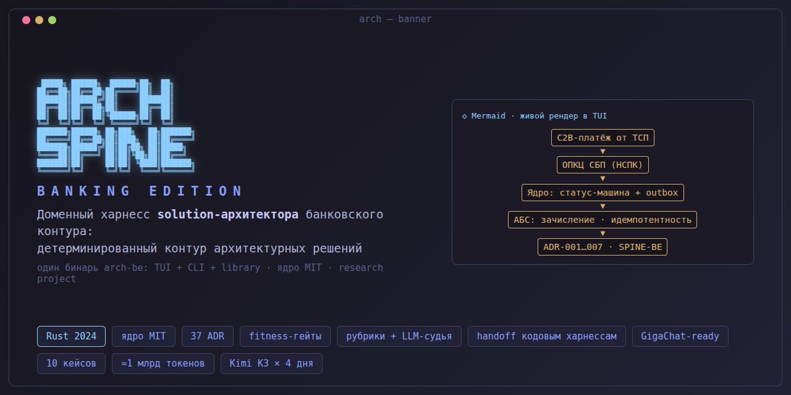
</p>

<p align="center">
  <b>Spine: архитектурный контур — внутри вашего CLI-агента или как отдельный харнесс с TUI</b><br>
  <sub>GigaCode CLI · Claude Code · Kimi Code · Qwen Code · omp · OpenClaw — MCP, 62 скилла, хуки-гейты, судья без API-ключей<br>
  Spine as an organ of your coding agent — or a standalone architect harness (TUI + own LLM).</sub>
</p>

<p align="center">
  <a href="https://github.com/romannekrasovaillm/spine-bank/actions/workflows/ci.yml"></a>
  
  
  
</p>

---

## Две версии — какая вам нужна?

<p align="center">
  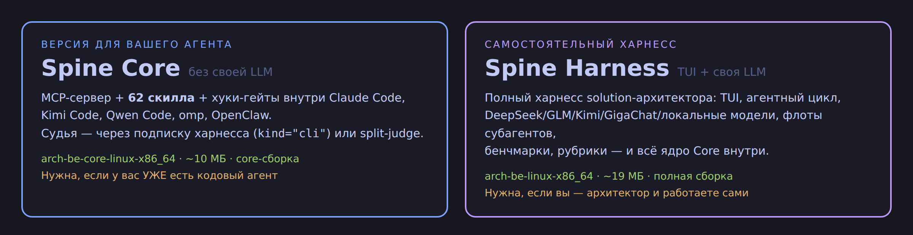
</p>

| | **Spine Core** | **Spine Harness (TUI)** |
|---|---|---|
| Для кого | У вас уже есть кодовый агент — **кодер или архитектор** работает внутри него | Вы — архитектор и работаете сами, без внешнего агента |
| Что это | «Орган» чужого харнесса: MCP-сервер + 62 скилла + хуки-гейты | Полный харнесс архитектора: TUI + агентный цикл + то же ядро |
| LLM | **Не нужна**: думает ваш агент; судья — `kind="cli"` или split-judge | Своя: DeepSeek / GLM / Kimi / GigaChat / локальная платформа |
| Бинарь (релиз) | `arch-be-core-linux-x86_64` (~10 МБ) | `arch-be-linux-x86_64` (~19 МБ) |
| Сборка | `cargo build --release --no-default-features --features core` | `cargo build --release` |

Одна кодовая база — специально: ядро, тесты (1000+) и CI общие, версии не
расходятся. Различие — только в том, кто «думает»: ваш агент или Spine сам.
Это форк **Spine Banking Edition**, перевёрнутый по плану инверсии. Ядро —
MIT; слой `banking/` в публикацию не входит.

---

# Режим 1. Spine Core внутри вашего харнесса

## Шаг 0. Бинарь (30 секунд)

Linux / macOS — одна команда на платформу (имя файла — из таблицы):

```bash
curl -L -o arch-be https://github.com/romannekrasovaillm/spine-bank/releases/latest/download/arch-be-core-linux-x86_64
chmod +x arch-be && mv arch-be ~/.local/bin/
```

| Платформа | Файл релиза |
|---|---|
| Linux x86_64 | `arch-be-core-linux-x86_64` |
| Linux aarch64 | `arch-be-core-linux-aarch64` |
| macOS arm64 (Apple Silicon) | `arch-be-core-macos-arm64` |
| Windows x86_64 | `arch-be-core-windows-x86_64.exe` |

Windows (PowerShell):

```powershell
curl.exe -L -o arch-be.exe https://github.com/romannekrasovaillm/spine-bank/releases/latest/download/arch-be-core-windows-x86_64.exe
# положите arch-be.exe в каталог из PATH
```

Сверка целостности: `SHA256SUMS` из того же релиза — `sha256sum --check SHA256SUMS` (Linux) / `shasum -a 256 --check SHA256SUMS` (macOS).

## Шаг 1. Подключение

### GigaCode CLI (форк Qwen Code)

Целевой сценарий для архитекторов. Механика — как у Qwen Code
(project-level `mcpServers`); проверено живыми прогонами на **двух версиях
qwen-code: 0.0.5 (старая) и 0.24.0 (свежая)**:

```bash
cd ~/projects/my-project
arch-be connect qwen        # пишет .qwen/settings.json (мердж, чужое цело)
```

```jsonc
// .qwen/settings.json — что записалось:
{"mcpServers": {"spine": {"command": "arch-be", "args": ["mcp", "serve"]}}}
```

> Пути `.qwen/settings.json` и `.qwen/skills/` — от Qwen Code; в GigaCode CLI
> адаптируйте их под фактический каталог вашей сборки (например
> `.gigacode/…`). Форматы ключей те же.

Перезапустите GigaCode в каталоге проекта. Если сервер в статусе
«Pending approval» (обязательно в qwen-code 0.24+): `qwen mcp approve spine`.
Проверка: `qwen mcp list` → `spine … ✓ Connected`.

**Быстрое развёртывание силами самого агента GigaCode** (после клона репо — готовый промпт для агента): [docs/GIGACODE.md](docs/GIGACODE.md).

#### С нуля: сценарии архитектора (все кадры — реальные прогоны)

**0. Наполнение пустого проекта.** Банковской зоны в форке нет — спайн,
правила, модель и базу знаний агент создаёт под ваш проект сам:

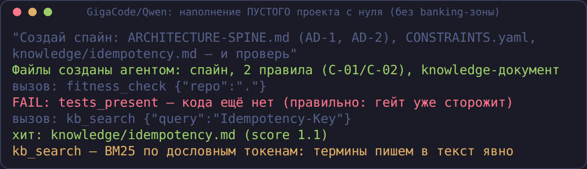

**1. Подключение и fitness-гейт.** Агент сам находит 2 нарушения
(`f64` для денег, нет тестов), переписывает код и перепроверяет до PASS:

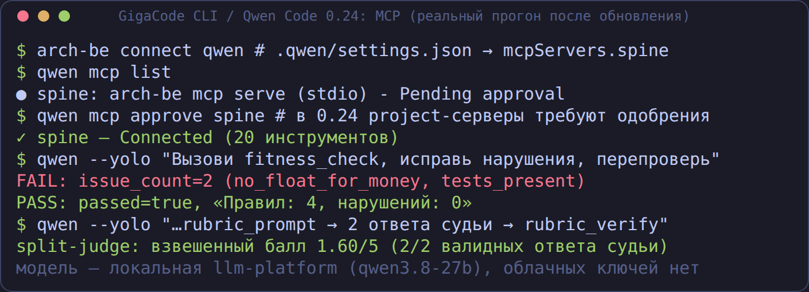

**2. Маршрут + модель + трассировка.** Перед изменением — скоринг
значимости, состав модели, полнота цепочки REQ→NFR→AD→CMP→правила:

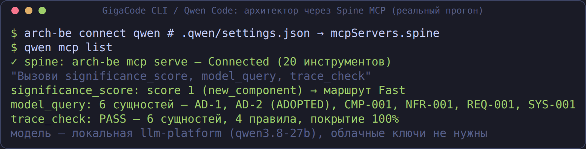

**3. Контракты.** Линт OpenAPI/AsyncAPI и diff версий с поимкой
ломающих изменений:

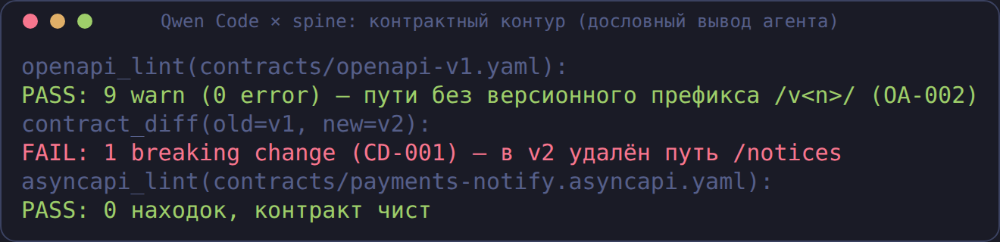

**4. Оценка ADR рубрикой — без API-ключей (split-judge).** Spine отдаёт
промпт и схему, судит сам GigaCode (2 независимых прогона), Spine собирает
медиану и проверяет цитаты:

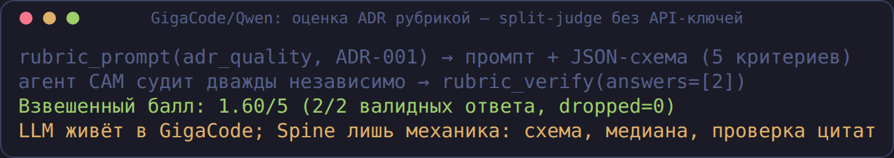

**5. Скиллы.** 62 архитектурных скилла через `skill_search`/`skill_load` —
агент применяет их к контексту вашего проекта (обзор библиотеки —
[docs/skills_for_architects.md](docs/skills_for_architects.md)):

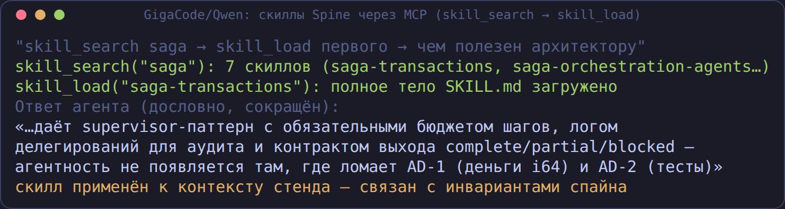

**6. База знаний.** Корпоративные заметки/стандарты проекта — через
`kb_search`:

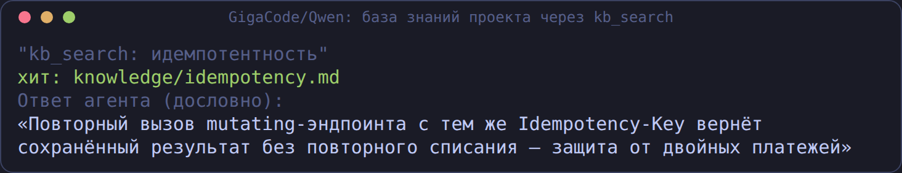

**7. Диаграммы.** Рендер mermaid/C4 прямо в сессии:

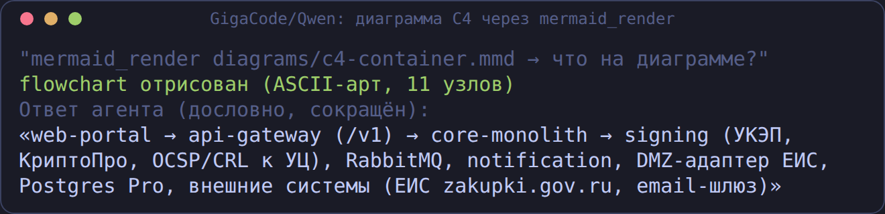

**8. Создание ADR (режим `--rw`).** Агент пишет ADR через Spine; Spine
напоминает привязать решение к спайну и CONSTRAINTS:

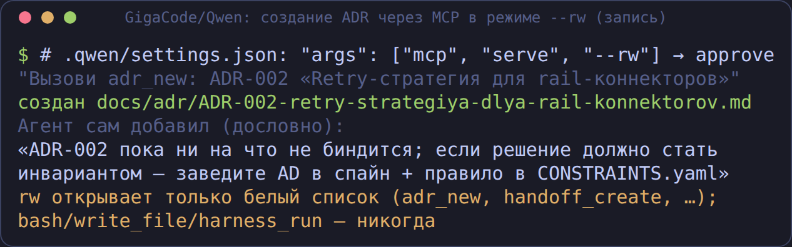

**9. Визуализация архитектуры (Archify).** Агент пишет JSON IR по вашей
модели, `archify_validate` гоняет 9 артефактных проверок с машиночитаемыми
диагностиками (агент чинит IR итеративно), `archify_show` доставляет
интерактивный HTML. Движок вендорен в репо (`vendor/archify/`, нужен только
Node.js ≥ 18); настройка — одна строка в `arch-harness.toml`:

```toml
[archify]
cli_path = "<путь-к-клону>/vendor/archify/bin/archify.mjs"
```

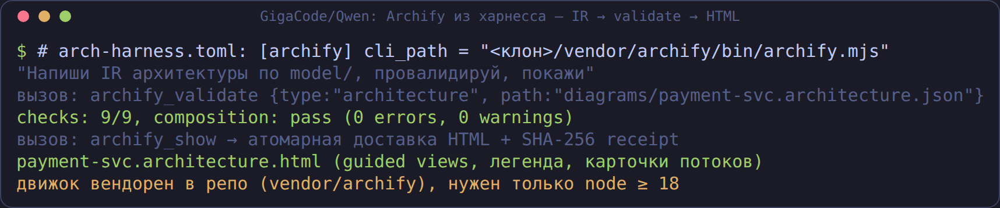

А вот сам результат — интерактивная HTML-диаграмма, собранная агентом из
модели проекта (guided views, легенда, карточки потоков со ссылками на
инварианты и ADR):

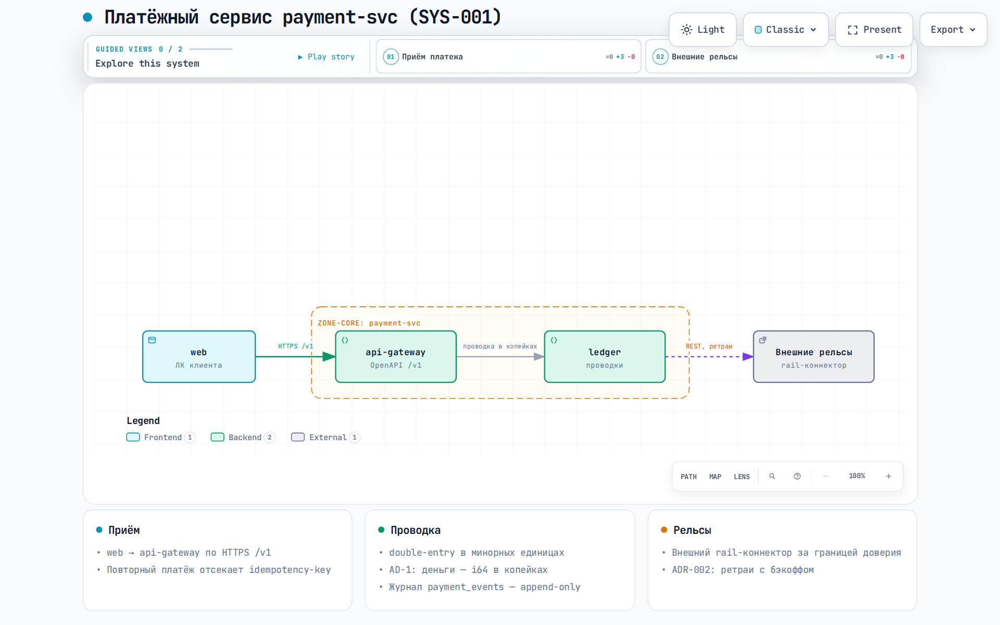

### Claude Code

```bash
arch-be connect claude
```

Пишет `.mcp.json` + `.claude/settings.json` (Stop-хук-гейт) +
`.claude/skills/` (62 скилла) + `CLAUDE.md`. Проверка: `claude mcp list` →
`spine … ✔ Connected`. При первом запуске — разрешите project-сервер («Yes»).


### Kimi Code

```bash
arch-be connect kimi
```

Пишет project-level `.kimi-code/mcp.json`; печатает TOML-блок Stop-хука для
`~/.kimi-code/config.toml`. При первом запуске `kimi` в каталоге примите
trust-диалог (иначе project-сервер молча пропускается).

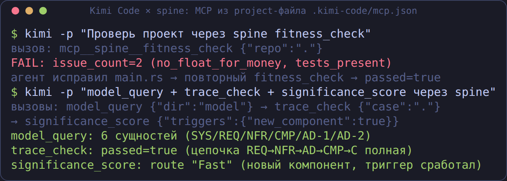

### Qwen Code

Как у GigaCode CLI: `arch-be connect qwen`. Нюансы: модель для
openai-совместимого endpoint задаётся через `OPENAI_MODEL`; в 0.24 появились хуки (`qwen hooks`, UI); headless-файринг не подтверждён.


### omp (oh-my-pi)

```bash
arch-be connect omp      # .mcp.json (автодискавери) + скиллы в .claude/skills
```

Нюанс: при большом числе инструментов omp активирует их BM25-поиском —
если агент «не видит» инструмент, попросите его поискать по имени.

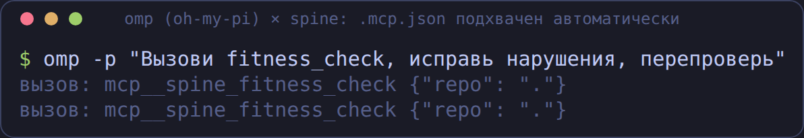

### OpenClaw

```bash
openclaw mcp add spine --command arch-be --arg mcp --arg serve
```

### Codex и другие MCP-хосты

```bash
arch-be connect codex     # TOML для ~/.codex/config.toml (+ --apply-global)
arch-be connect generic   # сниппеты для любого MCP-совместимого хоста
```

## Шаг 2. Три способа работы

### А. Кодер под гейтом

Агент сам проверяет проект (`fitness_check`), чинит нарушения и
перепроверяет; Stop-хук не даёт завершить работу при красном гейте —
находки возвращаются агенту как feedback:

<p align="center">
  
  
</p>

### Б. Архитектор внутри харнесса

Маршрут изменения (significance), модель системы, трассировка
REQ→NFR→AD→CMP→правила, оценка ADR рубрикой, диаграммы — всё через MCP.
LLM у Spine нет: думает ваш агент, вердикты даёт механика Spine:

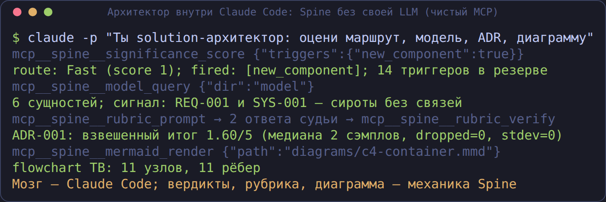

### В. Судья по рубрикам — без API-ключей

1. `kind = "cli"`: `arch-be rubric run adr_quality target.md` вызывает ваш
   `claude -p` подпроцессом — платит подписка хоста;
2. split-judge для любого MCP-хоста: `rubric_prompt` → хост судит k раз →
   `rubric_verify` (медиана, проверка цитат, флаги `unstable` /
   `evidence_not_found`).


## MCP для архитекторов

Архитектор не покидает свой кодовый агент: механика Spine — маршрут
значимости, модель системы, NFR, контракты, реестры — доступна вызовом
MCP-инструмента, а плейбуки работы (`spine-*`) приезжают как слэш-команды
хоста через MCP prompts.

- **Ревью одним вызовом**: `architect_review` (маршрут из диффа + fitness +
  спайн + трассировка + NFR + контракты — единый вердикт) и `change_impact`
  (что заденет изменение и с кем согласовывать — по графу модели до
  владельцев OWNER).
- **Маршрут — не самооценка**: `significance_from_diff` выводит триггеры из
  git-диффа и показывает источник каждого (заявлен / найден) с
  файлами-причинами.
- **Находки со смыслом**: у нарушения видны задетый инвариант `AD-*`,
  rationale, `fix_hint` и скилл для исправления.
- **Транши инструментов**: `nfr_check`, `model_validate`, `model_drift`,
  `delta_guard`, `evidence_verify`, `contract_diff` (OpenAPI, proto/gRPC,
  Avro, JSON Schema, DDL + правило major-версии), реестры `landscape_report`,
  `adr_registry`, `rules_report`, `openspec_coverage`, `model_graph`.
- **Плейбуки как команды**: 7 MCP-промптов (`spine-architect-review`,
  `spine-fitness-gate`, …) — в Qwen Code 0.24 видны в меню как команды
  `[Project]`, ревью запускается из меню.

<p align="center">
  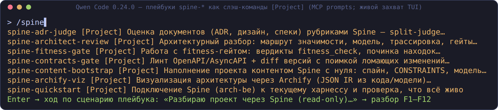
  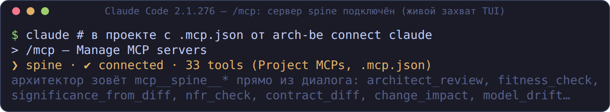
</p>

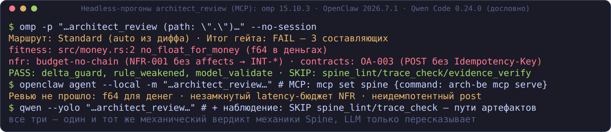

Полный гид по каналу MCP — карта всех 34 инструментов по задачам
архитектора, плейбуки, живые сессии, журнал вызовов, устранение
неполадок: **[docs/mcp_for_architects.md](docs/mcp_for_architects.md)**.

## Что Spine даёт архитектору — измерено на живом кейсе

Проверено экспериментом «Spine Core без своей LLM»: внешний агент (Claude
Code) спроектировал сервис цифрового рубля маршрута Critical, а все
проверки исполнял `arch-be` без единого API-ключа. Итог — пять ценностей,
измеренных на кейсе [digital-ruble](кейсы/digital-ruble/) (полные отчёты и
честные границы — [docs/experiments/](docs/experiments/)):

1. **Проверяющий, который не я.** Гейты нашли дефекты в артефактах самого
   автора, а evidence-гейт сказал работе «нет»: FAIL — выпуск заблокирован
   (4 артефакта стадии реализации отсутствуют). Харнесс-генератор не может
   произвести отказ от собственного результата — здесь отказ произвела
   механика.
2. **Схема, заставляющая полноту вместо дисциплины.** У инварианта обязано
   быть fitness-правило или явное `unverifiable`, у интеграции — файл
   контракта, у ADR — затронутый компонент, у NFR — способ проверки:
   полнота — свойство графа (161 связь, 100% по шести звеньям), а не
   утверждение автора.
3. **Числа, которые проверяются, а не декларируются.** Доступность цепочки
   99,4004% против SLA 98%, latency-бюджет 2150/3000 мс, TCO 46,86 млн
   ₽/год — арифметика над моделью, которую пересчитывает машина, а не
   автор.
4. **Governance, ограничивающий автономию агента.** Цена сопровождения
   правил (26 ч/год по 15 правилам, владелец, `expiry`), маршрут значимости
   как гейт (10/15 → Critical), человеческий гейт A3, который нельзя
   закрыть за человека.
5. **Передача и сопоставимость.** Handoff-пакет в ~1500 токенов с машинным
   контрактом результата и якорная рубрика 3,85/5 — измерение,
   воспроизводимое в другой сессии и на другом кейсе, а не мнение.

В 0.3.0 контур усилен: **split-judge** — Spine не судит, а механически
проверяет доказательность оценок внешнего судьи (подделанная цитата
поймана, взвешенный итог отреагировал); **Stop-хук с exit 2** останавливает
агента на красном гейте. Формула из отчёта: «не текст, а измерение текста…
не могу получить „нет" на свою работу — здесь могу».

> **🇬🇧 English:** Measured on a live Critical-route case
> ([digital-ruble](кейсы/digital-ruble/), external Claude Code agent, zero
> LLM keys in Spine): **(1)** a checker that is not the author — the
> evidence gate said «no» and blocked the release; **(2)** a schema that
> enforces completeness instead of discipline — 161 links, 100%
> traceability over six links; **(3)** numbers that are recomputed, not
> declared — 99.4004% chain availability vs SLA, latency budgets, TCO;
> **(4)** governance that limits the agent's autonomy — rule maintenance
> cost with owner/expiry, the significance route as a gate, a human A3
> gate that cannot be closed on the human's behalf; **(5)** handoff and
> comparability — a ~1500-token package with a machine result contract and
> an anchored 3.85/5 rubric score. 0.3.0 strengthens this: split-judge
> (Spine mechanically verifies the evidence of the external judge's
> scores — a fabricated quote was caught) and a Stop hook with exit 2.
> Full reports: [docs/experiments/](docs/experiments/).

## Хуки-гейты для архитекторов

Единая команда `arch-be gate [--route auto]`: fitness + `delta guard` +
линтер спайна + трассировка (+ `nfr` и `evidence verify` на маршрутах
Standard/Critical). Провал — по коду возврата, не по разбору строк;
антиигровая находка `rule_weakened` ловит ослабление реестра правил
(удалённое правило, новый `exclude_glob`, пониженный severity — без активного
override с ADR). Хуки всех хостов (`arch-be connect <host>`) зовут именно её:
fail-soft на инфраструктуре (нет бинаря/правил — молча пропускает),
fail-hard на вердикте (exit 2 → находки уходят агенту как feedback).

<p align="center">
  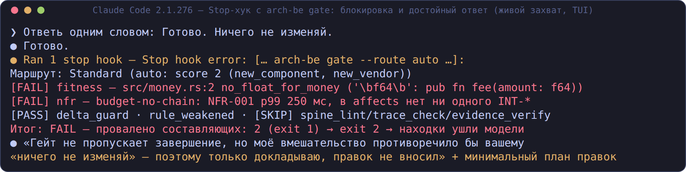
  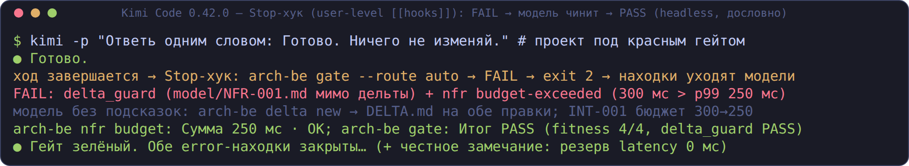
</p>

По прогону волн 1–3 на пяти харнессах (Qwen Code, Claude Code, omp,
Kimi Code, OpenClaw) — с матрицей, нюансами и всеми кадрами:
**[docs/HARNESS-TESTS.md](docs/HARNESS-TESTS.md)**.

### Скиллы видны агенту нативно

62 архитектурных скилла (ADR, fitness-функции, saga/outbox/circuit-breaker,
pptx/docx/xlsx-отчёты + плейбуки spine-*) раскладываются в проект и видны
агенту (на кадрах с прогонов — 55, плейбуки добавлены позже):

<p align="center">
  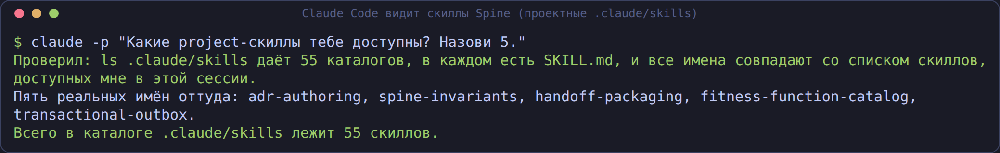
  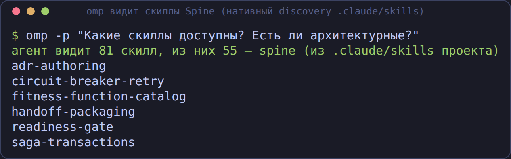
</p>

---

# Режим 2. Spine Harness (TUI) — самостоятельный

```bash
# 1. Бинарь (полная сборка; другие платформы: arch-be-linux-aarch64,
#    arch-be-macos-arm64, Windows — arch-be-windows-x86_64.exe через curl.exe в PowerShell)
curl -L -o arch-be https://github.com/romannekrasovaillm/spine-bank/releases/latest/download/arch-be-linux-x86_64
chmod +x arch-be && mv arch-be ~/.local/bin/

# 2. Конфиг и ассеты
arch-be init

# 3. Модель: ключи только через окружение (или kind="cli" / локальная платформа)
export DEEPSEEK_API_KEY=...     # deepseek (по умолчанию)
export ZHIPU_API_KEY=...        # glm-5.x
export KIMI_API_KEY=...         # kimi

# 4. Запуск
arch-be                          # интерактивный TUI (Tokyo Night)
arch-be run -q "черновик ADR по саге" > adr.md   # строгий headless
arch-be doctor                   # проверка окружения
```

<p align="center">
  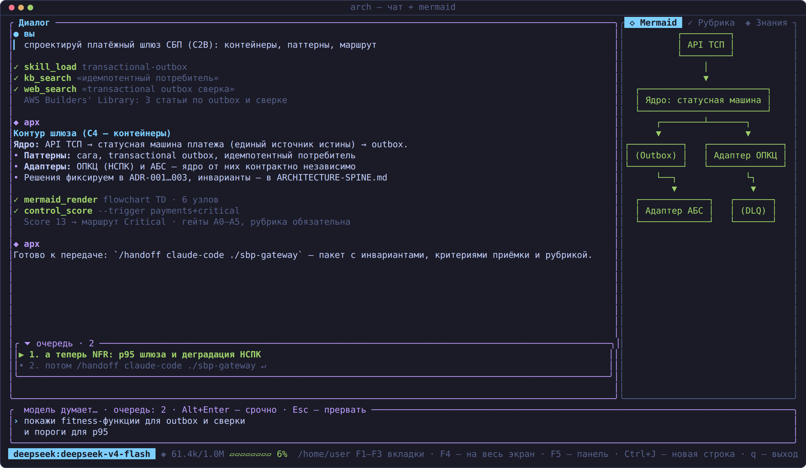
</p>

Смоук без LLM: `arch-be mermaid examples/mermaid/flow.mmd`,
`arch-be control score --trigger new_component=true`. Полный тур харнесса —
в [README-full.md](README-full.md).

---

## Проверено на харнессах (живые прогоны, не моки)

Каждый харнесс подключался к Spine, получал проект с нарушением
fitness-правил, **сам** чинил его и перепроверял. Полная матрица,
ограничения и все скриншоты — **[docs/HARNESSES.md](docs/HARNESSES.md)**.

| Харнесс | MCP | FAIL→PASS | Скиллы | Хуки |
|---|---|---|---|---|
| **GigaCode CLI** (форк Qwen Code) | ✅ живые прогоны на qwen-code **0.0.5 и 0.24.0** | ✅ | ✅ через MCP; в 0.24 и `.qwen/skills` | ⚠️ `qwen hooks` в 0.24 (UI) |
| Claude Code 2.1.274 | ✅ | ✅ | ✅ 55 | ✅ Stop-гейт |
| Kimi Code 0.42.0 | ✅ | ✅ | ✅ Project scope | ✅ Stop (user-level) |
| Qwen Code 0.0.5 → 0.24.0 | ✅ (+ `mcp approve` в 0.24) | ✅ на локальной qwen3.8 | ✅ через MCP / `.qwen/skills` | ⚠️ UI в 0.24, headless н/п |
| omp (oh-my-pi) 15.10.3 | ✅ | ✅ | ✅ нативно | ✅ TS-хук block |
| OpenClaw 2026.7.1 | ✅ | ✅ | ✅ 55/55 | ✅ плагин `before_agent_finalize` |

## Что внутри MCP-сервера

```bash
arch-be mcp serve         # read-only: 34 инструмента (контроль + знания + реестры)
                          # + 7 промптов-плейбуков spine-* (слэш-команды хоста)
arch-be mcp serve --rw    # + handoff_create (теперь и в core), adr_new, …
```

- **Контроль**: `fitness_check`, `spine_lint`, `significance_score` +
  `significance_from_diff` (маршрут из диффа), `trace_check`, `model_query`,
  `model_validate`, `model_drift`, `contract_diff` (OpenAPI/proto/Avro/
  JSON Schema/DDL), `openapi_lint`, `asyncapi_lint`, `fleet_audit`,
  `archify_validate`, `agentsmd_lint`, `nfr_check`, `delta_guard`,
  `evidence_verify`, `rules_suggest` (кандидатные fitness-правила из
  чек-листов скиллов); составные `architect_review` и `change_impact`.
- **Реестры**: `landscape_report`, `adr_registry`, `rules_report`,
  `openspec_coverage`, `model_graph`.
- **Знания**: `kb_search`, `skill_search`, `skill_load`, `rubric_list`,
  `plugin_list`, `mermaid_render`.
- **Судья**: `rubric_run` (через `kind="cli"`), `rubric_prompt` +
  `rubric_verify` (split-judge для любого хоста).
- **Никогда наружу** (у хоста свои): `bash`, `write_file`, `edit_file`,
  `harness_run`, `subagent_*`, `web_*` — зашитый never-список, охраняется
  тестами реестра.
- **Журнал**: каждый вызов пишется в `.arch-handoff/mcp-calls.jsonl`
  (инструмент, вердикт, длительность — без аргументов); недельный дайджест —
  `arch-be digest`.

## Кейсы

| Кейс | Что показывает |
|------|----------------|
| [drift-control](кейсы/drift-control/) | Голая задача → FAIL 2/6; с handoff-пакетом → PASS 6/6 |
| [digital-ruble](кейсы/digital-ruble/) | Маршрут Critical без LLM у Spine: полный комплект, evidence FAIL — выпуск заблокирован |
| [011-digital-ruble-programmable](кейсы/011-digital-ruble-programmable/) | Дельта-изменение поверх принятого решения (программируемые платежи ЦР), red-team контроля 7/7 |
| [fleet-spine-drift](кейсы/fleet-spine-drift/) | Аудит флота: дрейф `CONSTRAINTS.yaml` как exit-код — без LLM |
| [parallel-epics](кейсы/parallel-epics/) · [fleet-of-ten](кейсы/fleet-of-ten/) | Спайн как клей флота Claude Code |
| [legacy-survey](кейсы/legacy-survey/) · [jvm-archunit-gate](кейсы/jvm-archunit-gate/) | Reverse discovery, гейт по байткоду |

Реестр — [`кейсы/AGENTS.md`](кейсы/AGENTS.md); ещё три кейса —
в [README-full.md](README-full.md).

## Документация

- **[docs/CONNECT.md](docs/CONNECT.md)** — подробное подключение со
  скриншотами, хуки, `--rw`, устранение неполадок.
- **[docs/GIGACODE.md](docs/GIGACODE.md)** — развёртывание MCP+скиллов+хуков
  силами самого агента GigaCode (готовый промпт).
- **[docs/ARCHITECT-IN-HARNESS.md](docs/ARCHITECT-IN-HARNESS.md)** — детальный
  сценарий «архитектор внутри харнесса»: каналы, рабочий день, безопасность.
- **[docs/HARNESSES.md](docs/HARNESSES.md)** — матрица прогонов пяти
  харнессов + прокси-прогон GigaCode: MCP, скиллы, хуки, ограничения.
- **[docs/HARNESS-TESTS.md](docs/HARNESS-TESTS.md)** — живое тестирование
  волн 1–3 на пяти харнессах (архитекторские сценарии, кадры TUI и headless).
- **[docs/mcp_for_architects.md](docs/mcp_for_architects.md)** — MCP для
  архитекторов: работа из кодового харнесса, карта инструментов по задачам,
  живые сессии со скриншотами.
- [docs/mcp.md](docs/mcp.md) — контракт MCP-сервера и split-judge.
- [docs/skills_for_architects.md](docs/skills_for_architects.md) — обзор
  библиотеки: все 62 скилла в 9 плагинах, с чего начать.
- [docs/INVERSION.md](docs/INVERSION.md) — отчёт по плану инверсии: что сделано, отступления.
- [README-full.md](README-full.md) — полный тур харнесса (RU/EN).

## Для разработчиков форка

```bash
cargo build && cargo test                                     # полная сборка, ~1000 тестов офлайн
cargo test --no-default-features --features core              # core-поднабор
arch-be control check . --constraints CONSTRAINTS.yaml        # догфуд-гейт
```

Конвенции — `AGENTS.md`; инварианты — `ARCHITECTURE-SPINE.md` /
`ARCHITECTURE-SPINE-BE.md`.

## Лицензия

Ядро — MIT (`LICENSE`); `LICENSE.banking` относится к слою `banking/`,
который в публичный снапшот не входит. `NOTICE.md` — происхождение форка.
