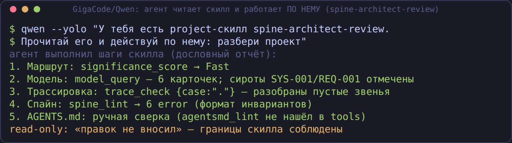
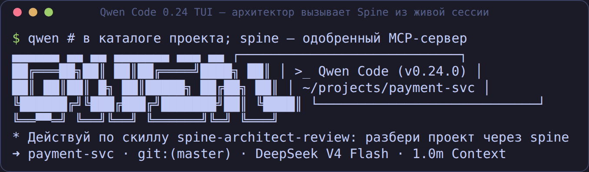
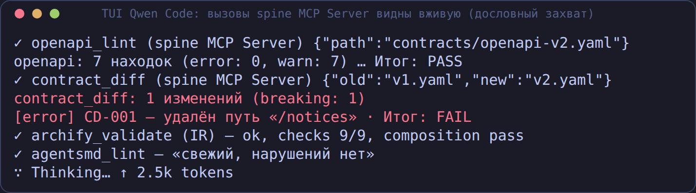
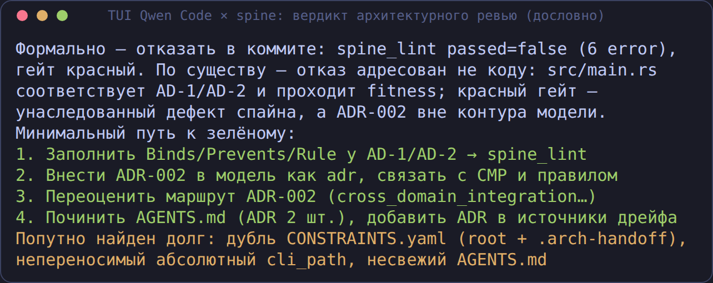
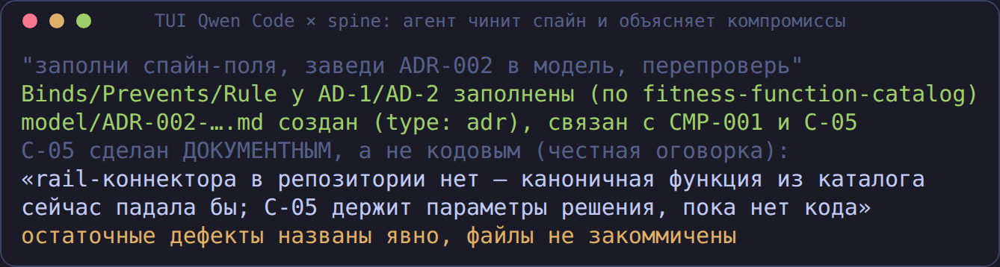

# Архитектор внутри кодового харнесса: полный сценарий работы со Spine

Это детальный разбор главного сценария форка: **архитектор работает из
своего CLI-агента** (GigaCode CLI, Claude Code, Kimi, Qwen, omp, OpenClaw),
а Spine внутри него даёт детерминированный контур — без собственной LLM.
Всё показанное снято с реальных прогонов (GigaCode-путь — на qwen-code
0.0.5 и 0.24.0; источники кадров — `screenshots/harnesses/sessions/`).

## Три канала, которыми Spine сидит в харнессе

| Канал | Что это | Куда попадает |
|---|---|---|
| **MCP** | 34 read-only инструмента (+10 под `--rw`): гейты, трасса, модель, контракты, NFR, evidence, реестры, знания, судья-механика | `.mcp.json` / `.qwen/settings.json` / `.kimi-code/mcp.json` |
| **Скиллы** | 62 SKILL.md: методы (ADR, saga, fitness…) + **плейбуки работы со Spine** (`spine-*`) | `.claude/skills`, `.qwen/skills`, `.kimi-code/skills`, workspace OpenClaw |
| **Хуки** | Гейт на событиях харнесса: Stop (Claude/Kimi), TS-хук (omp), плагин (OpenClaw) | `settings.json` / `--hook` / плагин |

Агент не просто «может вызвать инструмент» — он **читает плейбук-скилл и
работает по нему**. Реальный трейс (qwen 0.24.0): агенту сказали
«действуй по скиллу spine-architect-review» — и он пошагово сделал разбор
(маршрут → модель → трасса → спайн), отчитавшись по шагам:



## Подготовка (2 минуты)

```bash
curl -L -o arch-be https://github.com/romannekrasovaillm/spine-bank/releases/latest/download/arch-be-core-linux-x86_64
chmod +x arch-be && mv arch-be ~/.local/bin/
cd ~/projects/my-project
arch-be connect qwen          # GigaCode/Qwen; также: claude, kimi, omp, codex
qwen mcp approve spine        # qwen-code ≥ 0.24: project-серверы требуют одобрения
```

## Рабочий день архитектора — по сценариям

### 0. Живая TUI-сессия (Qwen Code ⇐ путь GigaCode)

Не headless, а обычный интерактивный запуск: архитектор открывает Qwen Code
в проекте и просит разбор — агент идёт по плейбук-скиллу, вызовы
`spine MCP Server` видны вживую, вердикт ревью — с конкретным путём к
зелёному гейту (всё ниже — дословные захваты реальной TUI-сессии на
qwen-code 0.24.0):







Второй ход той же сессии — агент чинит спайн (и честно докладывает
компромиссы: документное правило вместо кодового, остаточный долг):



### 1. Пустой проект: наполнить контур

Плейбук `spine-content-bootstrap`: агент сам создаёт спайн инвариантов,
`CONSTRAINTS.yaml`, `model/`, `knowledge/` — и сразу проверяет:


### 2. Разбор проекта

Плейбук `spine-architect-review`: маршрут значимости (с оговоркой про
триггеры), инвентаризация модели (сироты!), трассировка
REQ→NFR→AD→CMP→правила:


### 3. Решение: ADR и его оценка

Создать ADR — `adr_new` (сервер в `--rw`); оценить — split-judge
(`rubric_prompt` → агент судит k раз → `rubric_verify`), без единого
API-ключа у Spine:


### 4. Контракты до релиза

Плейбук `spine-contracts-gate`: линт + diff версий, ломающие изменения
называются ломающими:


### 5. Визуализация

Плейбук `spine-archify-viz`: IR из модели → 9 проверок → интерактивный HTML:


### 6. Гейт для кодера

Когда пишется код: `fitness_check` FAIL → агент чинит → PASS; Stop-хук не
даёт завершить при красном гейте (плейбук `spine-fitness-gate`):


## Под капотом (что гарантирует безопасность)

- **Read-only по умолчанию**: `--rw` открывает только белый список
  (`adr_new`, `handoff_create`, `agentsmd_generate`, `skill_distill`,
  `archify_*`, `reverse_survey`, `evidence_pack`, `delta_propose`), а
  `bash`/`write_file`/`harness_run`/`subagent_*`/`web_*`
  закрыты навсегда (never-список + охранные тесты реестра).
- **Политика R-уровней** работает и внутри MCP-моста: RequireConfirm в
  неинтерактиве = отказ с пояснением.
- **Хуки fail-soft на инфраструктуру** (нет бинаря/правил — молча пропуск)
  и **fail-hard на вердикте** (FAIL блокирует завершение).
- **Судья механический**: Spine считает медиану и проверяет цитаты
  дословно по тексту — подделать «4/5 в целом норм» нельзя.

## FAQ архитектора

**Где тут LLM?** У вашего харнесса. Spine — только детерминированная
механика: гейты, схемы, медианы, проверки цитат.

**Что если мой харнесс не умеет MCP?** Всё то же доступно CLI:
`arch-be control check .`, `arch-be trace check .`, `arch-be model …`,
`arch-be rubric …` — MCP лишь тонкая обёртка.

**Чем это отличается от «просто попросить агента быть внимательным»?**
Вердикт считает код, а не модель: правило либо сработало по файлу, либо
нет. Модель может ошибиться в выводах — но не может «замять» красный гейт.

Полная матрица по харнессам — [HARNESSES.md](HARNESSES.md); подключение —
[CONNECT.md](CONNECT.md); быстрое развёртывание силами агента GigaCode —
[GIGACODE.md](GIGACODE.md).
