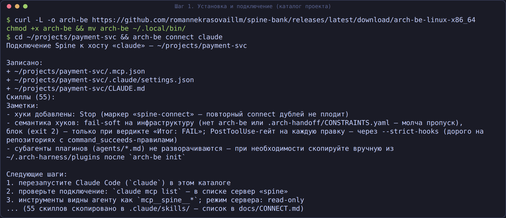
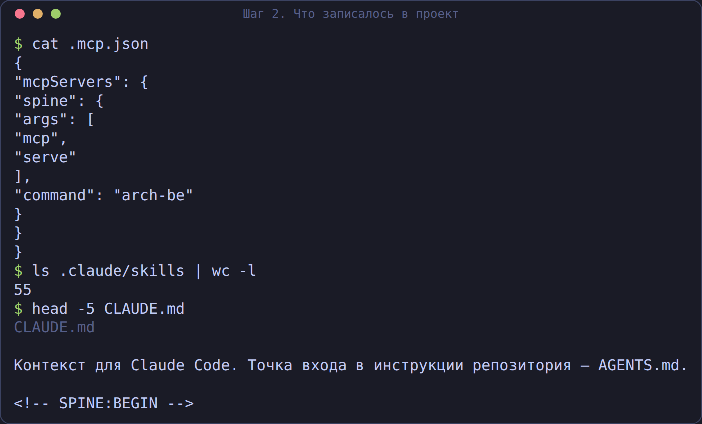
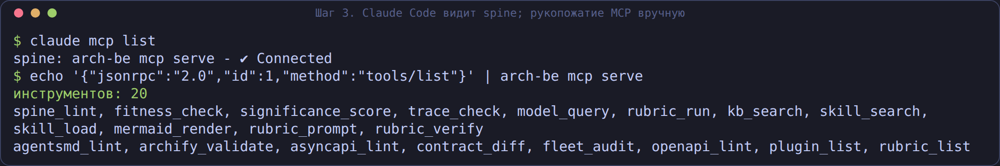
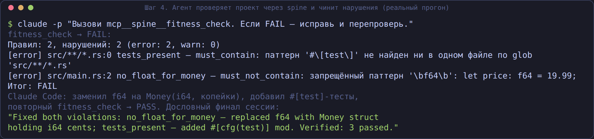
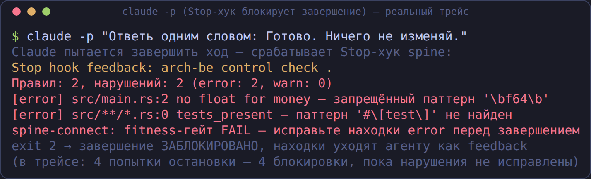
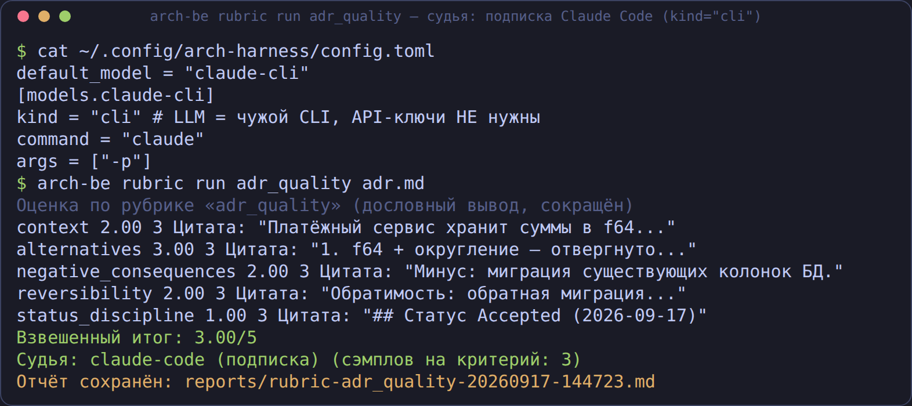

# Подключение Spine к вашему CLI-агенту

Пошаговое руководство для коллег: как подключить архитектурный контур Spine
(`arch-be`) к Claude Code, Qwen Code, Codex, Kimi Code, oh-my-pi (omp) или
любому MCP-совместимому агенту. Ни одного API-ключа LLM не потребуется —
модель даёт ваш агент, Spine даёт контроль, знания и гейты.

## 0. Установка

Готовый бинарь (Linux x86_64) — из раздела Releases:

```bash
curl -L -o arch-be https://github.com/romannekrasovaillm/spine-bank/releases/latest/download/arch-be-linux-x86_64
chmod +x arch-be && mv arch-be ~/.local/bin/
arch-be doctor    # проверка окружения (ключи LLM НЕ нужны — это нормально)
```

Или сборка из исходников (нужен Rust ≥ 1.85):

```bash
git clone https://github.com/romannekrasovaillm/spine-bank.git
cd spine-bank
cargo build --release --no-default-features --features core   # слим-сборка
ln -sf "$PWD/target/release/arch-be" ~/.local/bin/arch-be
```

## 1. Подключение одной командой

В корне проекта, который должен контролировать Spine:

```bash
arch-be connect claude      # Claude Code — полное подключение
arch-be connect qwen        # Qwen Code — .qwen/settings.json
arch-be connect codex       # Codex — печать TOML-блока (+ --apply-global)
arch-be connect kimi        # Kimi Code — проектный .kimi-code/mcp.json
arch-be connect omp         # oh-my-pi — .mcp.json + скиллы (если нет .claude/skills)
arch-be connect generic     # любой MCP-хост — все сниппеты на печать
```

| Хост | Что пишется в проект | Что печатается |
|---|---|---|
| `claude` | `.mcp.json`, `.claude/settings.json` (хуки), `.claude/skills/`, `CLAUDE.md` | следующие шаги |
| `qwen` | `.qwen/settings.json` (мердж `mcpServers`) | скиллы и хуки — сниппеты (layout не подтверждён) |
| `codex` | ничего (с `--apply-global` — `~/.codex/config.toml`) | TOML-блок для `~/.codex/config.toml` |
| `kimi` | `.kimi-code/mcp.json` (мердж; с `--apply-global` — ещё и `~/.kimi-code/mcp.json`) | JSON-блок user-level, TOML-блок хука для `~/.kimi-code/config.toml`, напоминание про trust-диалог |
| `omp` | `.mcp.json` (мердж); скиллы в `.claude/skills/` — только если каталога ещё нет | автодискавери `.mcp.json`; хуки — TS-расширения `omp --hook <file.ts>` |
| `generic` | ничего | все сниппеты для ручной установки |



Команда **идемпотентна** (повторный запуск не плодит дубли), **не затирает
чужое** (мердж `.mcp.json` и `settings.json` с сохранением ваших серверов и
хуков), имеет `--dry-run` (напечатать план, ничего не писать) и `--rw`
(открыть записывающие инструменты — см. §4).

Что появляется в проекте (на примере Claude Code):



### Kimi Code

`arch-be connect kimi` пишет проектный `.kimi-code/mcp.json` (мердж
`mcpServers.spine`, чужие серверы сохраняются; проектная запись перекрывает
одноимённую пользовательскую — так устроен Kimi Code). Поле `cwd` не
записывается: сервер наследует рабочий каталог харнесса.

Дополнительно печатаются:

- блок для ручной регистрации на пользовательском уровне
  (`~/.kimi-code/mcp.json`, общий для всех проектов) — запись туда с
  мерджем и бэкапом делает `arch-be connect kimi --apply-global`;
- TOML-блок Stop-хука для `~/.kimi-code/config.toml` (проектных хуков у
  Kimi Code нет): `[[hooks]]` с той же командой-гейтом
  `arch-be gate --route auto`, что у Claude Code (exit 2 = блок, stderr
  уходит модели).

При первом запуске `kimi` в каталоге появится trust-диалог со списком
project-level MCP-серверов — подтвердите «Trust this folder» (в
untrusted-папке project MCP не стартует, это штатная защита). Проверка
подключения: команда `/mcp` в TUI.

### oh-my-pi (omp)

`arch-be connect omp` пишет проектный `.mcp.json` формата Claude Desktop —
omp дискаверит его автоматически, отдельная регистрация не нужна. Скиллы
omp читает нативно из `.claude/skills/`: если такого каталога в проекте
ещё нет, connect раскладывает туда встроенные скиллы (как для Claude
Code); каталог уже есть — не трогается, чтобы не перетирать вашу
библиотеку. Хуков через connect нет: механизм хуков omp —
TypeScript-расширения, подключаемые флагом `omp --hook <file.ts>`;
команда-гейт для такого расширения — `arch-be gate`.

## 2. Проверка подключения

```bash
claude mcp list
# spine: arch-be mcp serve - ✔ Connected
```

При первом запуске Claude Code в проекте он спросит разрешение на
project-scoped сервер из `.mcp.json` и доверие каталогу — ответьте «Yes»
(штатная защита; в headless-режиме `-p` добавьте `--allowedTools "mcp__spine__*"`).

Тот же обмен можно проверить вручную — сервер говорит JSON-RPC 2.0 по stdio,
одна строка — одно сообщение:



## 3. Работа в сессии: агент под контролем спайна

Попросите агента проверить проект — например: «Вызови
`mcp__spine__fitness_check` для этого каталога». Инструмент читает
`.arch-handoff/CONSTRAINTS.yaml` и возвращает машиночитаемый вердикт.
Если гейт FAIL — агент видит находки и чинит их сам, затем перепроверяет:



Готовые сценарии работы со Spine доступны как **слэш-команды хоста**: сервер
отдаёт семь плейбуков `spine-*` (`spine-architect-review`, `spine-fitness-gate`
и др.) через MCP-промпты (`prompts/list`, `prompts/get`) — в Claude Code это
команды вида `/mcp__spine__spine-architect-review` из меню `/`. Текст сценария
встроен в бинарь сервера, поэтому команды работают независимо от того, куда
хост раскладывает файлы скиллов. Подробности — в `docs/mcp.md` («Промпты»).

А Stop-хук (записан в `.claude/settings.json`) не даёт агенту завершить
работу, пока гейт красный: при попытке остановки хук запускает
`arch-be gate --route auto` (единый гейт: fitness + delta guard +
rule_weakened + spine + trace, на маршрутах Standard/Critical ещё nfr и
evidence — см. `docs/control.md`), и при ненулевом коде возврата завершение
блокируется (exit 2), находки уходят агенту как feedback:



Семантика хуков — **fail-soft на инфраструктуру** (нет `arch-be` в PATH или
нет `.arch-handoff/CONSTRAINTS.yaml` — молча пропуск, exit 0; нет входа у
составляющих гейта — внутренний SKIP) и **fail-hard на вердикт** (ненулевой
код `arch-be gate` блокирует; строки вывода хук не разбирает). Дополнительный
гейт на каждую правку (`PostToolUse` для Edit/Write) включается флагом
`--strict-hooks` — учтите: если в CONSTRAINTS.yaml есть правила
`command_succeeds` (например, `cargo test`), такой гейт будет дорогим.

## 4. Режимы MCP-сервера

```bash
arch-be mcp serve          # дефолт: строго read-only (25 инструментов)
arch-be mcp serve --rw     # + записывающие: handoff_create, adr_new,
                           #   agentsmd_generate, skill_distill, archify_*,
                           #   reverse_survey, evidence_pack, delta_propose
```

Инструменты хоста за файлы и shell отвечают сами — `bash`, `write_file`,
`edit_file`, `harness_run`, `subagent_*`, `web_*` из Spine наружу **не
отдаются никогда** (never-список зашит и охраняется тестами реестра).

## 5. LLM-судья без API-ключей

Два способа оценивать документы рубриками, не заводя ключи у Spine:

**A. `kind = "cli"`** — Spine вызывает ваш авторизованный CLI подпроцессом:

```toml
# ~/.config/arch-harness/config.toml
default_model = "claude-cli"
[models.claude-cli]
kind = "cli"
command = "claude"
args = ["-p"]
```

```bash
arch-be rubric run adr_quality docs/adr/0001-money.md
```



**B. Split-judge** — для любого MCP-хоста, полностью механически:
`rubric_prompt` возвращает системный+пользовательский промпт, JSON-схему
ответа и конфиг судьи; хост судит сам (k раз); `rubric_verify` принимает
k сырых ответов, считает медиану, проверяет цитаты по тексту и собирает
итоговый отчёт с флагами `unstable` / `evidence_not_found`.

## 6. Устранение неполадок

| Симптом | Причина и лечение |
|---|---|
| `claude mcp list`: «Pending approval» | Project-сервер не одобрен — запустите `claude` интерактивно и подтвердите, либо `claude mcp add spine --scope local -- arch-be mcp serve` |
| Хук не срабатывает | Каталог не доверен (trust-диалог) или хуки отключены глобально; проверьте `arch-be gate` вручную — должен печатать «Итог: PASS/FAIL» |
| `command not found: arch-be` | Бинарь не в PATH: `ln -sf <путь>/arch-be ~/.local/bin/arch-be` |
| `rubric_run` отвечает -32603 | Модель без `kind = "cli"` требует API-ключ; добавьте cli-модель (§5A) или используйте split-judge (§5B) |
| Скиллы не видны агенту | Они в `.claude/skills/` проекта — проверьте, что агент читает project-скиллы (Claude Code: перезапуск) |

## 7. Отключение

```bash
arch-be connect claude --dry-run   # посмотреть, что именно записано
rm .mcp.json                        # или уберите ключ "spine" из файла
# хуки помечены маркером «spine-connect» — удалите их из .claude/settings.json
```
