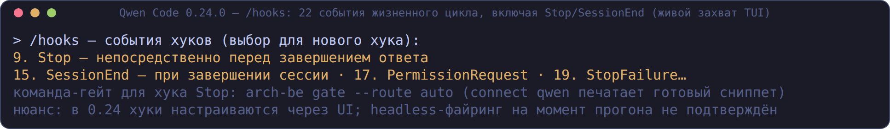

# Прогон волн 1–3 по пяти кодовым харнессам — живое тестирование

Дата: 2026-09-18. Бинарь: `arch-be` из ветки `improvements-waves` (волны 1–3
бэклога `spine-core-improvements.md`); харнессы: Qwen Code 0.24.0,
Claude Code 2.1.276, omp 15.10.3, Kimi Code 0.42.0, OpenClaw 2026.7.1-2.

Метод: **живые прогоны, не моки.** Демо-проект — платёжное ядро с намеренными
дефектами: `f64` в денежном коде (ошибка fitness), незамкнутая цепочка
NFR→INT (p99 250 мс), POST без `Idempotency-Key` в OpenAPI, новый компонент
`services/risk/` в рабочем дереве (триггеры диффа), спайн и 4 правила в
`.arch-handoff/CONSTRAINTS.yaml`. Модели: у харнессов свои (deepseek-v4-flash
через локальный прокси, qwen3.8-27b локальной платформы, z-ai/glm у kimi —
у каждого свой путь; Spine LLM не несёт — вердикты даёт механика).

Источники кадров — `screenshots/harnesses/sessions/waves-*.txt` (дословные
стенограммы прогонов), рендер — `scripts/termshot.py`.

## Итоговая матрица

| Харнесс | Подключение (`connect` + `doctor --host`) | Архитекторское ревью через MCP | Хук-гейт (`arch-be gate`) | Плейбуки-промпты |
|---|---|---|---|---|
| Qwen Code 0.24.0 | ✅ 4/4 проверок | ✅ TUI (`/spine-architect-review` из меню, разбор F1–F12) + headless `--yolo` | ⚠️ UI `/hooks` (22 события, Stop есть); headless-файринг не подтверждён | ✅ **7 промптов видны как команды [Project]**, ревью запущено из меню |
| Claude Code 2.1.276 | ✅ 4/4 (`/mcp`: spine ✔ connected · 33 tools) | ✅ TUI: вердикт с маршрутом и разбором находок | ✅ Stop-хук заблокировал «Готово.»; модель доложила и запросила разрешение | ✅ prompts/list отдаёт 7 (серверная сторона; NDJSON) |
| omp 15.10.3 | ✅ 4/4 | ✅ headless `-p`: структурированный вердикт по составляющим | ✅ через TS-расширение (`omp --hook`), команда-гейт — `arch-be gate` (проверено в прошлых прогонах; в этом раунде — документировано) | ⚠️ BM25-активация инструментов (как задокументировано) |
| Kimi Code 0.42.0 | ✅ 3/3 | ✅ (через хук-цикл — см. ниже) | ✅ Stop-хук: FAIL → модель сама создала дельту и ужала бюджет → PASS | (не проверялось в этом раунде) |
| OpenClaw 2026.7.1-2 | ✅ `mcp set spine` (изолированный `--profile`) | ✅ headless `agent --local`: полный разбор с резюме блокеров | (через плагин `before_agent_finalize` — задокументировано ранее) | (не проверялось) |

## Сценарий 1. Подключение архитектора

`arch-be connect <host>` + `arch-be doctor --host <host>` — все пять хостов
зелёные (gigacode честно предупреждает: сам GigaCode CLI на машине не
установлен, каталог настроек определён по совместимости с `.qwen/`):

```text
✓ arch-be  в PATH — MCP-сервер хоста стартанёт
✓ settings  .qwen/settings.json: mcpServers.spine → arch-be mcp serve (read-only)
✓ skills    .qwen/skills: 62 скилла
✓ host      qwen — 0.24.0
Итог: здоров (4 проверок)
```


## Сценарий 2. Архитектурное ревью одним вызовом (`architect_review`, волна 3)

Во всех пяти харнессах агент вызвал `mcp__spine__architect_review` и
пересказал механический вердикт — маршрут **Standard** (auto из диффа:
`new_component`, `new_vendor`), гейт FAIL, три блокера:

1. `fitness` — `src/money.rs:2` `no_float_for_money` (`f64` в деньгах);
2. `nfr` — `budget-no-chain` (NFR-001 без `affects → INT-*`);
3. `contracts` — `OA-003` (POST без `Idempotency-Key`).


Qwen Code пошёл дальше по плейбуку `spine-architect-review` из меню слэш-
команд (MCP prompts, волна 3) и выдал разбор из 12 находок (F1–F12) с
порядком чинки и ссылками на плейбуки — без единого напоминания о формуле
«действуй по скиллу»:

![Qwen: плейбуки как команды [Project]](screenshots/harnesses/waves-qwen-tui-prompts.png)

## Сценарий 3. Хук-гейт не даёт «позеленеть» (волна 1, п.4)

**Claude Code (TUI):** ответ «Готово.» на красном гейте → `Ran 1 stop hook` →
полный вердикт `arch-be gate --route auto` уходит модели → модель доложила
находки и **отказалась чинить без разрешения** («моё вмешательство
противоречило бы вашему „ничего не изменяй“») — гейт держит, модель ведёт
себя достойно:


**Kimi Code (headless, user-level `[[hooks]]`):** та же постановка → гейт FAIL
(`delta_guard`: правка спайна мимо дельты; `nfr`: 300 мс против p99 250 мс) →
модель без подсказок создала дельту (`arch-be delta new`), ужала бюджет
INT-001 300→250, перепрогнала — **Итог: PASS**; финал с честным замечанием
про нулевой резерв latency:


**Qwen Code 0.24:** хуки настраиваются через `/hooks` (22 события, включая
Stop/SessionEnd); команда-гейт — `arch-be gate` (печатается `arch-be connect
qwen`). Headless-файринг на момент прогона не подтверждён:



## Сценарий 4. Outcome-данные пилота (волна 2, п.9)

Все MCP-вызовы прогонов писались в проектный журнал
`.arch-handoff/mcp-calls.jsonl` (16 вызовов, 11 разных инструментов —
`architect_review` ×6, `fitness_check`, `significance_from_diff`,
`model_drift`, `nfr_check`, …). Недельный дайджест собран из журнала, не
вручную:

```text
$ arch-be digest
Всего вызовов: 16 (error 1, fail 10, ok 2, pass 3)
Топ нарушаемых правил: budget-no-chain, constraints-missing, empty_field,
  no_float_for_money
Доля FP: 0.0% (метод — пометки `control fp mark` / fail-вызовы)
```

## Найденные нюансы (честный список)

1. **SKIP-семантика путей**: `spine_lint` и `trace_check` в гейте ищут
   `ARCHITECTURE-SPINE.md`/`CONSTRAINTS.yaml` в корне кейса; в демо они лежат
   в `docs/` и `.arch-handoff/` → SKIP (fail-soft). Qwen и Claude оба это
   заметили и доложили. Решение проектное: каноничная раскладка —
   `arch-be delta init`/`connect` создают файлы в корне; наблюдение записано
   для возможного расширения поиска.
2. **Claude Code через медленный прокси**: первый ответ с полным контекстом
   (33 инструмента + 62 скилла) шёл с ретраями (до ~6 мин); на работу гейта
   не влияет.
3. **Kimi**: Stop-хук срабатывает однократно на ход (`stop_hook_active`) —
   хватает ровно для одного цикла «блок → починка → перепроверка».
4. **omp**: при большом числе инструментов активирует их BM25-поиском — если
   агент «не видит» `architect_review`, попросите поискать по имени
   (задокументировано в README).
5. **MCP-сервер в untrusted-папках**: Kimi Code молча пропускает project-MCP
   до trust-диалога; Qwen 0.24 требует approve (UI или `qwen mcp approve`);
   Claude Code в `bypassPermissions` подключает project-сервер сам.

## Приёмка пунктов бэклога (где подтверждено харнессами)

- п.1 `significance_from_diff`: вызван из харнессов (журнал), маршрут Standard
  с файлами-причинами в ответе (`services/risk/Cargo.toml`).
- п.3 находки со смыслом: `↳`-строки с rationale/fix_hint видны в выводе
  гейта внутри харнессов.
- п.4 `gate` + хуки: Claude Code и Kimi — блокировка/цикл на живых сессиях.
- п.5 транш 1: `nfr_check`/`model_validate`/`delta_guard`/`evidence_verify`
  вызваны из харнессов (журнал; вердикты в составе `architect_review`).
- п.9 журнал+дайджест: заполнен реальными вызовами пяти харнессов.
- п.11 MCP prompts: qwen 0.24 — 7 плейбуков как команды [Project] (на 0.3.2; на 0.3.5 их 9), ревью
  запущено из меню; серверная сторона (prompts/list/get) — NDJSON-тесты.
- п.12/13: `model_drift`, `architect_review`, `change_impact` — вызваны из
  харнессов (журнал).
