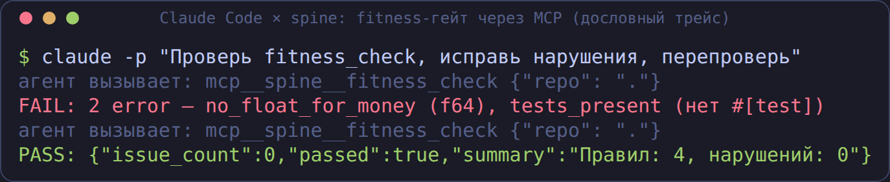
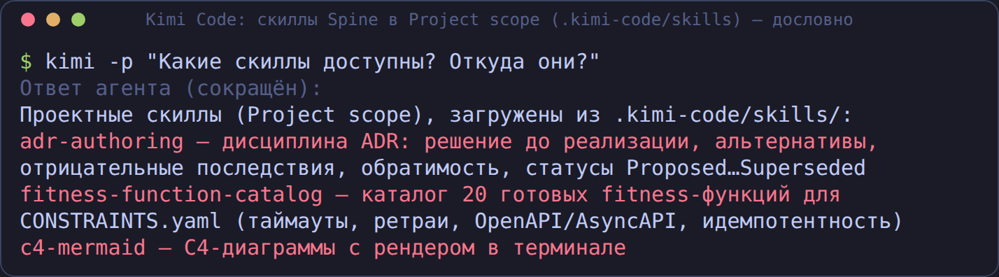
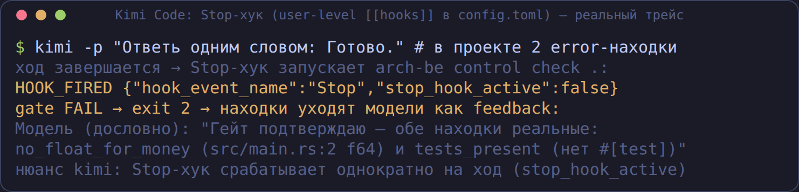
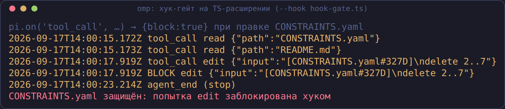
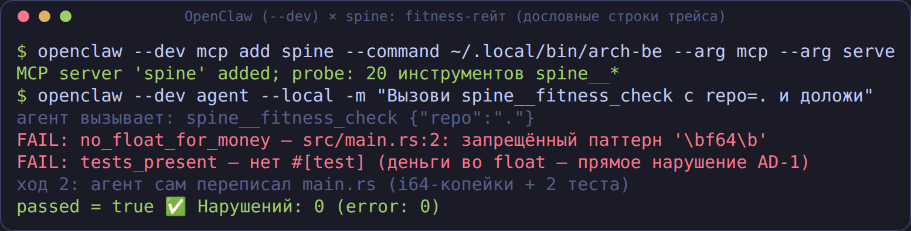
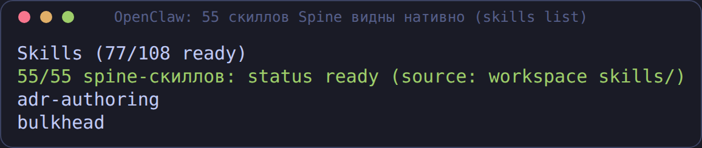

# Spine внутри пяти кодовых харнессов: проверено живьём

Матрица реальных прогонов (2026-09-17, arch-be 0.2.x): каждый харнесс
подключался к MCP-серверу `arch-be mcp serve`, получал задание с
нарушением fitness-правил, чинил его и перепроверялся. Без моков — все
скриншоты построены из дословных трейсов (источники —
`docs/screenshots/harnesses/sessions/*.txt`, рендерер —
`scripts/termshot.py`).

Тестовый стенд: проект `payment-svc` со спайном из 2 инвариантов,
4 fitness-правилами (2 намеренно нарушены в `src/main.rs`), моделью
`model/` (SYS/REQ/NFR/CMP/AD), контрактами OpenAPI/AsyncAPI и базой знаний.

## Сводная матрица

| Харнесс | MCP | fitness FAIL→PASS | Скиллы Spine | Хуки-гейты |
|---|---|---|---|---|
| **Claude Code** 2.1.274 | ✅ `.mcp.json` (connect) | ✅ агент сам починил и перепроверил | ✅ 55 из `.claude/skills` | ✅ Stop-хук блокирует завершение |
| **Kimi Code** 0.42.0 | ✅ `.kimi-code/mcp.json` (project) | ✅ | ✅ Project scope `.kimi-code/skills` | ✅ Stop-хук (user-level `[[hooks]]`) |
| **Qwen Code** 0.0.5 → **0.24.0** (= путь GigaCode CLI) | ✅ `.qwen/settings.json`; в 0.24 обязателен `qwen mcp approve` | ✅ (на локальной qwen3.8-27b) | ✅ через MCP; в 0.24 есть и `.qwen/skills` | ⚠️ в 0.24 есть `qwen hooks` (UI), headless-файринг не подтверждён |
| **omp (oh-my-pi)** 15.10.3 | ✅ `.mcp.json` авто-дискавери | ✅ | ✅ нативный discovery `.claude/skills` (81 видимый, 55 spine) | ✅ TS-хук `--hook`: `{block:true}` на правку CONSTRAINTS.yaml |
| **OpenClaw** 2026.7.1 | ✅ `openclaw mcp add` | ✅ | ✅ 55/55 ready (workspace `skills/`) | ✅ через плагин (`before_agent_finalize` → повторный проход при FAIL) |

Распределение инструментов по прогонам (каждый из 20 вызван хотя бы раз):
fitness_check — все 5 · split-judge (`rubric_prompt`+`rubric_verify`) —
claude · `model_query`, `trace_check`, `significance_score` — kimi ·
`openapi_lint`, `asyncapi_lint`, `contract_diff` — qwen · `mermaid_render`,
`spine_lint`, `agentsmd_lint`, `plugin_list` — omp · `kb_search`,
`skill_search`, `skill_load`, `rubric_list` — openclaw.

## Claude Code

```bash
arch-be connect claude     # .mcp.json + .claude/settings.json + .claude/skills/ + CLAUDE.md
```



Скиллы видны нативно (на момент прогона 55; сейчас 62 — добавлен плагин плейбуков spine-workflows):


Stop-хук (fail-soft на инфраструктуру, fail-hard на вердикт FAIL) —
см. также [CONNECT.md](CONNECT.md#3-работа-в-сессии-агент-под-контролем-спайна).

## Kimi Code

```jsonc
// .kimi-code/mcp.json (project-level; при первом запуске — trust-диалог)
{"mcpServers": {"spine": {"command": "arch-be", "args": ["mcp", "serve"]}}}
```




Хуки — user-level (`~/.kimi-code/config.toml`, `[[hooks]]`), Stop-событие;
гейт блокирует завершение хода при FAIL:



Нюансы: project-MCP в untrusted-каталоге молча пропускается (лечится одним
интерактивным запуском и «Trust this folder»); Stop-хук срабатывает
однократно на ход (`stop_hook_active`).

## Qwen Code и GigaCode CLI

**GigaCode CLI — форк Qwen Code**, поэтому прогоны на qwen-code 0.0.5 и 0.24.0 —
это проверка пути GigaCode: project-level `mcpServers` в
`.qwen/settings.json`, folder trust, те же инструменты `spine`.

```jsonc
// .qwen/settings.json
{"mcpServers": {"spine": {"command": "arch-be", "args": ["mcp", "serve"]}}}
```

Прогоны на локальной модели (llm-platform, qwen3.8-27b) — без облачных
ключей вообще. Архитекторский пакет (2026-09-17, второй заход):
`significance_score` → Fast (score 1, триггер new_component),
`model_query` → 6 сущностей (AD-1/AD-2 ADOPTED, CMP-001, NFR-001, REQ-001,
SYS-001), `trace_check` → PASS (4 правила, покрытие 100%):


Нюансы: модель для openai-совместимого endpoint задаётся через
`OPENAI_MODEL` (флаг `-m` при этом игнорируется); нативного загрузчика
скиллов нет — скиллы доступны через MCP (`skill_search`/`skill_load`);
lifecycle-хуков в 0.0.5 нет; в 0.24.0 появились `qwen hooks` (SessionStart/SessionEnd/UserPromptSubmit/AfterTool, UI-управление `/hooks`), но файринг в headless (`-p`/позиционный промпт) не подтверждён — используйте в интерактиве; в 0.24 project-MCP требуют `qwen mcp approve spine`; split-judge (`rubric_prompt`→`rubric_verify`) проверен и работает (1.60/5 по двум ответам судьи); на медленной локальной модели длинные
сессии (split-judge с двумя ответами судьи) могут превышать 10 минут —
в GigaCode с быстрым бэкендом это не проблема.

Дополнительно проверено на 0.24.0: **наполнение пустого проекта с нуля**
(агент сам создал `ARCHITECTURE-SPINE.md`, `.arch-handoff/CONSTRAINTS.yaml`,
`knowledge/` — `fitness_check` сразу начал сторожить; `kb_search` нашёл
документ по точному токену) и **Archify из харнесса** (агент написал JSON IR
по модели, `archify_validate` 9/9, `archify_show` → интерактивный HTML:
`screenshots/harnesses/qwen-archify-html.png`). Настройка Archify — одна
строка `[archify] cli_path` в `arch-harness.toml`, движок вендорен в репо
(`vendor/archify/`, нужен Node.js ≥ 18).

## omp (oh-my-pi)

`.mcp.json` подхватывается автоматически (совместим с выводом
`arch-be connect claude`):


Хук-гейт — TS-расширение через `omp --hook`: возврат `{block:true, reason}`
на `tool_call` реально блокирует правку `CONSTRAINTS.yaml`:



Нюанс: при большом числе инструментов модель активирует их через
BM25-поиск (`search_tool_bm25`) — если агент «не видит» инструмент, попросите
его поискать инструмент по имени.

## OpenClaw

```bash
openclaw mcp add spine --command arch-be --arg mcp --arg serve
openclaw agent --local -m "Проверь проект через spine fitness_check"
```

(в тестах использовался изолированный профиль `openclaw --dev`)





Хук-гейт — нативным плагином на событии `before_agent_finalize`
(`{action:"revise", reason}` → повторный проход при FAIL гейта).

## Скилл как плейбук: агент работает ПО инструкции

Доказано на qwen 0.24.0: агенту сказали «действуй по скиллу
spine-architect-review» — он пошагово выполнил разбор и отчитался по шагам:


## Сценарий: архитектор внутри кодового харнесса

Spine Core — это не только гейт для кодера. **Сам архитектор может работать
изнутри своего CLI-агента**, пользуясь Spine как инструментарием: маршрут
изменения, модель системы, оценка ADR рубрикой, диаграммы — всё через MCP,
без единой LLM у Spine (думает харнесс, вердикты даёт механика). Реальный
прогон (Claude Code, 9 ходов):


Тот же контур работает в Kimi/Qwen/omp/OpenClaw — разница только в способе
регистрации сервера (см. секции выше).

## А рубрики? — Да, в любом харнессе

Два пути, оба без API-ключей у Spine:

1. **Split-judge** (любой MCP-хост): `rubric_prompt` → хост судит k раз по
   схеме → `rubric_verify` собирает медиану, проверяет цитаты, флаги
   `unstable`/`evidence_not_found`. Проверено на Claude Code: итог 2.70/5
   по двум ответам судьи.
2. **`kind = "cli"`** (судья = подписка харнесса): `arch-be rubric run
   adr_quality target.md` вызывает `claude -p` подпроцессом. Проверено:
   отчёт 3.00/5 с цитатами-доказательствами.

## Воспроизводимость

Стенд и сценарии описаны в `docs/screenshots/harnesses/sessions/`;
каждая сессия — текстовый сценарий с дословными строками трейсов,
рендер — `scripts/termshot.py` (SVG — источник истины, PNG — для README).
