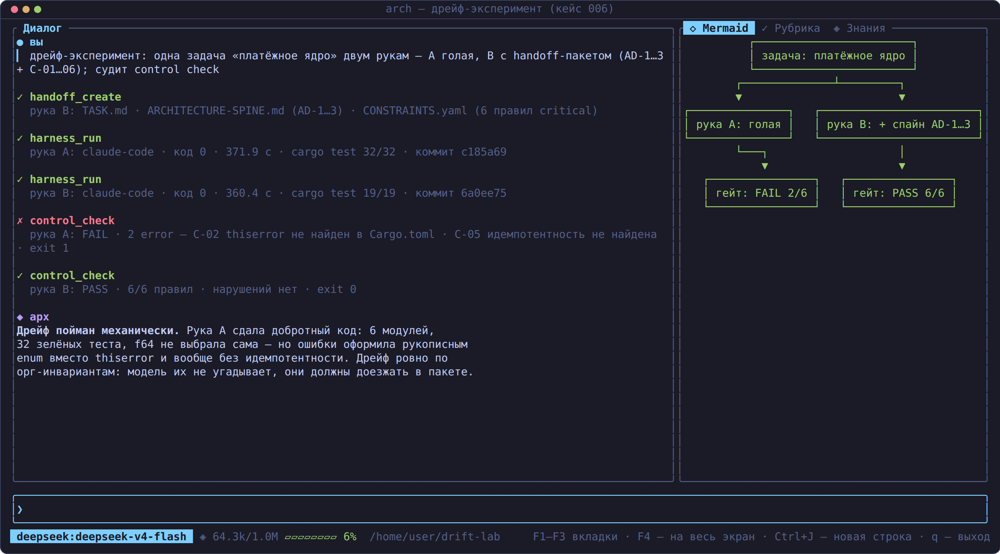

# Handoff: передача контекста кодовому харнессу · Handing context to a coding harness

**🇷🇺 Русский** | [🇬🇧 English below](#english)

Пошаговый разбор того, как архитектор передаёт задачу на исполнение внешнему
кодовому харнессу (Claude Code, Qwen Code, OpenClaw, Hermes, Theseus,
CodeWhale) — без потери архитектурного контекста и без ручного копирования
спек в чужой чат.

<p align="center">
  
</p>

## Поток по кадру

1. **Архитектор формулирует границу работ** в диалоге: «передай статусную
   машину на исполнение Claude Code и проконтролируй результат». К этому
   моменту в сессии уже есть спайн (AD-инварианты), ADR и mermaid-модель.
2. **`handoff_create`** собирает пакет `<repo>/.arch-handoff/`:
   - `TASK.md` — формулировка задачи для кодового харнесса + **план отката**
     (якорь baseline, сигналы-триггеры, владелец решения) + требование
     финального git-коммита;
   - `ARCHITECTURE.md` — **epic-context** (~800–1500 токенов, окно якорной
     рубрики `handoff_quality`): спайн, затронутые ADR, границы «что нельзя
     трогать»;
   - `CONSTRAINTS.yaml` — fitness-правила под стек репозитория (заготовка,
     переписывается под spine AD-n перед передачей);
   - `ROLLBACK.yaml` — машиночитаемый план отката (baseline-якорь + шаги):
     репетируется на гейте A4 (`arch-be control gate A4 <repo> --rehearse`,
     см. `docs/control.md`); для маршрута Critical пакет без якоря и плана
     не собирается;
   - `RUBRIC.yaml` — якорная рубрика приёмки;
   - `MANIFEST.json` — дата, модель, источники, маршрут значимости и
     рекомендованный таймаут прогона (Fast/Standard/Critical → 1800/3600/7200 с);
     `adr/` — копии ADR.
   Предгейт: каталог без git инициализируется (`git init` + пустой
   baseline-коммит — якорь отката и точка интеграции); у git-репозитория
   якорь — текущий HEAD.

   > **Core-сборка**: создание пакета — чисто файловая работа (модуль
   > `src/handoff.rs`, без сети/TUI), поэтому `handoff_create` доступен и в
   > слим-сборке (`--no-default-features --features core`): его отдаёт
   > `arch-be mcp serve --rw`. Прогон пакета (`harness_run`, адаптеры
   > харнессов) остаётся только в полной сборке.
3. **`harness_run`** прогоняет пакет адаптером `[harnesses.claude-code]`
   (`claude -p --dangerously-skip-permissions`, задача — в stdin).
   **Умные таймауты**: абсолютный потолок 30 мин + таймаут тишины 10 мин
   (нет вывода и нет изменений файлов репо → завис); молча работающий
   харнесс не трогаем — heartbeat идёт по mtime репозитория. При прерывании
   убивается вся процессная группа (сирот не остаётся), частичный вывод
   возвращается с рекомендацией `git status`. Значения `timeout_secs` ниже
   600 поднимаются автоматически — ранний обрыв оставлял репозиторий
   полусобранным.
4. **Контракт результата**: кодовый харнесс обязан завершить работу
   fenced-блоком ` ```json ` с полем `status` (`complete | partial |
   blocked`) и списками `assumptions`, `open_questions`,
   `conflicts_with_prior_decisions` — харнесс **разбирает его механически**
   (валидация схемы: `Valid`/`Invalid`/`Missing`; эскалация blocked и
   непустых conflicts/open_questions в сводку; CLI на blocked отвечает
   кодом выхода 2). Отсутствие или невалидность
   контракта помечается предупреждением: ответ мог быть неполным.
   **Финализация**: перед JSON исполнитель обязан сделать git-коммит
   результата (`git add -A -- . ':!.arch-handoff'` + commit) — оркестратор
   забирает работу из git log; если исполнитель завершился без коммита,
   харнесс сам фиксирует оставшиеся правки авто-коммитом
   (`auto_commit = true` в конфиге адаптера; `.arch-handoff/` и мусор
   `__pycache__/`/`*.pyc` в коммит не попадают) и помечает это строкой
   «АВТО-КОММИТ» в сводке.
5. **Архитектурный контроль после прогона**: `control_check` гоняет
   fitness-правила пакета против репозитория (`pytest -q` PASS,
   `no-print-in-py` PASS) и проверяет, что spine-инварианты AD-1…AD-3 не
   нарушены. Открытые вопросы архитектор фиксирует в ADR (на кадре —
   ADR-004: таймаут подтверждения НСПК).
6. **Протокол для архкома** — `/export docx` выгружает ход сессии
   (со скриншотами рубрик и контрактом) в Word.

## Почему не bash и не «покажи TASK.md в чат»

- **Квотинг**: длинный `TASK.md` с кавычками/бэктиками ломает команду —
  адаптер передаёт задачу через stdin/argv, а не интерполяцию в shell.
- **Env-scrub**: bash-инструмент прячет `*_KEY`/`*_TOKEN` от команд —
  харнесс, авторизующийся переменной окружения, останется без креденшелов;
  `harness_run` пробрасывает env адаптера как настроено.
- **Таймауты**: у bash-инструмента потолок ~600 с, у прогона харнесса —
  30 мин абсолютных + таймаут тишины; агентный цикл применяет per-tool
  таймаут (у `harness_run` — до 7200 с + запас).
- **Сироты**: bash-обрыв убивал только обёртку, дочерние процессы харнесса
  продолжали работать и конфликтовали с повторным запуском.

CLI-эквивалент вне диалога: `arch-be handoff --repo <path> --task "…"` и
`arch-be harness-run <harness> --repo <path> [--task "…"]` — см.
`harness_integrations.md`.

## Кадр со стороны исполнителя

Так выглядит принимающая сторона — живой Claude Code, запущенный по пакету
в изолированном worktree (`~/.arch-harness/worktrees/…`):

<p align="center">
  
</p>

Что видно на кадре:

- промпт — это сгенерированный пакет: «прочитай `.arch-handoff/TASK.md`,
  `AGENTS.md`, `ARCHITECTURE-SPINE.md`, реализуй модуль по инвариантам
  AD-1..AD-3, добейся зелёного pytest, в конце — JSON-контракт»;
- харнесс сам читает spine (`git log` показывает spine-коммит
  «AD-1..AD-3»), собирает контекст и работает по инвариантам — контекст
  доехал без ручного копирования;
- работа идёт в отдельном worktree с собственным `pytest.ini` — основной
  репозиторий не тронут до приёмки;
- `API error · Retrying · attempt 1/10` — транзиентные сбои API модели
  переживаются ретраями самого харнесса; со стороны Spine такой прогон не
  считается зависшим, пока идёт вывод или меняются файлы (idle-таймаут
  тишины, см. выше).

---

<a id="english"></a>

## 🇬🇧 The flow, frame by frame

1. **The architect states the scope** in chat ("hand the state machine over
   to Claude Code and supervise the result"). The session already holds the
   spine (AD invariants), ADRs and a mermaid model.
2. **`handoff_create`** assembles `<repo>/.arch-handoff/`: `TASK.md`
   (the task + **rollback plan** — baseline anchor, trigger signals, decision
   owner — + the mandatory final git commit), `ARCHITECTURE.md` (epic
   context, ~800–1500 tokens — the anchor rubric window), `CONSTRAINTS.yaml`
   (stack-detected fitness rules, a scaffold to be rewritten against the
   spine), `RUBRIC.yaml` (acceptance rubric), `ROLLBACK.yaml` (machine-readable
   rollback plan — baseline anchor + steps; rehearsed at gate A4 via
   `arch-be control gate A4 <repo> --rehearse`, see `docs/control.md`; the
   Critical route refuses to assemble a package without an anchor and a plan),
   `MANIFEST.json` (including the
   significance route and the recommended run timeout: Fast/Standard/Critical
   → 1800/3600/7200 s) + `adr/` copies. Pre-gate: a directory without git is
   initialized (`git init` + an empty baseline commit — the rollback anchor);
   for a git repo the anchor is the current HEAD.
3. **`harness_run`** executes the package through the configured adapter
   (e.g. `claude -p --dangerously-skip-permissions`, task via stdin).
   **Smart timeouts**: a 30-min absolute ceiling plus a 10-min silence
   timeout (no output and no repo file changes → hung); a quiet but working
   harness is kept alive by the repo mtime heartbeat. On abort the whole
   process group is killed (no orphans) and partial output is returned with
   a `git status` recommendation. `timeout_secs` below 600 is raised
   automatically — early aborts used to leave repos half-built.
4. **Result contract**: the coding harness must finish with a fenced
   ` ```json ` block carrying `status` (`complete | partial | blocked`),
   `assumptions`, `open_questions`, `conflicts_with_prior_decisions`; the
   launcher **parses it mechanically** (schema validation:
   `Valid`/`Invalid`/`Missing`; blocked and non-empty
   conflicts/open_questions are escalated into the summary; the CLI exits
   with code 2 on blocked). A missing or invalid contract is flagged.
   **Finalization**: before the JSON, the executor must git-commit its work
   (`git add -A -- . ':!.arch-handoff'` + commit) — the orchestrator
   collects results from the git log; if the executor finishes without a
   commit, the harness commits the leftovers itself (auto-commit,
   `auto_commit = true` in the adapter config; `.arch-handoff/` and
   `__pycache__/`/`*.pyc` junk are excluded) and flags it with an
   "AUTO-COMMIT" line in the summary.
5. **Post-run architectural control**: `control_check` replays the fitness
   rules against the repository and verifies the spine invariants
   (AD-1…AD-3 intact). Open questions are captured as ADRs.
6. **Evidence for the review board** — `/export docx` writes the session
   transcript to Word.

CLI equivalents: `arch-be handoff --repo <path> --task "…"` and
`arch-be harness-run <harness> --repo <path>` — see
`harness_integrations.md`.

## The executor's side of the frame

What the receiving end looks like — a live Claude Code run against the
package in an isolated worktree (`~/.arch-harness/worktrees/…`):

<p align="center">
  
</p>

- the prompt is the generated package itself ("read `.arch-handoff/TASK.md`,
  `AGENTS.md`, `ARCHITECTURE-SPINE.md`, implement the module under
  AD-1..AD-3, make pytest green, finish with the JSON contract");
- the harness reads the spine on its own (git log shows the spine commit),
  gathers context and works by the invariants — no manual copy-pasting;
- work happens in a dedicated worktree with its own `pytest.ini` — the main
  repo stays untouched until acceptance;
- `API error · Retrying · attempt 1/10` — transient model API failures are
  absorbed by the harness's own retries, and Spine's silence timeout does
  not treat the run as hung while output or file changes keep coming.
