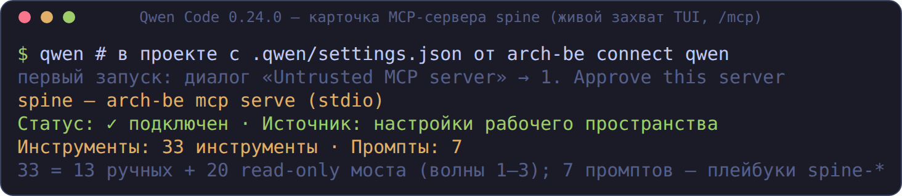

# MCP для архитекторов: работа из кодового харнесса

Практический гид: как solution-архитектору работать со Spine **изнутри
своего кодового агента** (GigaCode CLI, Claude Code, Kimi Code, Qwen Code,
omp, OpenClaw, Codex) через MCP-сервер `arch-be mcp serve`.

Формула: **думает LLM вашего харнесса — вердикты даёт механика Spine**.
У Spine нет своей модели в этом режиме: он отдаёт детерминированный контур
(гейты, трассировка, модель, контракты, реестры, рубрики) вызовом
инструмента, и по умолчанию сервер строго **read-only** — ничего не пишет
в репозиторий клиента.

Это гид по каналу MCP. Полный сценарий «архитектор в харнессе» со всеми
тремя каналами (MCP + скиллы + хуки) — в
[ARCHITECT-IN-HARNESS.md](ARCHITECT-IN-HARNESS.md); протокольный контракт
сервера (аргументы, коды ошибок, JSON-схемы) — в [mcp.md](mcp.md).

## Подключение

Одна команда раскладывает MCP-конфиг (заодно скиллы и хуки — их можно
отключить флагами `--no-skills` / `--no-hooks`):

```bash
cd ~/projects/my-project
arch-be connect qwen     # GigaCode CLI / Qwen Code; также: claude, kimi, omp, codex, generic
```

| Харнесс | Куда пишется MCP-конфиг | Нюанс первого запуска |
|---|---|---|
| GigaCode CLI / Qwen Code | `.qwen/settings.json` → `mcpServers.spine` | qwen-code ≥ 0.24: project-серверы требуют одобрения — диалог «Untrusted MCP server» или `qwen mcp approve spine` |
| Claude Code | `.mcp.json` проекта (мердж `mcpServers.spine`) | проверка: `claude mcp list` / `/mcp` в TUI |
| Kimi Code | `.kimi-code/mcp.json` (project-уровень перекрывает user-level) | project MCP не стартует в untrusted-папке — подтвердите trust-диалог |
| omp | `.mcp.json` (дискаверится автоматически) | при большом числе инструментов omp активирует их BM25-поиском — попросите агента «найди инструмент по имени» |
| OpenClaw | `openclaw mcp add spine --command arch-be --arg mcp --arg serve` | — |
| Codex | `arch-be connect codex --apply-global` → `~/.codex/config.toml` | только глобально, с бэкапом `*.bak-spine-connect` |
| любой другой MCP-хост | `arch-be connect generic` | напечатает сниппеты для ручной установки |

Проверка окружения после подключения: `arch-be doctor --host qwen`
(подставьте свой хост). Подробности по каждому хосту, хуки, `--dry-run` —
в [CONNECT.md](CONNECT.md).

Живая карточка сервера после подключения (Qwen Code 0.24.0, `/mcp`):
33 инструмента + 7 промптов — это и есть весь контур:




## Карта инструментов по задачам архитектора

33 read-only инструмента = 13 ручных контрольных + 20 мостовых из реестра.
Сгруппированы по задачам рабочего дня; полные сигнатуры — в [mcp.md](mcp.md).

### Маршрут и ревью изменения

| Инструмент | Что даёт |
|---|---|
| `significance_score` | маршрут Fast/Standard/Critical по 15 триггерам (заявленным) |
| `significance_from_diff` | anti-bypass: триггеры выводятся из git-диффа и **объединяются** с заявленными; `undeclared` — что агент «забыл» заявить, с файлами-основаниями |
| `architect_review` | всё ревью одним вызовом: маршрут из диффа + fitness + спайн + трассировка + NFR + контракты → единый вердикт `passed` |
| `change_impact` | радиус изменения по графу модели: затронутые сущности, правила C-NNN, контракты, владельцы OWNER — с кем согласовывать |

### Гейты и правила

| Инструмент | Что даёт |
|---|---|
| `fitness_check` | прогон CONSTRAINTS.yaml (must_contain / must_not_contain / command_succeeds / …); `passed=false` — правила нарушены |
| `spine_lint` | линтер ARCHITECTURE-SPINE.md (дубли AD-id, пустые Binds/Prevents, заглушки, непиннутые версии) |
| `trace_check` | позвенная трассируемость REQ → NFR → AD/ADR → CMP → правило |
| `delta_guard` | защита путей (`protect`) между base и рабочим деревом |
| `evidence_verify` | комплектность evidence bundle изменения на Standard/Critical |
| `nfr_check` | соответствие NFR-атрибутов (производительность, надёжность, …) |

### Модель системы

| Инструмент | Что даёт |
|---|---|
| `model_query` | сущности модели (SYS/REQ/NFR/CMP/AD/INT) и карточки со связями |
| `model_validate` | целостность модели: битые ссылки, сироты, дубли id |
| `model_drift` | дрейф модели против снимка (baseline) |
| `model_graph` | граф связей: текст или mermaid `flowchart LR` |

### Контракты

| Инструмент | Что даёт |
|---|---|
| `openapi_lint` / `asyncapi_lint` | линт спецификаций |
| `contract_diff` | diff версий: OpenAPI, proto/gRPC, Avro, JSON Schema, DDL; правило major-версии; связка с моделью по `INT.contract` |

### Реестры и EA

| Инструмент | Что даёт |
|---|---|
| `landscape_report` | ландшафт систем набора проектов: markdown-отчёт или mermaid |
| `adr_registry` | реестр ADR: коллизии номеров, дубли заголовков, пропуски полей |
| `rules_report` | инвентарь правил: owner / expiry / effort_hours, находки |
| `openspec_coverage` | покрытие требований OpenSpec правилами (`covers:`) |
| `fleet_audit` / `agentsmd_lint` / `archify_validate` | аудит флота копий, линт AGENTS.md, валидация диаграмм Archify |

### Знания и скиллы

| Инструмент | Что даёт |
|---|---|
| `kb_search` | поиск по базе знаний архитектора (`knowledge.dirs`) |
| `skill_search` / `skill_load` | поиск по библиотеке из 62 скиллов и загрузка полного текста |
| `mermaid_render` | mermaid-диаграмма в ASCII (flowchart, sequence, ER, C4) |
| `rubric_list` / `plugin_list` | что есть из рубрик и плагинов |

### Судья по рубрикам (без API-ключей у Spine)

| Инструмент | Что даёт |
|---|---|
| `rubric_prompt` | split-judge, фаза 1: промпты судьи + JSON-схема — исполняет модель хоста |
| `rubric_verify` | фаза 2: отчёт из сырых ответов хоста — медиана, проверка цитат дословно, флаги `unstable` / `evidence_not_found` |
| `rubric_run` | прямой прогон рубрики (нужен ключ в конфиге arch-be или модель `kind = "cli"` — судит ваш CLI-харнесс) |

### Режим `--rw` (опционально)

`arch-be mcp serve --rw` добавляет белый список аддитивных записей:
`handoff_create`, `adr_new`, `agentsmd_generate`, `skill_distill`,
`archify_deliver` / `archify_show` / `archify_compare`, `reverse_survey`,
`evidence_pack`, `delta_propose`. Закрыто навсегда (never-список,
охраняется тестами реестра): `bash`, `write_file`, `edit_file`,
`harness_run`, `subagent_*`, `web_*` — это принадлежность хоста.

## Плейбуки `spine-*` как слэш-команды хоста (MCP prompts)

Кроме инструментов сервер отдаёт capability **prompts**: семь плейбуков
работы со Spine приезжают в хост как готовые команды — не нужно помнить
формулировки и не важно, куда хост кладёт файлы скиллов.

| Промпт | Сценарий |
|---|---|
| `spine-quickstart` | проверка подключения и границ сервера |
| `spine-content-bootstrap` | наполнение пустого проекта: спайн, CONSTRAINTS.yaml, model/, knowledge/, первый ADR |
| `spine-architect-review` | архитектурный разбор: маршрут, модель, трассировка, инвентаризация |
| `spine-adr-judge` | split-judge оценка документа рубрикой (`target`, `rubric`) |
| `spine-contracts-gate` | контрактный гейт: линт + diff версий (`path`, `old`, `new`) |
| `spine-archify-viz` | визуализация Archify: JSON IR → валидация → HTML (`subject`) |
| `spine-fitness-gate` | работа под fitness-гейтом: находки → починка → перепроверка |

В Qwen Code 0.24 плейбуки видны в меню как команды `[Project]` — ревью
запускается из меню; в Claude Code — как `/mcp__spine__<имя>` или выбор
в меню `/`:


## Живые сессии (всё ниже — дословные захваты реальных прогонов)

Вызовы инструментов в интерактивной TUI-сессии (Qwen Code 0.24.0): агент
идёт по плейбуку `spine-architect-review`, вызовы `spine MCP Server`
видны вживую:


Архитектурная сессия в Claude Code (headless, `claude -p`): маршрут
значимости → модель (найдены сироты REQ-001/SYS-001) → split-judge ADR
(1.60/5, медиана двух сэмплов) → mermaid-рендер C4. Мозг — Claude Code;
вердикты, рубрика, диаграмма — механика Spine:


Kimi Code: `fitness_check` FAIL (no_float_for_money, tests_present) →
агент исправил → `passed=true`; далее `model_query` (6 сущностей) →
`trace_check` (цепочка полная) → `significance_score` (маршрут Fast):


База знаний проекта из харнесса (`kb_search`): запрос «идемпотентность» →
хит `knowledge/idempotency.md` → агент отвечает по документу, а не по
памяти:


Контрактный гейт до релиза (плейбук `spine-contracts-gate`): линт
OpenAPI/AsyncAPI + diff версий — ломающие изменения называются ломающими:


Split-judge: `rubric_prompt` → модель хоста судит k раз → `rubric_verify`
считает медиану и проверяет цитаты дословно — без единого API-ключа у
Spine:


Гейт для кодера: `fitness_check` FAIL → агент чинит → PASS (плейбук
`spine-fitness-gate`):


Headless-прогоны `architect_review` в трёх харнессах — единый вердикт
ревью одним вызовом:


## Что возвращает инструмент

Контрольные инструменты отвечают единым вердиктом (`structuredContent` и
тот же pretty-JSON в тексте):

```json
{
  "passed": false,
  "issue_count": 2,
  "error_count": 2,
  "issues": [{"severity": "error", "rule": "no_float_for_money", "file": "src/main.rs", "line": 0, "message": "…",
              "ad": "AD-2", "rationale": "деньги — только minor units", "fix_hint": "i64 копейки + rust_decimal", "skill": "money-types"}],
  "summary": "Правил: 6, нарушений: 2 (error: 2, warn: 0)"
}
```

- `passed: false` — основание **отказать изменению**, перечислив находки
  (эта инструкция отдаётся хосту и в `initialize.instructions`).
- У находок `fitness_check` бывают карточные поля `ad` / `adr` /
  `rationale` / `owner` / `fix_hint` / `skill` — архитектурный контекст
  из карточки правила: какой инвариант задет, как чинить, какой скилл
  загрузить через `skill_load`.
- Отчётные инструменты (`landscape_report`, `rules_report`,
  `model_graph`, `change_impact`, …) вердикта не имеют — `passed` у них
  не применим.

## Журнал вызовов и недельный дайджест

Каждый вызов `tools/call` пишется в проектный append-only журнал
`.arch-handoff/mcp-calls.jsonl` (рядом с CONSTRAINTS.yaml проекта):
инструмент, вердикт (`pass`/`fail`/`ok`/`error`/`invalid`), длительность,
имена нарушенных правил — **без содержимого аргументов**. Ротация — одно
поколение при 5 МиБ.

Из журнала заполняется протокол outcome-метрик:

```bash
arch-be digest            # недельный дайджест: активность, топ нарушаемых правил
arch-be control fp mark   # пометить находку ложной — попадёт в FP-реестр дайджеста
```

Подробности — [mcp.md](mcp.md) (журнал) и [outcome-metrics.md](outcome-metrics.md).

## Безопасность и границы

- **Read-only по умолчанию**; `--rw` открывает только белый список
  аддитивных записей, never-список закрыт навсегда.
- **Политика R-уровней** действует и внутри MCP-моста: решение
  `Deny`/`RequireConfirm` возвращается как `isError` с причиной
  (подтверждение в неинтерактивном MCP невозможно — трактуется как отказ).
- Секреты не пересекают границу: ключи LLM — это ключи харнесса, Spine
  свои не требует (кроме `rubric_run` без `kind = "cli"`).
- Сбой журнала не ломает вызов (fail-soft); сервер не падает ни на каком
  вводе, цикл живёт до EOF stdin.

## Проверка без клиента

```bash
printf '%s\n' \
  '{"jsonrpc":"2.0","id":1,"method":"initialize","params":{"protocolVersion":"2025-06-18","capabilities":{},"clientInfo":{"name":"t","version":"0"}}}' \
  '{"jsonrpc":"2.0","id":2,"method":"tools/list","params":{}}' \
  '{"jsonrpc":"2.0","id":3,"method":"tools/call","params":{"name":"architect_review","arguments":{"path":"."}}}' \
  | arch-be mcp serve
```

## Устранение неполадок

| Симптом | Причина и лечение |
|---|---|
| Qwen Code: сервер не стартует | project-серверы требуют одобрения (≥ 0.24): диалог при первом запуске или `qwen mcp approve spine` |
| Kimi Code: сервера нет в сессии | папка не в trust — подтвердите trust-диалог; project-уровень перекрывает user-level `~/.kimi-code/mcp.json` |
| omp: агент «не видит» инструмент | инструменты активируются BM25-поиском — попросите агента найти инструмент по имени |
| Claude Code: пусто в `/mcp` | проверьте `claude mcp list` и что `.mcp.json` в корне проекта; сервер стартует из cwd проекта — относительные пути резолвятся от него |
| `rubric_run` → `-32603` | нет ключа провайдера в конфиге arch-be; используйте split-judge (`rubric_prompt`/`rubric_verify`) или модель `kind = "cli"` |
| пути «не находятся» | всем мостовым инструментам можно передать `cwd` — рабочий каталог клиента; по умолчанию — cwd процесса сервера |

## Что читать дальше

- [mcp.md](mcp.md) — протокольный контракт: все аргументы, JSON-схемы
  вердиктов, коды ошибок, журнал.
- [ARCHITECT-IN-HARNESS.md](ARCHITECT-IN-HARNESS.md) — полный сценарий
  «архитектор в харнессе»: MCP + скиллы + хуки, рабочий день по шагам.
- [CONNECT.md](CONNECT.md) — подключение по хостам, хуки-гейты, `--rw`.
- [HARNESSES.md](HARNESSES.md) — матрица живых прогонов пяти харнессов;
  [HARNESS-TESTS.md](HARNESS-TESTS.md) — тестирование волн 1–3 по
  архитекторским сценариям.
