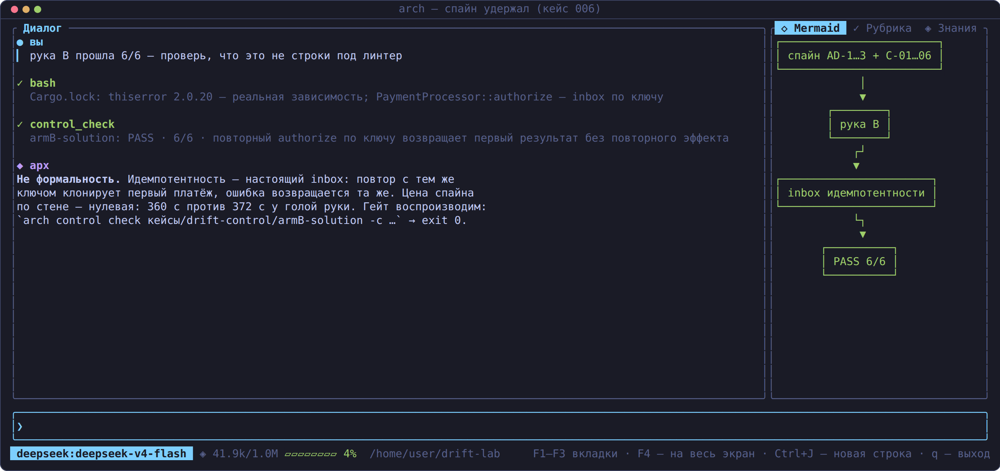

# Кейс 006 — `drift-control`: удерживает ли спайн кодовый харнесс от архитектурного дрейфа

> **Что показывает кейс.** Контролируемый эксперимент с двумя руками.
> Одна и та же задача (Rust-библиотека платёжного ядра) отдана реальному
> Claude Code headless дважды: рука A — голый текст задачи, рука B — тот же
> текст + handoff-пакет (спайн из трёх инвариантов + шесть fitness-правил).
> Механический гейт `arch-be control check` судит обе руки одними правилами.
> Итог: рука A — **FAIL, exit 1** (нет thiserror, нет идемпотентности —
> дрейф ровно по орг-специфичным инвариантам при полностью зелёных тестах),
> рука B — **PASS 6/6**, с настоящим inbox'ом идемпотентности, а не строкой
> под линтер. Спайн измеримо удерживает исполнителя от дрейфа.
>
> **For English readers:** a controlled two-arm experiment — the same
> payment-core task given to a real headless Claude Code twice: bare task
> vs task + handoff package (3 spine invariants + 6 fitness rules). The
> mechanical gate (`arch-be control check`) fails arm A with exit 1 (no
> thiserror, no idempotency — drift on exactly the org-specific invariants,
> with all tests green) and passes arm B 6/6 with a real idempotency
> inbox. The spine measurably holds the code harness against architectural
> drift. Evidence in `evidence/`, both solutions included and re-checkable.

- **Исполнитель**: Claude Code 2.1.233 headless (бэкенд
  `deepseek-v4-pro[1m]`); оркестрация — CLI Spine (`arch-be harness-run`).
- **Статус**: прогнан на живом стенде 2026-08-17; все артефакты
  фактические; обе руки воспроизводимо перепроверяются из репозитория
  (см. «Воспроизведение» в `evidence/runs.md`).

## Дизайн

```
   задача «платёжное ядро» (одна и та же)
        │                        │
        ▼                        ▼
  рука A: голая задача    рука B: задача + .arch-handoff/
  (решения принимает      (AD-1 деньги i64 · AD-2 thiserror ·
   сам исполнитель)        AD-3 идемпотентный authorize
                           + CONSTRAINTS.yaml: C-01…C-06)
        │                        │
        ▼                        ▼
  6 модулей, 32 теста     1 модуль, 19 тестов, thiserror 2.0.20,
  рукописный enum ошибок  PaymentProcessor с inbox идемпотентности
        │                        │
        └──────────┬─────────────┘
                   ▼
   arch-be control check --constraints CONSTRAINTS.yaml
        │                        │
        ▼                        ▼
  FAIL · exit 1             PASS · exit 0
  C-02 thiserror ✗          нарушений нет
  C-05 idempotency ✗
```

## Результаты (кратко)

- **Рука A (контроль)**: fitness FAIL 2/6 — C-02 (`thiserror` в Cargo.toml)
  и C-05 (`[Ii]dempotenc` в src) не выполнены; при этом C-01 (без f64),
  C-03/C-04 (без anyhow), C-06 (тесты зелёные) — PASS. Код качественный
  (6 модулей, 32 теста, чистый коммит) — дрейф невиден без гейта.
- **Рука B (спайн)**: fitness PASS 6/6; идемпотентность — реальный inbox
  (`PaymentProcessor::authorize` дедуплицирует по ключу: повтор возвращает
  первый результат без повторного эффекта); исполнитель сам сверил себя с
  таблицей C-01…C-06 в отчёте.
- **Стена**: 371.9 с (A) и 360.4 с (B) — цена спайна по времени нулевая.
- Сводка с дословными выводами гейта и оговорками о честности —
  `evidence/runs.md`; полные отчёты исполнителей — `armA.log`/`armB.log`.

## Скриншоты

| Две руки, один гейт | Спайн удержал: 6/6 |
|---|---|
|  |  |

## Анатомия кейса

```
ARCHITECTURE-SPINE.md   три инварианта AD-1…AD-3 (Binds/Prevents/Rule)
handoff-example/        пакет руки B как был передан: TASK.md (задача +
                        инварианты + критерии приёмки + откат + финализация),
                        ARCHITECTURE-SPINE.md, CONSTRAINTS.yaml (6 правил
                        critical: no-f64, thiserror, no-anyhow, идемпотентность,
                        тесты) — минимальный пакет: без рубрики и манифеста,
                        эксперимент мерил именно fitness-гейт
armA-solution/          результат руки A: payment-core — 6 модулей,
                        27 юнит + 4 интеграционных + 1 doctest; ошибки —
                        рукописный enum; идемпотентности нет
armB-solution/          результат руки B: payments-core — один lib.rs
                        (603 строки), thiserror 2.0.20 в Cargo.lock,
                        inbox идемпотентности, 19 юнит-тестов
evidence/               runs.md (дизайн, таблица, воспроизведение,
                        оговорки), armA.log/armB.log (полные stdout
                        исполнителя), armA-fitness.txt (FAIL, exit 1) /
                        armB-fitness.txt (PASS, exit 0), commits.txt
screenshots/            цветные кадры (генерируются из src/tui/shot.rs,
                        тест gen_case06_screenshots)
```

## Чему учит кейс

- **Дрейф невидим без механического гейта**: рука A сдала код, который
  проходит ревью «на глаз» — зелёные тесты, чистая история, добротные
  абстракции. Отклонения от орг-стандартов (thiserror, идемпотентность)
  обнаруживаются только машинной сверкой с явно записанными инвариантами.
- **Модель не угадывает орг-инварианты**: обобщённый исполнитель выбирает
  разумные общие решения (свой enum ошибок, без идемпотентности — она не
  запрошена); специфичные для организации стандарты должны доезжать в
  пакете дословно — это и есть работа solution-архитектора.
- **Цена контракта — нулевая по стене**: 360 с против 372 с; спайн не
  тормозит исполнителя, он снимает лотерею дизайна.
- **Правила должны быть исполняемыми**: C-01…C-06 — не проза в вики, а
  `must_contain`/`must_not_contain`/`command_succeeds`, проверяемые
  `arch-be control check` за секунды, с exit-кодом для CI.
- **Честная оговорка**: рука B знала критерии приёмки заранее — это не
  перекос, а сама гипотеза: инварианты обязаны доезжать явно. И текстовый
  JSON-контракт результата обе руки проигнорировали — урок «инструкция
  без механического разбора — слабый контракт» зафиксирован в runs.md.
