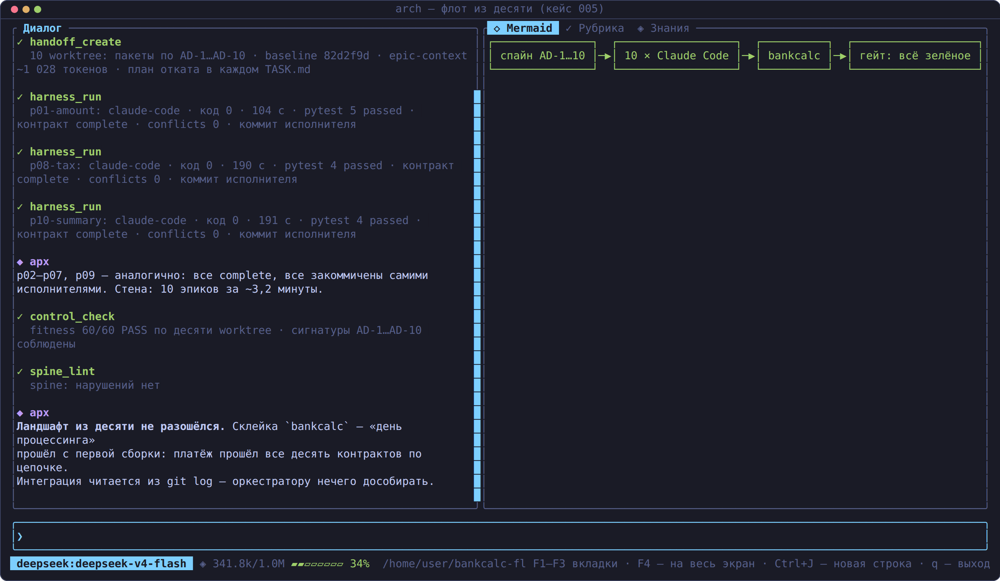
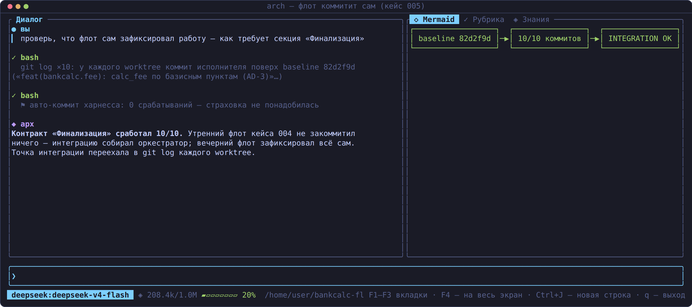

# Кейс 005 — `fleet-of-ten`: десять параллельных Claude Code, десять эпиков — ноль расхождений

> **Что показывает кейс.** Масштабирование кейса 004 втроём… вдесятером:
> десять независимых Claude Code headless параллельно реализуют десять
> эпиков библиотеки `bankcalc` (расчётный контур: валидация, округление,
> комиссии, курсы, идентификаторы, календарь, ретраи, НДС, лимиты, сводка),
> каждый в изолированном git-worktree, не видя друг друга. Канал
> согласования один — спайн из десяти инвариантов. Итог: 10/10 `complete`,
> 42/42 тестов, 60/60 fitness-правил, интеграция с первой сборки — и
> **каждый исполнитель сам закоммитил результат**.
>
> **For English readers:** ten parallel Claude Code executors, ten epics,
> one spine of ten invariants — the landscape converged on the first
> integration build, and each executor committed its own work (the
> "Finalization" contract). Evidence in `evidence/`.

- **Исполнители**: 10 × Claude Code headless (бэкенд `deepseek-v4-pro[1m]`);
  оркестрация — CLI Spine (`arch-be handoff` / `arch-be harness-run`).
- **Маршрут**: Standard; рекомендованный таймаут из MANIFEST (3600 с)
  подхвачен прогонами автоматически.
- **Статус**: прогнан на живом стенде 2026-08-16; стена — ~3,2 минуты на
  десять эпиков; все артефакты фактические.

## Дизайн

```
            ARCHITECTURE-SPINE.md — AD-1…AD-10 (Binds/Prevents/Rule)
              │        │        │        │        │
        ┌─────┬─┴────┬──┴───┬───┴──┬────┬─┴────┬───┴──┬────┬─────┐
        ▼       ▼      ▼      ▼      ▼    ▼      ▼      ▼    ▼     ▼
      p01     p02    p03    p04   p05  p06    p07    p08  p09   p10
      amount  money  fee    rate  ids  calendar retry tax  limit summary
      (10 worktree × Claude Code headless, handoff-пакет в каждом)
              │        │        │        │        │
              └────────┴────────┴───┬────┴────────┴────────┘
                                    ▼
                  интеграционный гейт: пакет bankcalc,
                  «день процессинга» — платёж по всем десяти контрактам
```

## Результаты (кратко)

- **10/10 прогонов `complete`**, код 0, 103–191 с каждый (стена ~3,2 мин);
  **42/42 тестов**, **60/60 fitness-правил** PASS, `spine_lint` чист —
  сводка с длительностями в `evidence/runs.md`.
- **Флот закоммитил сам**: у каждого worktree коммит исполнителя поверх
  baseline (тексты осмысленные: «feat(bankcalc.fee): calc_fee по базисным
  пунктам (AD-3)») — `evidence/commits.txt`. Контракт «Финализация»,
  добавленный после утреннего кейса 004, сработал 10/10; авто-коммит
  харнесса не понадобился ни разу.
- **Ноль конфликтов** в контрактах: аннотированные сигнатуры в спайне и
  regex приёмки в этот раз согласованы заранее (урок из конфликта p1
  кейса 004).
- Интеграция: сквозной сценарий прошёл с первой сборки
  (`evidence/integration-run.txt`); честная оговорка про упавшую первую
  редакцию теста — в `runs.md`.

## Скриншоты

| Флот из десяти и гейты | Финализация: флот коммитит сам |
|---|---|
|  |  |

## Анатомия кейса

```
ARCHITECTURE-SPINE.md   десять инвариантов AD-1…AD-10 + Deferred
bankcalc/               единый пакет после склейки: десять модулей,
                        написанных десятью исполнителями, + __init__.py
tests/                  test_{amount,money,fee,rate,ids,calendar,retry,
                        tax,limit,summary}.py (42 теста) + test_integration.py
handoff-example/        пакет p01 как был передан: TASK.md (с секциями
                        «План отката» и «Финализация»), epic-context,
                        CONSTRAINTS.yaml под AD-1, RUBRIC.yaml, MANIFEST.json
evidence/               runs.md (таблица прогонов), commits.txt (git log
                        всех worktree), integration-run.txt,
                        harness-run-p01-stdout.txt (полный вывод прогона)
screenshots/            цветные кадры (генерируются из src/tui/shot.rs,
                        тест gen_case05_screenshots)
```

## Чему учит кейс

- **Предел параллелизма — не в моделях, а в контрактах**: десять стыков
  сошлись без единого сообщения между исполнителями; согласование оплачено
  заранее дословными Rule + машинно-проверяемыми приёмочными правилами.
- **«Финализация» меняет топологию работы**: оркестратору нечего
  дособирать — точка интеграции перенесена в git log каждого worktree.
- **Стоимость контракта окупается с ростом флота**: на трёх исполнителях
  спайн экономил нервы, на десяти — он единственный способ не утонуть
  в расхождениях.
- **Гейты масштабируются линейно**: один и тот же набор из шести
  fitness-правил на модуль дал 60/60 без адаптации — шаблон
  «сигнатура + no-print + no-io + тесты + pytest» переносим.
