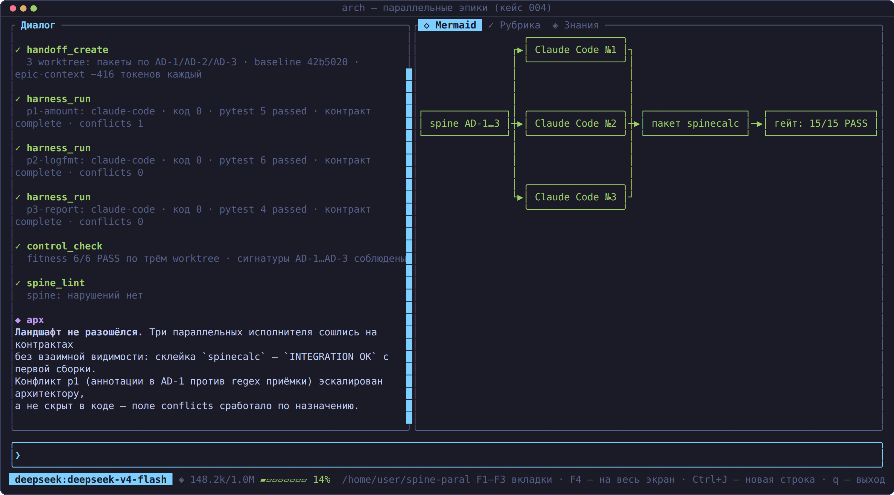
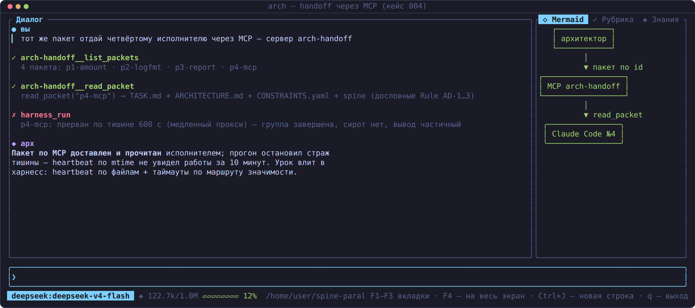

# Кейс 004 — `parallel-epics`: три параллельных Claude Code, три эпика — один ландшафт

> **Что показывает кейс.** Три независимых кодовых агента (Claude Code
> headless) параллельно реализуют три эпика одной библиотеки в изолированных
> git-worktree, не видя работу друг друга. Единственный канал согласования —
> architecture-spine (AD-1…AD-3) в handoff-пакете. Итог: стыки сошлись с
> первой сборки, интеграционный гейт зелёный, ландшафт проекта не разошёлся.
>
> **For English readers:** three parallel Claude Code executors, three epics,
> one spine of invariants — the architecture kept the project landscape from
> diverging; evidence and the defect-to-fix trail are in `evidence/`.

- **Модель/харнесс исполнителей**: Claude Code headless (бэкенд
  `deepseek-v4-pro[1m]`), оркестратор — Spine (агент-архитектор на DeepSeek).
- **Маршрут**: Standard (библиотечные контракты, 3 триггера значимости).
- **Статус**: прогнан на живом стенде 2026-08-16; все артефакты фактические
  (код написан исполнителями, выводы прогонов — в `evidence/`).

## Дизайн эксперимента

```
                ARCHITECTURE-SPINE.md (AD-1…AD-3)
                  Binds / Prevents / Rule + Deferred
                               │
        ┌──────────────────────┼──────────────────────┐
        │ handoff-пакет        │ handoff-пакет        │ handoff-пакет
        ▼                      ▼                      ▼
  worktree p1-amount     worktree p2-logfmt      worktree p3-report
  Claude Code #1         Claude Code #2          Claude Code #3
  validate_amount()      format_log()            build_report()
        │                      │                      │
        └──────────────────────┼──────────────────────┘
                               ▼
                 интеграционный гейт: пакет spinecalc,
                 сквозной тест «валидация → лог → отчёт»
```

Плюс четвёртый канал передачи: тот же пакет отдан агенту через MCP-сервер
`arch-handoff` (`list_packets` / `read_packet` по id) — handoff как сервис,
а не только как файлы в worktree.

## Результаты (кратко)

- **15/15 тестов** по трём модулям (5/6/4), fitness-правила — PASS,
  `spine_lint` — без нарушений, интеграционный сквозной тест — OK с первой
  сборки (см. `evidence/runs.md` и `evidence/integration-run.txt`).
- Поле `conflicts_with_prior_decisions` сработало по назначению: p1 не
  «решил на месте» расхождение сигнатуры (аннотации в AD-1 против regex
  приёмки), а эскалировал его архитектору — расхождение зафиксировано
  в контракте, а не скрыто в коде.
- Прогон вскрыл реальные дефекты обвязки (нет финального коммита, короткий
  потолок таймаута, эвристический разбор контракта) — все устранены в
  харнессе в тот же день; перечень — в `evidence/runs.md`.

## Скриншоты

| Параллельный прогон флота | Пакет по MCP |
|---|---|
|  |  |

## Анатомия кейса

```
ARCHITECTURE-SPINE.md   инварианты AD-1…AD-3 (Binds/Prevents/Rule) + Deferred
spinecalc/              единый пакет после склейки: amount.py, logfmt.py,
                        report.py (написаны тремя исполнителями), __init__.py
tests/                  test_amount/logfmt/report.py (5+6+4 тестов) +
                        test_integration.py (сквозной гейт склейки)
handoff-example/        реальный пакет .arch-handoff/ модуля p1, как был
                        передан исполнителю (TASK.md, ARCHITECTURE.md,
                        CONSTRAINTS.yaml — переписан под AD-1, RUBRIC.yaml,
                        MANIFEST.json)
evidence/               runs.md (таблица прогонов и дефектов),
                        integration-run.txt (фактический вывод гейта)
screenshots/            цветные кадры прогона (TUI харнесса)
```

## Чему учит кейс

- **Spine — контракт для параллелизма**: три исполнителя сошлись на
  сигнатурах без единой строчки взаимной видимости; согласование прошло
  через Binds/Prevents/Rule + приёмочные regex в CONSTRAINTS.yaml.
- **Конфликт — не сбой, а сигнал**: непустой `conflicts_with_prior_decisions`
  у p1 — пример правильной эскалации вместо тихого отклонения от спеки.
- **Handoff по MCP**: пакет читается сервисом (`read_packet("p4-mcp")`) —
  один и тот же контракт работает и как файлы, и как API.
- **Дефекты — тоже результат**: прогон вскрыл четыре дефекта обвязки;
  их фиксы (финализация-коммит, авто-коммит, таймауты по маршруту,
  механический разбор контракта) — часть истории кейса в `evidence/runs.md`.
